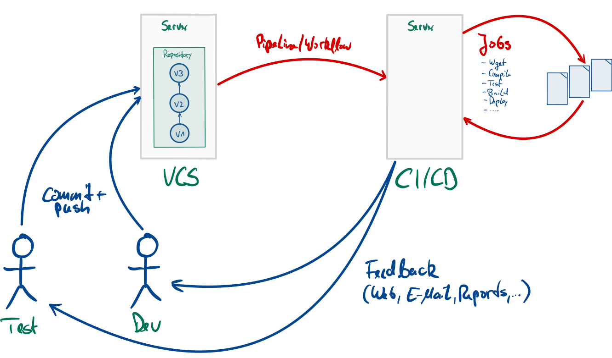
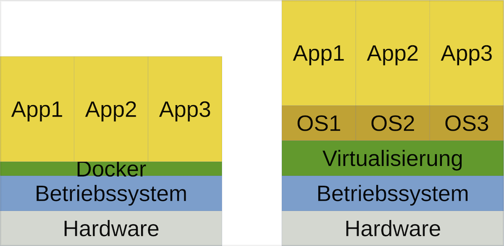
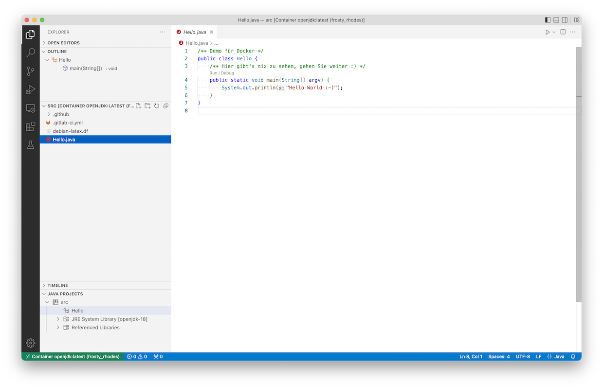

## Motivation CI/CD: WFM (_Works For Me_)

{width="80%" web_width="60%"}

::: notes
Auf dem CI-Server muss man eine Arbeitsumgebung konfigurieren und bereitstellen, für
Java-basierte Projekte muss beispielsweise ein JDK existieren und man benötigt Tools
wie Maven oder Gradle, um die Buildskripte auszuführen. Je nach Projekt braucht man
dann noch weitere Tools und Bibliotheken. Diese Konfigurationen sind unabhängig vom
CI-Server und werden üblicherweise nicht direkt installiert, sondern über eine
Virtualisierung bereitgestellt.

Selbst wenn man keine CI-Pipelines einsetzt, hat man in Projekten mit mehreren
beteiligten Personen häufig das Problem "_WFM_" ("works for me"). Jeder Entwickler
hat sich auf ihrem Rechner eine Entwicklungsumgebung aufgesetzt und nutzt in der Regel
seine bevorzugte IDE oder sogar unterschiedliche JDK-Versionen ... Dadurch kann es
schnell passieren, dass Probleme oder Fehler auftreten, die sich nicht von allen
Beteiligten immer nachvollziehen lassen. Hier wäre eine einheitliche Entwicklungsumgebung
sinnvoll, die in einer "schlanken" Virtualisierung bereitgestellt wird.

Als Entwickler kann man zeitgleich in verschiedenen Projekten beteiligt sein, die
unterschiedliche Anforderungen an die Entwicklungstools mit sich bringen. Es könnte
beispielsweise passieren, dass man zeitgleich drei bestimmte Python-Versionen benötigt.
In den meisten Fällen schafft man es (mit ein wenig Aufwand), diese Tools nebeneinander
zu installieren. Oft ist das in der Praxis aber schwierig und fehleranfällig.

In diesen Fällen kann eine Virtualisierung helfen.
:::


## Virtualisierung: Container vs. VM

{width="80%" web_width="60%"}

::: notes
Wenn man über Virtualisierung auf dem Desktop spricht, kann man grob zwei Varianten
unterscheiden. In beiden Fällen ist die Basis die Hardware (Laptop, Desktop-Rechner)
und das darauf laufende (Host-) Betriebssystem (Linux, FreeBSD, macOS, Windows, ...).
Darauf läuft dann wiederum die Virtualisierung.

Im rechten Bild wird eine herkömmliche Virtualisierung mit virtuellen Maschinen (_VM_)
dargestellt. Dabei wird in der VM ein komplettes Betriebssystem (das "Gast-Betriebssystem")
installiert und darin läuft dann die gewünschte Anwendung. Die Virtualisierung (VirtualBox,
VMware, ...) läuft dabei als Anwendung auf dem Host-Betriebssystem und stellt dem
Gast-Betriebssystem in der VM einen Rechner mit CPU, RAM, ... zur Verfügung und übersetzt
die Systemaufrufe in der VM in die entsprechenden Aufrufe im Host-Betriebssystem. Dies benötigt
in der Regel entsprechende Ressourcen: Durch das komplette Betriebssystem in der VM ist eine
VM (die als Datei im Filesystem des Host-Betriebssystems liegt) oft mehrere 10GB groß. Für die
Übersetzung werden zusätzlich Hardwareressourcen benötigt, d.h. hier gehen CPU-Zyklen und RAM
"verloren" ... Das Starten einer VM dauert entsprechend lange, da hier ein komplettes
Betriebssystem hochgefahren werden muss. Dafür sind die Prozesse in einer VM relativ stark
vom Host-Betriebssystem abgekapselt, so dass man hier von einer "Sandbox" sprechen kann: Viren
o.ä. können nicht so leicht aus einer VM "ausbrechen" und auf das Host-Betriebssystem zugreifen
(quasi nur über Lücken im Gast-Betriebssystem kombiniert mit Lücken in der Virtualisierungssoftware).

Im linken Bild ist eine schlanke Virtualisierung auf Containerbasis dargestellt. Die Anwendungen
laufen direkt als Prozesse im Host-Betriebssystem, ein Gast-Betriebssystem ist nicht notwendig.
Durch den geschickten Einsatz von `namespaces` und `cgroups` und anderen in Linux und FreeBSD
verfügbaren Techniken werden die Prozesse abgeschottet, d.h. der im Container laufende Prozess
"sieht" die anderen Prozesse des Hosts nicht. Die Erstellung und Steuerung der Container übernimmt
hier beispielsweise Docker. Die Container sind dabei auch wieder Dateien im Host-Filesystem.
Dadurch benötigen Container wesentlich weniger Platz als herkömmliche VMs, der Start einer Anwendung
geht deutlich schneller und die Hardwareressourcen (CPU, RAM, ...) werden effizient genutzt.
Nachteilig ist, dass hier in der Regel ein Linux-Host benötigt wird (für Windows wird mittlerweile
der Linux-Layer (_WSL_) genutzt; für macOS wurde bisher eine Linux-VM im Hintergrund hochgefahren,
mittlerweile wird aber eine eigene schlanke Virtualisierung eingesetzt). Außerdem steht im Container
üblicherweise kein graphisches Benutzerinterface zur Verfügung. Da die Prozesse direkt im
Host-Betriebssystem laufen, stellen Container keine Sicherheitsschicht ("Sandboxen") dar!

In allen Fällen muss die Hardwarearchitektur beachtet werden: Auf einer Intel-Maschine können
normalerweise keine VMs/Container basierend auf ARM-Architektur ausgeführt werden und umgekehrt.
:::


## Getting started

*   DockerHub: fertige Images => [hub.docker.com/search](https://hub.docker.com/search?q=&type=image)

\smallskip

*   Image downloaden: `docker pull <IMAGE>`
*   Image starten: `docker run <IMAGE>`

::: notes
### Begriffe

*   **Docker-File**: Beschreibungsdatei, wie Docker ein Image erzeugen soll.
*   **Image**: Enthält die Dinge, die lt. dem Docker-File in das Image gepackt werden sollen.
    Kann gestartet werden und erzeugt damit einen Container.
*   **Container**: Ein laufendes Images (genauer: eine laufende Instanz eines Images). Kann
    dann auch zusätzliche Daten enthalten.

### Beispiele
:::

::: slides
\bigskip
\smallskip

**Beispiele**
:::

```
docker pull debian:stable-slim
docker run  --rm -it  debian:stable-slim  /bin/sh
```

::: notes
`debian` ist ein fertiges Images, welches über DockerHub bereit gestellt wird. Mit dem
Postfix `stable-slim` wird eine bestimmte Version angesprochen.

Mit `docker run debian:stable-slim` startet man das Image, es wird ein Container
erzeugt. Dieser enthält den aktuellen Datenstand, d.h. wenn man im Image eine Datei
anlegt, wäre diese dann im Container enthalten.

Mit der Option `--rm` wird der Container nach Beendigung automatisch wieder gelöscht. Da
jeder Aufruf von `docker run <IMAGE>` einen neuen Container erzeugt, würden sich sonst
recht schnell viele Container auf dem Dateisystem des Hosts ansammeln, die man dann manuell
aufräumen müsste. Man kann aber einen beendeten Container auch erneut laufen lassen ...
(vgl. Dokumentation von `docker`). Mit der Option `--rm` sind aber auch im Container angelegte
Daten wieder weg! Mit der Option `-it` wird der Container interaktiv gestartet und man landet
in einer Shell.

Bei der Definition eines Images kann ein "_Entry Point_" definiert werden, d.h. ein Programm,
welches automatisch beim Start des Container ausgeführt wird. Häufig erlauben Images aber auch,
beim Start ein bestimmtes auszuführendes Programm anzugeben. Im obigen Beispiel ist das `/bin/sh`,
also eine Shell ...
:::

\smallskip

```
docker pull openjdk:latest
docker run  --rm  -v "$PWD":/data -w /data  openjdk:latest  javac Hello.java
docker run  --rm  -v "$PWD":/data -w /data  openjdk:latest  java Hello
```

::: notes
Auch für Java gibt es vordefinierte Images mit einem JDK. Das Tag "`latest`" zeigt dabei auf die
letzte stabile Version des `openjdk`-Images. Üblicherweise wird "`latest`" von den Entwicklern immer
wieder weiter geschoben, d.h. auch bei anderen Images gibt es ein "`latest`"-Tag. Gleichzeitig ist
es die Default-Einstellung für die Docker-Befehle, d.h. es kann auch weggelassen werden:
`docker run openjdk:latest` und `docker run openjdk` sind gleichwertig. Alternativ kann man hier auch
hier wieder eine konkrete Version angeben.

Über die Option `-v` wird ein Ordner auf dem Host (hier durch `"$PWD"` dynamisch ermittelt) in den
Container eingebunden ("gemountet"), hier auf den Ordner `/data`. Dort sind dann die Dateien sichtbar,
die im Ordner `"$PWD"` enthalten sind. Über die Option `-w` kann ein Arbeitsverzeichnis definiert
werden.

Mit `javac Hello.java` wird `javac` im Container aufgerufen auf der Datei `/data/Hello.java`
im Container, d.h. die Datei `Hello.java`, die im aktuellen Ordner des Hosts liegt (und in den
Container gemountet wurde). Das Ergebnis (`Hello.class`) wird ebenfalls in den Ordner `/data/`
im Container geschrieben und erscheint dann im Arbeitsverzeichnis auf dem Host ... Analog kann
dann mit `java Hello` die Klasse ausgeführt werden.
:::

[Demo: Container in der Konsole]{.bsp href="https://youtu.be/LE_QcHqUg9Y"}


## Images selbst definieren

```{.docker size="footnotesize"}
FROM debian:stable-slim

ARG USERNAME=pandoc
ARG USER_UID=1000
ARG USER_GID=1000

RUN apt-get update && apt-get install -y --no-install-recommends            \
        apt-utils bash wget make graphviz biber                             \
        texlive-base texlive-plain-generic texlive-latex-base               \
    #
    && groupadd --gid $USER_GID $USERNAME                                   \
    && useradd -s /bin/bash --uid $USER_UID --gid $USER_GID -m $USERNAME    \
    #
    && apt-get autoremove -y && apt-get clean -y && rm -rf /var/lib/apt/lists/*

WORKDIR /pandoc
USER $USERNAME
```

\bigskip

`docker build -t <NAME> -f <DOCKERFILE> .`

::: notes
`FROM` gibt die Basis an, d.h. hier ein Image von Debian in der Variante `stable-slim`,
d.h. das ist der Basis-Layer für das zu bauende Docker-Image.

Über `ARG` werden hier Variablen gesetzt.

`RUN` ist der Befehl, der im Image (hier Debian) ausgeführt wird und einen neuen Layer
hinzufügt. In diesen Layer werden alle Dateien eingefügt, die bei der Ausführung des
Befehls erzeugt oder angelegt werden. Hier im Beispiel wird das Debian-Tool `apt-get`
gestartet und weitere Debian-Pakete installiert.

Da jeder `RUN`-Befehl einen neuen Layer anlegt, werden die restlichen Konfigurationen
ebenfalls in diesem Lauf durchgeführt. Insbesondere wird ein nicht-Root-User angelegt,
der von der UID und GID dem Default-User in Linux entspricht. Die gemounteten Dateien
haben die selben Rechte wie auf dem Host, und durch die Übereinstimmung von UID/GID
sind die Dateien problemlos zugreifbar und man muss nicht mit dem Root-User arbeiten
(dies wird aus offensichtlichen Gründen als Anti-Pattern angesehen). Bevor der `RUN`-Lauf
abgeschlossen wird, werden alle temporären und später nicht benötigten Dateien von
`apt-get` entfernt, damit diese nicht Bestandteil des Layers werden.

Mit `WORKDIR` und `USER` wird das Arbeitsverzeichnis gesetzt und auf den angegebenen User
umgeschaltet. Damit muss der User nicht mehr beim Aufruf von außen gesetzt werden.

Über `docker build -t <NAME> -f <DOCKERFILE> .` wird aus dem angegebenen Dockerfile und
dem Inhalt des aktuellen Ordners ("`.`") ein neues Image erzeugt und mit dem angegebenen
Namen benannt.


**Hinweis zum Umgang mit Containern und Updates**:
Bei der Erstellung eines Images sind bestimmte Softwareversionen Teil des Images geworden.
Man kann prinzipiell in einem Container die Software aktualisieren, aber dies geht in dem
Moment wieder verloren, wo der Container beendet und gelöscht wird. Außerdem widerspricht
dies dem Gedanken, dass mehrere Personen mit dem selben Image/Container arbeiten und damit
auch die selben Versionsstände haben. In der Praxis löscht man deshalb das alte Image einfach
und erstellt ein neues, welches dann die aktualisierte Software enthält.
:::

[Beispiel: debian-latex.df]{.bsp href="https://github.com/Programmiermethoden-CampusMinden/Prog2-Lecture/blob/master/lecture/building/src/docker/debian-latex.df"}


## CI-Pipeline (GitLab)

```yaml
default:
    image: openjdk:17

job1:
    stage: build
    script:
        - java -version
        - javac Hello.java
        - java Hello
        - ls -lags
```

::: notes
In den Gitlab-CI-Pipelines (analog wie in den GitHub-Actions) kann man Docker-Container
für die Ausführung der Pipeline nutzen.

Mit `image: openjdk:17` wird das Docker-Image `openjdk:17` vom DockerHub geladen und durch
den Runner für die Stages als Container ausgeführt. Die Aktionen im `script`-Teil, wie
beispielsweise `javac Hello.java` werden vom Runner an die Standard-Eingabe der Shell des
Containers gesendet. Im Prinzip entspricht das dem Aufruf auf dem lokalen Rechner:
`docker run openjdk:17 javac Hello.java`.
:::

[Demo: GitLab CI/CD und Docker]{.bsp href="https://youtu.be/3Tj3lhcoKro"}


## CI-Pipeline (GitHub)

```yaml
name: demo
on:
    push:
        branches: [master]
    workflow_dispatch:

jobs:
    job1:
        runs-on: ubuntu-latest
        container: docker://openjdk:17
        steps:
            - uses: actions/checkout@v4
            - run: java -version
            - run: javac Hello.java
            - run: java Hello
            - run: ls -lags
```

::: notes
https://stackoverflow.com/questions/71283311/run-github-workflow-on-docker-image-with-a-dockerfile
https://docs.github.com/en/actions/using-jobs/running-jobs-in-a-container

In den GitHub-Actions kann man Docker-Container für die Ausführung der Pipeline nutzen.

Mit `docker://openjdk:17` wird das Docker-Image `openjdk:17` vom DockerHub geladen und auf dem
Ubuntu-Runner als Container ausgeführt. Die Aktionen im `steps`-Teil, wie beispielsweise
`javac Hello.java` werden vom Runner an die Standard-Eingabe der Shell des Containers gesendet.
Im Prinzip entspricht das dem Aufruf auf dem lokalen Rechner: `docker run openjdk:17 javac Hello.java`.
:::

[Demo: GitHub Actions und Docker]{.bsp href="https://youtu.be/jrxoax2fPRI"}


## VSCode und das Plugin "Remote - Containers"

{width="80%"}

::: notes
1.  VSCode (Host): Plugin "Remote - Containers" installieren
2.  Docker (Host): Container starten mit Workspace gemountet
3.  VSCode (Host): Attach to Container => neues Fenster (Container)
4.  VSCode (Container): Plugin "Java Extension Pack" installieren
5.  VSCode (Container): Dateien editieren, kompilieren, debuggen, ...

Mit Visual Studio Code (VSC) kann man über SSH oder in einem Container arbeiten. Dazu installiert man sich
VSC lokal auf dem Host und installiert dort das Plugin "Remote - Containers". VSC kann darüber vordefinierte
Docker-Images herunterladen und darin arbeiten oder man kann alternativ einen Container selbst starten und
diesen mit VSC verbinden ("attachen").

Beim Verbinden öffnet VSC ein neues Fenster, welches mit dem Container verbunden ist. Nun kann man in diesem
neuen Fenster ganz normal arbeiten, allerdings werden alle Dinge in dem Container erledigt. Man öffnet also
Dateien in diesem Container, editiert sie im Container, übersetzt und testet im Container und nutzt dabei die
im Container installierten Tools. Sogar die entsprechenden VSC-Plugins kann man im Container installieren.

Damit benötigt man auf einem Host eigentlich nur noch VSC und Docker, aber keine Java-Tools o.ä. und kann
diese über einen im Projekt definierten Container (über ein mit versioniertes Dockerfile) nutzen.

_Anmerkung_: IntelliJ kann remote nur debuggen, d.h. das Editieren, Übersetzen, Testen läuft lokal auf dem
Host (und benötigt dort den entsprechenden Tool-Stack). Für das Debuggen kann Idea das übersetzte Projekt
auf ein Remote (SSH, Docker) schieben und dort debuggen.


Noch einen Schritt weiter geht das Projekt [code-server](https://github.com/coder/code-server): Dieses stellt
u.a. ein Docker-Image [codercom/code-server](https://hub.docker.com/r/codercom/code-server) bereit, welches
einen Webserver startet und über diesen kann man ein im Container laufendes (angepasstes) VSC erreichen. Man
braucht also nur noch Docker und das Image und kann dann über den Webbrowser programmieren. Der Projektordner
wird dabei in den Container gemountet, so dass die Dateien entsprechend zur Verfügung stehen:

```sh
docker run -it --name code-server -p 127.0.0.1:8080:8080 -v "$HOME/.config:/home/coder/.config" -v "$PWD:/home/coder/project" codercom/code-server:latest
```

Auf diesem Konzept setzt auch der kommerzielle Service [GitHub Codespaces](https://github.com/features/codespaces)
von GitHub auf.
:::

[Demo: VSCode und Docker]{.bsp href="https://youtu.be/Rs1W_rXkoNM"}


::::::::: notes
## Link-Sammlung

*   [Wikipedia: Docker](https://en.wikipedia.org/wiki/Docker_(software))
*   [Wikipedia: Virtuelle Maschinen](https://en.wikipedia.org/wiki/Virtual_machine)
*   [Docker: Überblick, Container](https://www.docker.com/resources/what-container)
*   [Docker: HowTo](https://docs.docker.com/get-started/)
*   [DockerHub: Suche nach fertigen Images](https://hub.docker.com/search?q=&type=image)
*   [Docker und Java](https://docs.docker.com/language/java/)
*   [Dockerfiles: Best Practices](https://docs.docker.com/develop/develop-images/dockerfile_best-practices/)
*   [Gitlab, Docker](http://git03-ifm-min.ad.hsbi.de/help/ci/docker/using_docker_images.md#overriding-the-entrypoint-of-an-image)
*   [VSCode: Entwickeln in Docker-Containern](https://code.visualstudio.com/docs/remote/containers)
*   @DockerInAction und @DockerInPractice
:::::::::


## Wrap-Up

*   Schlanke Virtualisierung mit Containern (kein eigenes OS)
*   _Kein_ Sandbox-Effekt

\smallskip

*   Begriffe: Docker-File vs. Image vs. Container
*   Ziehen von vordefinierten Images
*   Definition eines eigenen Images
*   Arbeiten mit Containern: lokal, CI/CD, VSCode ...


<!-- DO NOT REMOVE - THIS IS A LAST SLIDE TO INDICATE THE LICENSE AND POSSIBLE EXCEPTIONS (IMAGES, ...). -->
::: slides
## LICENSE


Unless otherwise noted, this work is licensed under CC BY-SA 4.0.

\bigskip

### Exceptions
*   Website [hub.docker.com](https://hub.docker.com/search?q=)
:::
