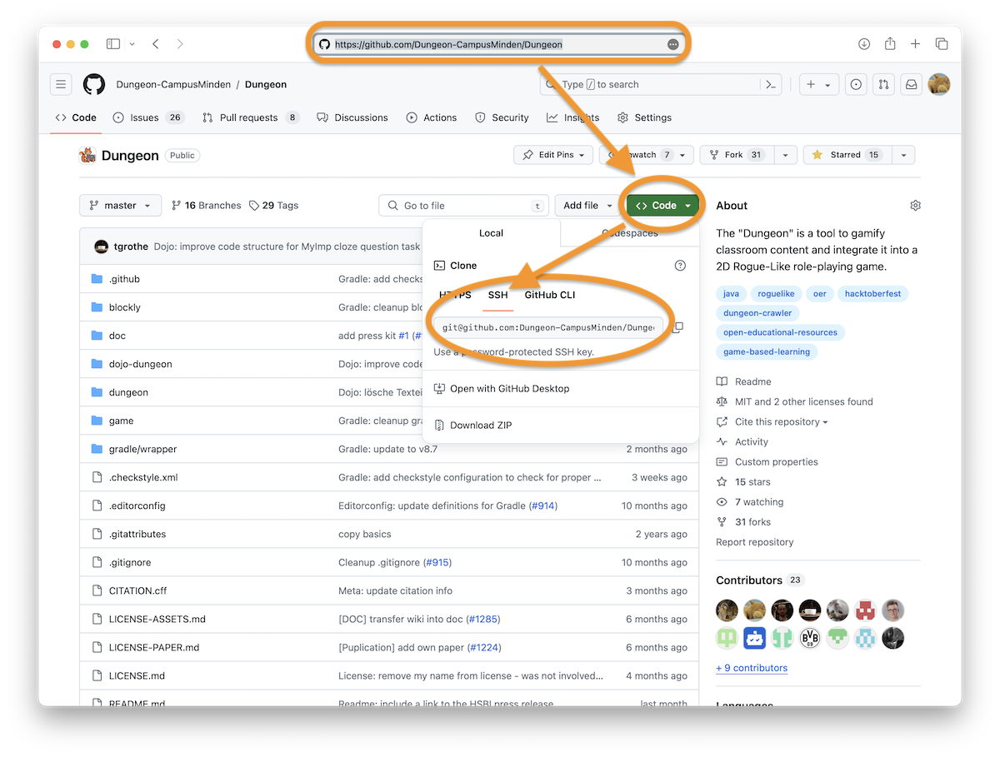
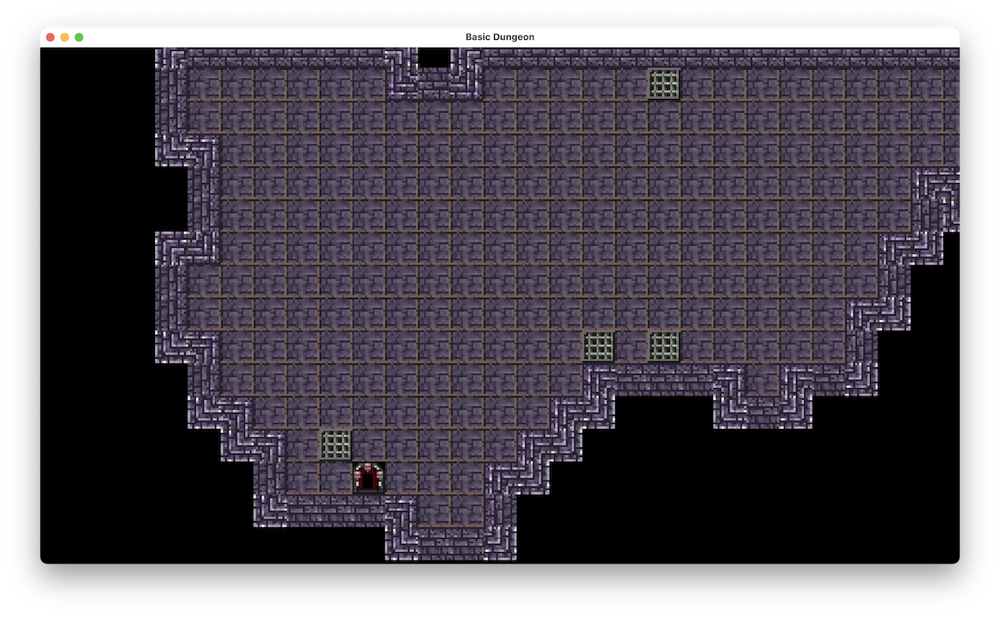
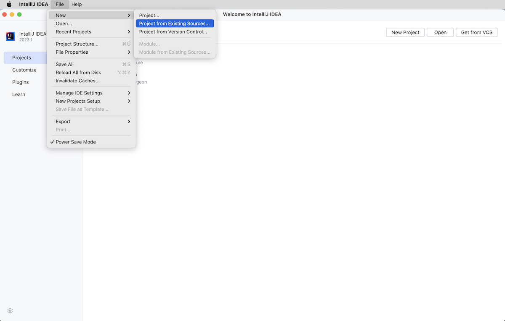
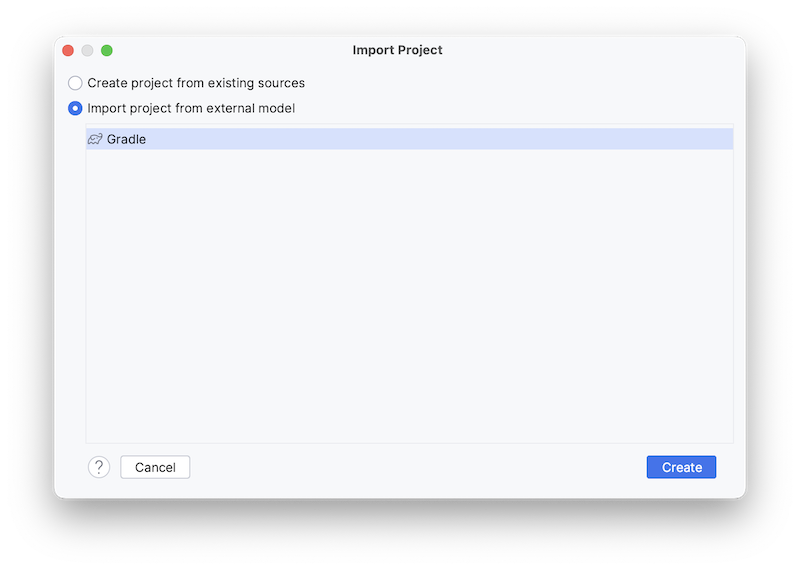

<!-- XXX
Dieses Dokument ist nicht für die Nutzung als Foliensatz vorbereitet.
-->

## How-To Dungeon

In diesem Semester werden Sie im Praktikum schrittweise Erweiterungen in verschiedenen
"fertigen" Rogue-like Computerspielen programmieren und dabei (hoffentlich) die Methoden aus
der Vorlesung einsetzen können.

Das Projekt "PM-Dungeon" stellt wichtige Bausteine für das Spiel bereit, beispielsweise eine
Game-Loop und eine API für das Generieren und Benutzen von Leveln und vieles andere mehr. Im
Hintergrund werkelt das etablierte Open-Source-Spieleframework [libGDX](https://libgdx.com).

Wir werden uns in diesem How-To einen Überblick verschaffen und einen ersten Einstieg
versuchen: Wir programmieren einen einfachen Helden.


## Projekt PM-Dungeon

Das Projekt PM-Dungeon entstand in verschiedenen Forschungsprojekten und wurde (und wird)
aktiv von Studierenden und wissenschaftlichen Mitarbeitern am Campus Minden entwickelt.

Zuletzt lief das Forschungsprojekt "Dungeon", gefördert durch die [Stiftung für Innovation in
der Hochschullehre](https://stiftung-hochschullehre.de) im ["Freiraum
2022"](https://stiftung-hochschullehre.de/foerderung/freiraum2022/). Dabei sollten diesmal
nicht die Studierenden selbst Code schreiben, sondern die Lehrenden sollen Aufgaben in einer
speziellen (von uns entwickelten) Programmiersprache schreiben (können), woraus dann ein
fertiges Dungeon-Spiel generiert wird (mit der Aufgabe als Quest o.ä. im Dungeon eingebettet)
und die Studierenden können durch das Spielen die Aufgaben lösen.

Sie werden merken, dass trotz klarer Richtlinien und Ideen die Entwicklung in der Praxis doch
nicht so einfach ist und dass viele Dinge immer wieder geübt und erinnert werden müssen: Namen
von Klassen und Methoden, sinnvolles Javadoc, Dokumentation jenseits des Javadoc, aber auch
Commit-Messages und PR-Summaries.


## Installation des Frameworks

Sie finden das Projekt auf GitHub:
[github.com/Dungeon-CampusMinden/Dungeon](https://github.com/Dungeon-CampusMinden/Dungeon).



Laden Sie sich den Quellcode herunter, um damit in der IDE arbeiten zu können. Prinzipiell
gibt es viele verschiedene Wege, in diesem Tutorial laden wir es per Git in der Konsole
herunter:

``` sh
git clone git@github.com:Dungeon-CampusMinden/Dungeon.git pm-dungeon
```

Dabei entsteht der Ordner `pm-dungeon/` mit dem Dungeon-Projekt als Inhalt.


## Java: Java SE 21 (LTS)

Wir benutzen im Dungeon-Projekt die aktuelle LTS-Version des JDK, d.h. **Java SE 21 (LTS)**.
Sie können sich das JDK bei [Oracle](https://www.oracle.com/java/technologies/downloads/)
herunterladen oder
[Alternativen](https://code.visualstudio.com/docs/languages/java#_install-a-java-development-kit-jdk)
ausprobieren. Bitte unbedingt die jeweilige 64-bit Version nutzen!

In der Konsole sollte

``` sh
java -version
```

ungefähr diese Ausgabe erzeugen (ignorieren Sie die Minor-Version, wichtig ist Major-Version:
21 bzw. "LTS"):

    java version "21.0.3" 2024-04-16 LTS
    Java(TM) SE Runtime Environment (build 21.0.3+7-LTS-152)
    Java HotSpot(TM) 64-Bit Server VM (build 21.0.3+7-LTS-152, mixed mode, sharing)


## Erster Test

Für einen ersten Test gehen Sie in der Konsole in den vorhin erzeugten neuen Ordner
`pm-dungeon/` und führen Sie dort den Befehl

``` sh
./gradlew game:runBasicStarter
```

aus. Dabei sollte das (mitgelieferte) Build-Tool [Gradle](https://gradle.org/) starten und die
benötigten Java-Bibliotheken herunterladen und schließlich das Spiel in einer Minimalversion
starten - Sie sollten also ein Level sehen und einen hüpfenden Helden.



Dies dauert je nach Internetanbindung etwas - beim nächsten Start geht es dann aber deutlich
schneller, weil ja bereits alles da ist.


## Import in der IDE

Importieren Sie das Projekt als Gradle-basiertes Projekt, dann übernimmt die IDE die
Konfiguration für Sie.





Über das Gradle-Menü können Sie nun in der IDE den "runBasicStarter"-Task (Menüpunkt "game")
starten, und es erscheint wieder ein minimales Level mit einem wartenden Helden.


## Überblick über die (Sub-) Projekte

Sie finden im Package-Explorer eine Reihe von Unterprojekten (Gradle-Subprojekte). Für PR2
sind eigentlich nur die Subprojekte
["dojo-dungeon"](https://github.com/Dungeon-CampusMinden/Dungeon/tree/master/dojo-dungeon) und
["devDungeon"](https://github.com/Dungeon-CampusMinden/dev-dungeon/tree/master/devDungeon)
relevant sowie die Dokumentation in den verschiedenen `doc/`-Ordnern (die derzeit leider noch
eine ziemliche Baustelle ist).


Dojo-Dungeon und DevDungeon stellen zwei verschiedene (mehr oder weniger fertige) Spiele dar,
die von Studierenden erstellt wurden (Dojo-Dungeon: [\@Denniso3](https://github.com/Denniso3),
[\@tgrothe](https://github.com/tgrothe) und [\@JudiTeller](https://github.com/JudiTeller);
DevDungeon: [\@Flamtky](https://github.com/Flamtky)). Diese Spiele nutzen wir an einigen
Stellen im Praktikum.

Die Basis für die beiden Spiele stellt das Dungeon-Framework dar, welches in den
Gradle-Subprojekten ["game"](https://github.com/Dungeon-CampusMinden/Dungeon/tree/master/game)
und ["dungeon"](https://github.com/Dungeon-CampusMinden/Dungeon/tree/master/dungeon) zu finden
ist. Game stellt dabei eine Art minimale Basis zum Programmieren eigener Spiele dar (alle
Klassen im Package `core`), und Dungeon erweitert diese Basis und fügt einige häufig benötigte
Elemente und weitere Texturen (Package `contrib`) hinzu. Zusätzlich gibt es hier noch einige
Klassen für die DSL, was für PR2 aber nicht relevant ist.

Das Subprojekt
["blockly"](https://github.com/Dungeon-CampusMinden/Dungeon/tree/master/blockly) ist die
Einbindung einer blockbasierten Programmiersprache in das Dungeon-Framework und spielt für PR2
ebenfalls keine Rolle.

Die Strukturen in allen Sub-Projekten ist ähnlich: Sie finden unter `<subproject>/src/` die
Java-Packages und in `<subproject>/assets/` vordefinierte Texturen und Soundfiles sowie
Crafting-Rezepte (beispielsweise für Boden, Wände und den Hero). Alle Sourcen sind (mehr oder
weniger) mit Javadoc dokumentiert, zusätzlich gibt es jeweils in `<subproject>/doc/` weitere
Anleitungen und Hinweise.

Für die Aufgaben im Praktikum starten Sie am besten zunächst beim relevanten Code in den
Sub-Projekten Dojo-Dungeon und DevDungeon. Schauen Sie sich die für die Aufgabe benutzten
Klassen und deren Javadoc an. In der Regel nutzen diese auch Klassen aus Dungeon und Game,
deren Aufbau und Javadoc Sie sich ebenfalls anschauen sollten. Zusätzlich gibt es für Game und
Dungeon noch weitere Dokumentation in den `doc/`-Ordnern.


## Überblick über die Strukturen


Die Klasse `starter.Game` ist der zentrale Einstiegspunkt. Hier werden
alle wichtigen Dinge konfiguriert, und es gibt die
`Game#main()`-Methode, die das Spiel startet. Zusätzlich gibt es weitere
Methoden, die für Sie relevant sind:

-   `Game#render()`: Diese Methode wird von libGDX in der Game-Loop
    automatisch einmal pro Frame (per Default 30-mal pro Sekunde - 30
    FPS) aufgerufen, d.h. hier können Sie die Dinge realisieren, die pro
    Frame passieren bzw. berechnet werden sollen. Hier wird
    beispielsweise für jeden Controller die `update()`-Methode
    aufgerufen, wodurch u.a. Spielmechaniken ausgeführt werden und
    Objekte bewegt werden und ein Neuzeichnen ausgelöst wird. Im Prinzip
    stellt diese Methode unseren Teil der Game-Loop dar. _Achtung_: Sie
    rufen diese Methode nicht selbst auf - sie wird automatisch von
    libGDX in der Game-Loop aufgerufen!
-   `Game#setup()`: Diese Methode wird einmal beim Start des Spiels
    aufgerufen und kann für die Konfiguration und Initialisierung der
    verschiedenen Systeme genutzt werden. Im Auslieferungszustand wird
    hier u.a. auch das erste Level geladen.
-   `Game#frame()`: Diese Methode wird zu Beginn eines jeden Frame
    aufgerufen, noch bevor die `update()`-Methode der Controller
    aufgerufen wird.
-   `Game#onLevelLoad()`: Diese Methode wird aufgerufen, wenn ein Level
    geladen wird. Hier können Sie später die Entitäten erstellen, die
    initial im Level verteilt werden sollen.

Es gibt noch eine ganze Reihe von Packages, beispielsweise `graphic` mit
der `DungeonCamera` (damit man auch was sieht im Dungeon) oder `level`
mit der `LevelAPI` zum Generieren zufälliger neuer Level und zum Laden
und zum Zugriff (wo bin ich und warum?) oder `controller` mit den
"Controllern", die bestimmte Dinge im Spiel zu managen. Der wichtigste
Controller ist sicherlich der `SystemController`, der im Moment das ECS
im Dungeon integriert (zu ECS später mehr).


## Mein Held

Um einen besseren Blick in das System zu bekommen, erstellen wir einen
eigenen einfachen Helden.

Dazu schalten wir zunächst in `starter.Game#setup()` in Zeile 118 die
Initialisierung des Default-Helden ab (einfach die Zeile
`hero = new Hero();` auskommentieren).


## Einschub: ECS oder Entities, Components und Systems

Der Held ist ein Element im Spiel. Dieses muss geeignet modelliert
werden.

Unser Dungeon implementiert dabei eine Variante eines
[Entity Component System (*ECS*)](https://en.wikipedia.org/wiki/Entity_component_system)
und folgt damit "großen Vorbildern" wie beispielsweise
[Unity](https://learn.unity.com/tutorial/entity-component-system).

### Entity

Die Idee dahinter ist: Alle Elemente im Spiel werden als _Entität_
realisiert, d.h. der Held und die Monster und die Items, die man so
finden kann, sind alles Entitäten. Im Prinzip könnten sogar die Boden-
und Wandkacheln Entitäten sein.

Eine Entität an sich kann erst einmal nichts und dient nur als Container
für _Components_. Das Spiel kennt alle derzeit vorhandenen Entitäten.

Unsere Basisklasse für Entitäten ist im Moment `ecs.entities.Entity`.

### Component

Components bündeln bestimmte Werte einer Entität für bestimmte Zwecke,
d.h. statt der Attribute in einer Klasse (Entität) nutzen wir hier eine
weitere Kapselung.

Beispielsweise könnte man die Lebenspunkte u.ä. in einer
`HealthComponent` verpacken und dann in einer Entität speichern. Oder
man könnte in einer `VelocityComponent` hinterlegen, wie schnell eine
Entität in x- und in y-Richtung bewegt werden kann (Wände würden dabei
einfach den Wert 0 bekommen). Oder man könnte in einer
`PositionComponent` speichern, wo die Entität gerade ist. Schauen Sie
einfach mal in das Package `ecs.components`.

Wichtig ist: Eine Instanz einer Component ist immer an eine Entität
gekoppelt, es kann keine Components ohne (Bindung an) Entitäten geben.
Andersherum kann eine Entität immer nur ein Objekt einer bestimmten
Component (eines Component-Typs) haben, also nicht zwei Objekte vom
Typ `PositionComponent`. Components speichern vor allem Werte und
haben nur in Ausnahmefällen eigenes Verhalten.

Die Basisklasse für Components ist derzeit `ecs.components.Component`.


### System

Mit Entitäten und passenden Components, über die wir die Eigenschaften
ausdrücken, können wir bereits Spielelemente im Dungeon repräsentieren.

Für die Bewegung und Interaktion sorgen nun passende Systeme. Das Spiel
kennt alle Systeme und ruft deren `update()`-Methode in der Game-Loop
(also pro Frame) auf.

Dabei könnte beispielsweise ein `HealthSystem` sich alle Entitäten
filtern, deren `HealthComponent` unterhalb einer kritischen Schwelle
liegen und diese rot anmalen lassen. Oder ein `PlayerSystem` könnte
dafür sorgen, dass die Eingaben auf der Tastatur geeignet an den Helden
weitergegeben werden und in eine Bewegung oder Kampf o.ä. umgewandelt
werden.

Sie finden unsere Systeme im Package `ecs.systems`, und die Basisklasse
ist derzeit `ecs.systems.ECS_System` - falls Sie einmal eigene Systeme
implementieren wollen.


## Nun aber Helden!

### Ein Held ist eine Entität

Also legen wir eine neue Heldenklasse als Unterklasse von
`ecs.entities.Entity` an:

``` java
public class MyHero extends Entity {}
```

Den nutzen wir in `starter.Game#setup()` in Zeile 118 an Stelle des
vorhin auskommentierten Default-Helden: `hero = new MyHero();`.

Prinzipiell haben Sie damit alles, um das Spiel starten zu können. In
der Praxis bekommen Sie aber eine Exception, weil die neue Entität vom
Typ `MyHero` keine `PositionComponent` hat und das Spiel nicht sicher
ist, wo es diese Entität nun anzeigen soll.

_Hinweis_: Eine Entität ist nur ein Container für Components. Insofern
bräuchten wir eigentlich nicht von `Entity` ableiten, sondern könnten
direkt eine Instanz von `Entity` anlegen und dort die gewünschten
Components hineintun. In der Praxis mag es aber vielleicht ganz nett
sein, trotzdem eine eigene Klasse zu spendieren, weil man hier Dinge
für die Initialisierung kapseln kann - die würden sonst "frei" im
`starter.Game#setup()` o.ä. "herumfliegen".

### Wo bin ich grad?

Der Held braucht eine Position. Dazu gibt es
`ecs.components.PositionComponent`, und wir legen im Konstruktor einfach
eine an:

``` java
public class MyHero extends Entity {
    public MyHero() {
        super();

        new PositionComponent(this);
    }
}
```

Eine Component ist immer an eine Entität gebunden, deshalb wird der
neuen `PositionComponent` eine Referenz auf das eigene Objekt (den
Helden, `this`) mitgegeben. Der Konstruktor der `PositionComponent`
sorgt automatisch dafür, dass die neue Component gleich auch im Helden
registriert wird.

Wenn man keine Position mitgibt, wird einfach eine zufällige Position im
Level genutzt. Alternativ kann man eine eigene Position mitgeben. Im
Dungeon existieren aktuell zwei Koordinatensysteme:
`level.tools.Coordinate` (Integer-basiert) und `tools.Point`
(Float-basiert). Die Level werden als Matrix von `Tile` (Boden, Wand,
Loch, ...) gespeichert. Die Position dieser `Tile` wird als
`Coordinate` gespeichert, was dem Index des Tiles in der Matrix
entspricht. Entitäten können aktuell aber auch zwischen zwei Tiles oder
schräg-links-oben auf einem Tile stehen, dafür gibt es die Positionen
als `Point`. Entsprechend könnte man den neuen Helden bei `(0,0)` in das
Level setzen: `new PositionComponent(this, new Point(0, 0));` (wobei
diese Position möglicherweise nicht spielbar ist).

Wenn Sie jetzt das Spiel starten, sehen Sie - immer noch nichts (außer
den Wänden). Hmmm.

### Animateure

Um den Held zeichnen zu können, brauchen wir eine Animation - also eine
`AnimationComponent`.

``` java
public class MyHero extends Entity {
    public MyHero() {
        super();

        new PositionComponent(this);

        Animation idleLeft = AnimationBuilder.buildAnimation("character/knight/idleLeft");
        Animation idleRight = AnimationBuilder.buildAnimation("character/knight/idleRight");
        new AnimationComponent(this, idleLeft, idleRight);
    }
}
```

Wir brauchen dabei nur die Pfade unterhalb von `game/assets/` angeben
(dieser Ordner ist im `build.gradle` entsprechend konfiguriert).

Jetzt wackelt der Held auf der Stelle herum :)

### Bewege mich

Für die Bewegung ist das `VelocitySystem` zuständig. Dieses fragt in
allen Entitäten die `VelocityComponent` ab und setzt bei tatsächlicher
Bewegung auch eine passende Bewegungsanimation.

Um auf Tastatureingaben reagieren zu können, braucht das `PlayerSystem`
in der Helden-Entität ein `PlayableComponent`.

``` java
public class MyHero extends Entity {
    public MyHero() {
        super();

        new PositionComponent(this);

        Animation idleLeft = AnimationBuilder.buildAnimation("character/knight/idleLeft");
        Animation idleRight = AnimationBuilder.buildAnimation("character/knight/idleRight");
        new AnimationComponent(this, idleLeft, idleRight);

        new PlayableComponent(this);

        float xSpeed = 0.3f;
        float ySpeed = 0.3f;
        Animation runLeft = AnimationBuilder.buildAnimation("character/knight/runLeft");
        Animation runRight = AnimationBuilder.buildAnimation("character/knight/runRight");
        new VelocityComponent(this, xSpeed, ySpeed, runLeft, runRight);
    }
}
```

Aktuell kennt die `VelocityComponent` nicht nur die (Maximal-)
Geschwindigkeit, sondern auch die Texturen, wenn der Held sich nach
links oder rechts bewegt. Diese Daten werden der Component entsprechend
mitgegeben.

Nun sollten Sie Ihren Helden bewegen können.

_Hinweis_: Normalerweise sollten Systeme bei der Iteration über alle
Entitäten nur diejenigen Entitäten wirklich bearbeiten, die alle
benötigten Components aufweisen. In der aktuellen Implementierung kann
aber leider passieren, dass ein System mehrere Components braucht und
sich dann mit einer `MissingComponentException` über das
Nichtvorhandensein selbiger beschwert. Diese Abhängigkeiten sind in
https://github.com/Dungeon-CampusMinden/Dungeon/blob/master/doc/ecs/systems/readme.md
dokumentiert.


## Wrap-Up

::: notes
Damit endet der kurze Ausflug in den Dungeon.
:::

Schauen Sie gern in die vorhandenen Klassen und Packages und in die
Dokumentation hinein:

-   Default-Held: `ecs.entities.Hero`
-   Klassen in "`game/`"
-   Dokumentation unter "`doc/`"

::: notes
Die Javadoc-Kommentare sollten Ihnen erste Ideen zur Funktionsweise
geben (auch wenn für das angestrebte Ideal noch einiges an Arbeit
notwendig ist). Schauen Sie gern die Dokumentation unter "`doc/`" an,
die im Laufe des Semesters schrittweise weiter wachsen wird.
:::

\bigskip

Anregungen für **Spielideen** [können Sie beispielsweise in den folgenden
Videos finden:]{.notes}

-   [Shattered Pixel Dungeon Rogue Beginners Guide Playthrough](https://youtu.be/qoc_tDN0QC4)
-   [Shattered Pixel Dungeon Duelist Update!](https://youtu.be/LgSjUWjQg0s)

::: notes
Viel Spass im PM-Dungeon!
:::


<!-- DO NOT REMOVE - THIS IS A LAST SLIDE TO INDICATE THE LICENSE AND POSSIBLE EXCEPTIONS (IMAGES, ...). -->
::: slides
## LICENSE


Unless otherwise noted, this work is licensed under CC BY-SA 4.0.
:::
