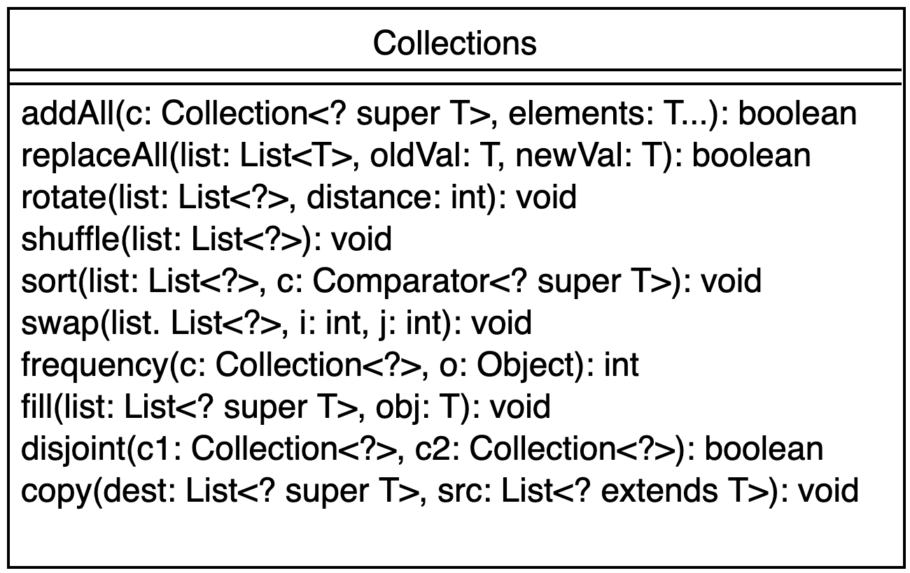
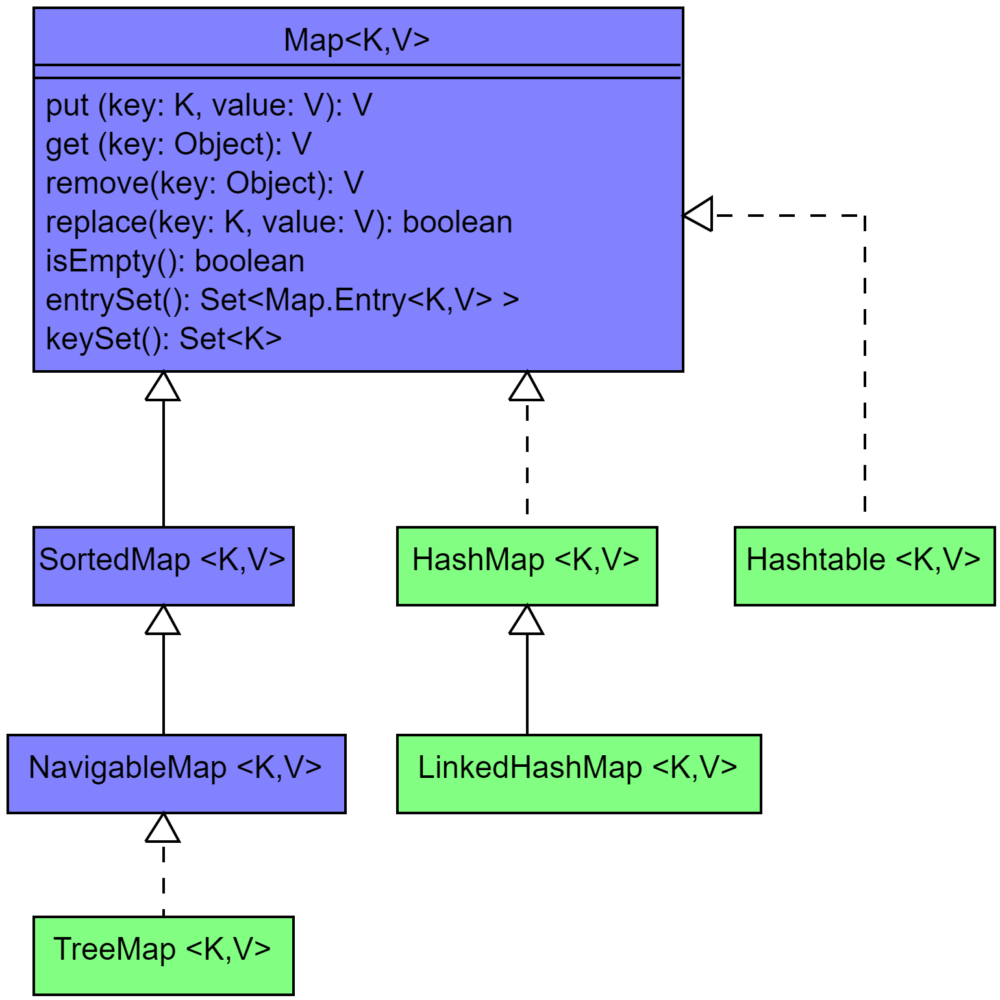
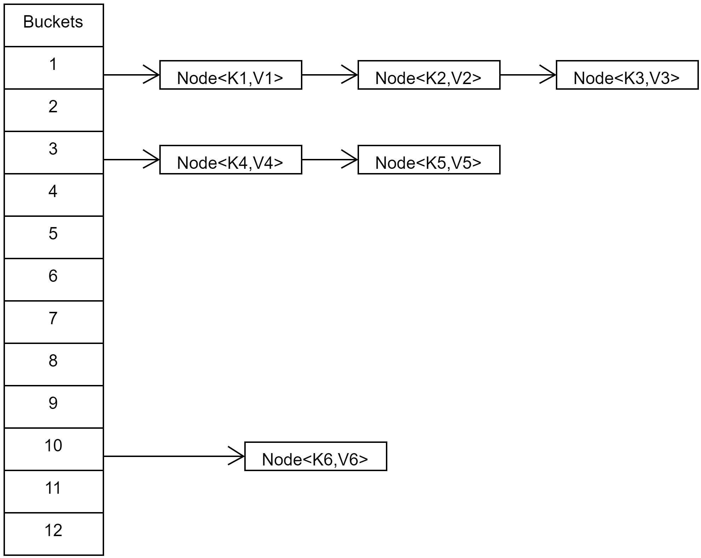
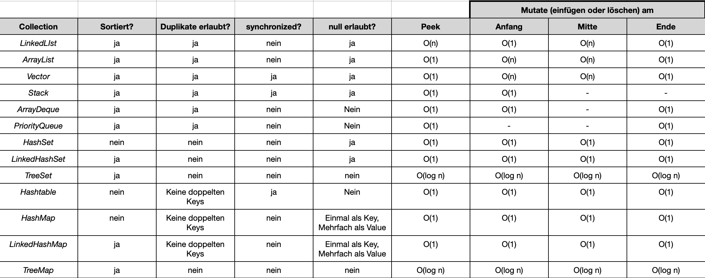

## Motivation: Snippet aus einer Klasse im PM-Dungeon

```java
private List<Entity> entities = new ArrayList<>();

public void add(Entity e){
    if (!entities.contains(e)) entities.add(e);
}
```

::: notes
Die war ein reales Beispiel aus der Entwicklung des PM-Dungeon.

Es wurde eine `ArrayList<T>` zum Verwalten der Entitäten genutzt. Allerdings sollte
jedes Element nur einmal in der Liste vorkommen, deshalb wurde beim Einfügen einer
Entität geprüft, ob diese bereits in der Liste ist.

Hier wird die **falsche Datenstruktur** genutzt!

Eine Liste kann ein Objekt mehrfach enthalten, eine Menge (_Set_) hingegen kann ein
Objekt nur _einmal_ enthalten.
:::


## Collection-API in Java

{width="72%"}

::: notes
_Hinweis_: Die abstrakten (Zwischen-) Klassen wurden im obigen UML aus Gründen der
Übersichtlichkeit _nicht_ aufgeführt. Aus den selben Gründen sind auch nur ausgewählte
Methoden aufgenommen worden.

_Hinweis_: Blau = Interface, Grün = Klasse.

`Collection<T>` ist ein zentrales Interface im JDK und stellt die gemeinsame API der
Collection-Klassen dar. Klassen, die `Collection<T>` implementieren, speichern und
verwalten eine Menge an Objekten.

Unter anderem gibt es die aus dem Modul "ADS" bekannten Datentypen wie Listen, Sets,
Queues etc.

Man unterscheidet zwischen "sorted" (geordnete) Collections, welche eine bestimmte
Reihenfolge der Elemente halten (Reihenfolge des Einfügens, aufsteigende Werte etc.)
und "unsorted" (ungeordnete) Collections, welche keine bestimmte Reihenfolge halten.

Eine Übersicht, welche Collection welche Datenstruktur implementiert, kann unter
["Collection Implementations"](https://docs.oracle.com/en/java/javase/17/docs/api/java.base/java/util/doc-files/coll-overview.html)
eingesehen werden.

*   `List<T>`-Collections sind eine geordnete Liste an Objekten. Per Index-Zugriff können
    Objekte an jeder Stelle der Liste zugegriffen (oder hinzugefügt) werden.
*   `Queue<T>`-Collections sind eine geordnete Sammlung von Objekten. Objekte können nur
    am Ende der Queue hinzugefügt werden und nur am Anfang der Queue (der Head) gelesen
    oder entnommen werden ("first in first out").
*   `Set<T>`-Collections sind eine (i.d.R.!) ungeordnete Menge an Objekten, die stets nur
    einmal in der Set enthalten sein können. In einem Set kann nicht direkt auf ein Objekt
    zugegriffen werden. Es kann aber geprüft werden, ob ein spezifisches Objekt in einer
    Set gespeichert ist.

**Wichtig**: `List<T>`, `Set<T>`, `Queue<T>` und `Map<K,V>` sind **Interfaces**, definieren
also bestimmte Schnittstellen, die sich so wie aus ADS her bekannt verhalten. Diese können
jeweils mit sehr unterschiedlichen Datenstrukturen implementiert werden und können dadurch
auch intern ein anderes Verhalten haben (sortiert vs. nicht sortiert, Zugriffszeiten, ...).

Siehe auch [Interface Collection](https://docs.oracle.com/en/java/javase/17/docs/api/java.base/java/util/Collection.html).
:::


## Listen: _ArrayList_

```java
private List<Entity> entities = new ArrayList<>();
```

\bigskip
\bigskip

{width="80%"}

::: notes
[Link zu einer netten Animation](https://github.com/Programmiermethoden-CampusMinden/PM-Lecture/blob/master/markdown/java-jvm/images/arraylist.gif)

Eine `ArrayList<T>` ist von außen betrachtet ein sich dynamisch vergrößerndes Array.

Intern wird allerdings ein statisches(!) Array benutzt. Wenn dieses Array voll ist,
wird es um 50% vergrößert und alle Inhalte in das neue Array kopiert. Davon merkt
man als Nutzer aber nichts.

Dank es Arrays kann auf ein Element per Index mit O(1) zugegriffen werden.

Wird ein Element aus der Liste gelöscht, rücken alle Nachfolgenden Einträge in der
Liste einen Index auf (interner Kopiervorgang).

Deshalb ist eine `ArrayList<T>` effizient in der Abfrage und Manipulation von Einträgen,
aber deutlich weniger effizient beim Hinzufügen und Löschen von Einträgen.

Per Default wird eine `ArrayList<T>` mit einem Array der Länge 10 angelegt, sobald das
erste Element eingefügt wird. Man kann die Startgröße auch im Konstruktoraufruf der
`ArrayList<T>` bestimmen: beispielsweise `new ArrayList<>(20)`.

Die Methoden einer `ArrayList<T>` sind nicht `synchronized`.
:::


## Listen: _LinkedList_

{width="80%"}

::: notes
[Link zu einer netten Animation](https://github.com/Programmiermethoden-CampusMinden/PM-Lecture/blob/master/markdown/java-jvm/images/linkedlist.gif)

Eine `LinkedList<T>` ist eine Implementierung einer doppelt verketteten Liste (diese
kennen Sie bereits aus ADS) in Java.

Jeder Eintrag wird als Knoten repräsentiert, der den eigentlichen Wert speichert und
zusätzlich je einen Verweis auf den Vorgänger- und Nachfolger-Knoten hat.

Der Head der `LinkedList<T>` zeigt auf den Anfang der Liste, der Nachfolger des letzten
Eintrag ist immer `null`.

Für den Zugriff auf ein Element muß man die `LinkedList<T>` traversieren und beginnt
dabei am Anfang der Liste, deshalb ist ein Zugriff O(n).

Neue Elemente können effizient an das Ende der Liste eingefügt werden, indem der letzte
Eintrag einen Verweis auf den neuen Knoten bekommt: O(1) (sofern man sich nicht nur den
Start der Liste merkt, sondern auch das aktuelle Ende).

Wenn ein Element aus der Liste gelöscht wird, muss dieses zunächst gefundenen werden und
die Liste danach neu verkettete werden: O(n).

Die Methoden einer `LinkedList<T>` sind nicht `synchronized`.
:::


## _Vector_ und _Stack_

*   `Vector<T>`:
    *   Ein `Vector<T>` ähnelt einer `ArrayList<T>`
    *   Das Array eines Vector wird jedoch verdoppelt, wenn es vergrößert wird
    *   Die Methoden von `Vector<T>` sind `synchronized`

\bigskip

*   `Stack<T>`:
    *   Schnittstelle: "last in first out"-Prinzip
        *   `push(T)`: Pushe Element oben auf den Stack
        *   `pop(): T`: Hole oberstes Element vom Stack
    *   Tatsächlich aber: `class Stack<E> extends Vector<E>`


## Iterierbarkeit: _Iterable_ und _Iterator_

```java
private List <Entity> entities = new ArrayList<>();

for (Entity e : entities) { ... }
entities.forEach(x -> ...);
```

\bigskip
\bigskip

{width="80%"}

::: notes
Die Klassen aus der Collection-API implementieren das Interface `Iterable<T>` und sind damit
iterierbar. Man kann sie darüber in einer klassischen `for`-Schleife nutzen, oder mit der
Methode `forEach()` direkt über die Sammlung laufen.

Intern wird dabei ein passender `Iterator<T>` erzeugt, der die Elemente der Sammlung schrittweise
mit der Methode `next()` zurückgibt. Mithilfe eines Cursor merkt sich der Iterator, bei welchem
Eintrag der Datenstruktur er aktuell ist. Mit der Methode `hasNext()`kann geprüft werden, ob noch
ein weiteres Element über den Iterator aus der Datenstruktur verfügbar ist.

Mit `remove()`kann das letzte zurückgegebene Element aus der Datenstruktur entfernt werden. Diese
Methode ist im Interface als Default-Methode implementiert.


Damit kann man die Datenstrukturen auf eine von der Datenstruktur vorgegebene Weise ablaufen,
beispielsweise einen Binärbaum.

[Link zu einer netten Animation](https://github.com/Programmiermethoden-CampusMinden/PM-Lecture/blob/master/markdown/java-jvm/images/iterator.gif)

Man kann auch selbst für eigene Klassen einen passenden `Iterator<T>` implementieren, der zum Ablaufen
der Elemente der eigenen Klasse genutzt werden kann. Damit die eigene Klasse auch in einer `for`-Schleife
genutzt werden kann, muss sie aber auch noch `Iterable<T>` implementieren.


[Beispiel: iterator_example.*]{.bsp href="https://github.com/Programmiermethoden-CampusMinden/PM-Lecture/tree/master/markdown/java-jvm/src/collections/iterator_example/"}
:::


## Hilfsklasse _Collections_

{width="70%" web_width="50%"}

::: notes
`Collections` ist eine Utility-Klasse mit statischen Methoden, die auf `Collection<T>`s ausgeführt werden.
Diese Methoden nutzen das `Collection<T>`-Interface und/oder die `Iterable<T>`-Schnittstelle.

Siehe auch [Class Collections](https://docs.oracle.com/en/java/javase/17/docs/api/java.base/java/util/Collections.html).

Der Hintergrund für diese in Java nicht unübliche Aufsplittung in ein Interface und eine Utility-Klasse
ist, dass bis vor kurzem Interface nur Schnittstellen definieren konnten. Erst seit einigen Java-Versionen
kann in Interfaces auch Verhalten definiert werden (Default-Methoden). Aus heutiger Sicht würde man also
vermutlich die statischen Methoden in der Klasse `Collections` eher direkt als Default-Methoden im Interface
`Collection<T>` implementieren und bereitstellen, statt eine separate Utility-Klasse zu definieren.
:::


## _Map_

{width="55%" web_width="50%"}

::: notes
_Hinweis_: Die abstrakten (Zwischen-) Klassen wurden im obigen UML aus Gründen der
Übersichtlichkeit _nicht_ aufgeführt. Aus den selben Gründen sind auch nur ausgewählte
Methoden aufgenommen worden.

_Hinweis_: Blau = Interface, Grün = Klasse.

_Hinweis_: Tatsächlich ist der Typ des Keys in den Methoden `get()` und `remove()` mit `Object`
spezifiziert und nicht mit dem Typ-Parameter `K`. Das ist aus meiner Sicht eine Inkonsistenz in
der API.

Eine `Map<K,V>` speichert Objekte als Key/Value-Paar mit den Typen `K` (Key) und `V` (Value).

Dabei sind die Keys in einer Map einzigartig und werden verwendet, um auf das jeweilige Value
zuzugreifen. Ein Value kann entsprechend (mit unterschiedlichen Keys) mehrfach im einer Map
enthalten sein.

Es gibt eine Reihe verschiedener Implementierungen, die unterschiedliche Datenstrukturen
einsetzen, beispielsweise:

*   `HashMap<K,V>` hält keine Ordnung in den Einträgen. Verwendet den Hashwert, um Objekte zu
    speichern. Zugriff auf Einträge in einer `HashMap` ist O(1).
*   `LinkedHashMap<K,V>` hält die Einträge in der Reihenfolge, in der sie eingefügt wurden.
*   `TreeMap<K,V>` hält die Einträge in aufsteigender Reihenfolge.

Siehe auch [Interface Map](https://docs.oracle.com/en/java/javase/17/docs/api/java.base/java/util/Map.html).
:::


## _HashMap_

{width="72%" web_width="60%"}

::: notes
Eine `HashMap<K,V>` speichert die Elemente in mehreren einfach verketteten Listen. Dafür
verwendet sie die innere Klasse `Node<K,V>`.

Die Heads, die auf den Anfang einer Liste zeigen, werden in "Buckets" gespeichert. Initial
besitzt eine HashMap 12 Buckets, diese werden bei Bedarf erweitert.

Um einen Eintrag hinzufügen, wird zunächst aus dem `hashCode()` des Key-Objektes mithilfe der
Hash-Funktion der Index des Buckets berechnet. Ist der Bucket gefunden, wird geprüft, ob das
Objekt dort schon vorkommt: Mit dem `hashCode()` des Key-Objektes werden alle Objekte in der
Liste des Buckets verglichen. Wenn es Einträge mit dem selben `hashCode()` in der Liste gibt,
wird mit `equals` geprüft, ob die Key-Objekte identisch sind. Ist dies der Fall, wird der
existierende Eintrag überschrieben, anderenfalls wird der neue Eintrag an das Ende der Liste
hinzugefügt.

Implementierungsdetail: Wenn die Listen zu groß werden, wird die Hashtabelle neu angelegt mit
ungefähr der doppelten Anzahl der Einträge (Buckets) und die alten Einträge per _Re-Hash_ neu
verteilt (vgl. [Class HashMap](https://docs.oracle.com/en/java/javase/17/docs/api/java.base/java/util/HashMap.html)).

`HashMap<K,V>` Methoden sind nicht `synchronized`.

`HashMap<K,V>` unterstützt einen `null`-Key. Es darf beliebig viele `null`-Values geben.

Die Unterklasse `LinkedHashMap<K,V>` kann Ordnung zwischen den Elementen halten. Dafür wird
eine doppelt verkettete Liste verwendet.


[Beispiel: hash_example.HashCodeExample]{.bsp href="https://github.com/Programmiermethoden-CampusMinden/PM-Lecture/blob/master/markdown/java-jvm/src/collections/hash_example/HashCodeExample.java"}
:::


## _Hashtable_

*   Nicht zu verwechseln mit der Datenstruktur: Hash-Tabellen (!)
*   `Hashtable<K,V>` ist vergleichbar mit einer `HashMap<K,V>`
*   `Hashtable<K,V>`-Methoden sind `synchronized`
*   Kein Key oder Value darf `null` sein


::::::::: notes
## Spielregeln für _equals()_, _hashCode()_ und _compareTo()_

### _equals()_

`boolean equals(Object o)` ist eine Methode Klasse `Object` und wird genutzt, um Objekte auf Gleichheit zu
prüfen. Die Default-Implementierung von `equals()` in `Object` vergleicht die beiden Objekte mit `==`, gibt
also nur dann `true` zurück, wenn die beiden zu vergleichenden Objekte die selbe Objekt-ID haben.

In der Praxis kann es sich anbieten, diese Methode zu überschreiben und eigene Kriterien für Gleichheit
aufzustellen.

Dabei sind Spielregeln zu beachten (für nicht-`null` Objekte `x`, `y` und `z`):

1.  Reflexivität: `x.equals(x) == true`
2.  Symmetrie: `x.equals(y) == y.equals(x)`
3.  Transitivität: Wenn `x.equals(y) == true` und `y.equals(z) == true`, dann auch `x.equals(z) == true`
4.  Konsistenz: Mehrfache Aufrufe von `equals()` mit den selben Werten müssen immer das selbe Ergebnis liefern
5.  `x.equals(null) == false`

### _hashCode()_

Die Methode `int hashCode()` gibt den Hash-Wert eines Objektes zurück. Der Hash-Wert eins Objektes wird genutzt,
um dieses in einen Hash-basierten Container abzulegen bzw. zu finden.

Der Rückgabewert der Methode `hashCode()` für ein Objekt bleibt über die Laufzeit einer Anwendung immer identisch,
solange sich die zur Prüfung der Gleichheit genutzten Attribute nicht ändern.

### _compareTo()_

Die Methode `int compareTo()` (Interface `Comparable<T>`) vergleicht Objekte und definiert damit eine Ordnung
auf den Objekten. Während `equals()` für die Prüfung auf Gleichheit eingesetzt wird, wird `compareTo()` für die
Sortierung von Objekten untereinander verwendet.

Spielregeln:

1.  `x.compareTo(y) < 0` wenn `x` "kleiner"  als `y` ist
2.  `x.compareTo(y) > 0` wenn `x` "größer"  als `y` ist
3.  `x.compareTo(y) = 0`  wenn `x` "gleich"  als `y` ist
4.  Symmetrie: `signum(x.compareTo(y)) == -signum(y.compareTo(x))`
4.  Transitivität: Wenn `x.compareTo(y) > 0` und `y.compareTo(z) > 0`, dann auch `x.compareTo(z) > 0`
5.  Wenn `x.compareTo(y) == 0`, dann auch `signum(x.compareTo(z)) == signum(y.compareTo(z))`

### Der _equals()_-_hashCode()_-_compareTo()_-Vertrag
:::::::::

::: slides
## Der _equals()_-_hashCode()_-_compareTo()_-Vertrag
:::

**Wird `equals()` überschrieben, sollte auch `hashCode()` (passend) überschrieben werden.**

\bigskip
\bigskip

1.  Wenn `x.equals(y) == true`, dann _muss_ auch `x.hashCode() == y.hashCode()`

2.  Wenn `x.equals(y) == false`, _sollte_ `x.hashCode() != y.hashCode()` sein
    [(Unterschiedliche `hashCode()`-Werte für unterschiedliche Objekte verbessern allerdings die Leistung
    von Hash-Berechnungen, etwa in einer `HashMap<K,V>`!)]{.notes}

3.  [Es wird sehr empfohlen, dass `equals()` und `compareTo()` konsistente Ergebnisse liefern:]{.notes}
    `x.compareTo(y) == 0` gdw. `x.equals(y) == true`
    [(Dies _muss_ aber nicht zwingend eingehalten werden, sorgt dann aber u.U. für unerwartete Nebeneffekte
    beim Umgang mit `Collection<T>` und `Map<K,V>`!)]{.notes}


::: notes
[Beispiel: hash_example.HashCodeExample]{.bsp href="https://github.com/Programmiermethoden-CampusMinden/PM-Lecture/blob/master/markdown/java-jvm/src/collections/hash_example/HashCodeExample.java"}
:::


::: notes
## Überblick

{width="80%"}

Komplexitätswerte beziehen sich auf den Regelfall. Sonderfälle wie das Vergrößern des Array einer
`ArrayList<T>` können für temporär erhöhte Komplexität sorgen (das ist dem O-Kalkül aber egal).
:::


## Wrap-Up

*   Interface `Collection<T>`: Schnittstelle für Datenstrukturen/Sammlungen
    [zur Verwaltung einer Menge von Objekten]{.notes}
*   Klasse `Collections`: Statische Hilfs-Methoden [(anwendbar auf `Collection<T>`s)]{.notes}
*   `Iterable<T>` liefert einen `Iterator<T>` zur Iteration über eine `Collection<T>`
*   Interface `Map<K,V>`: Speichern von Key/Value-Paaren
*   `equals()`-`hashCode()`-`compareTo()`-Vertrag beachten


<!-- DO NOT REMOVE - THIS IS A LAST SLIDE TO INDICATE THE LICENSE AND POSSIBLE EXCEPTIONS (IMAGES, ...). -->
::: slides
## LICENSE


Unless otherwise noted, this work is licensed under CC BY-SA 4.0.
:::
