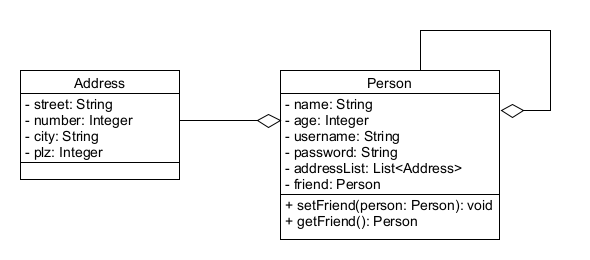

Implementieren Sie die beiden Klassen entsprechend dem UML-Diagram:

Objekte vom Typ `Person` sowie `Address` sollen serialisierbar sein (vgl. Vorlesung). Dabei soll das Passwort nicht serialisiert bzw. gespeichert werden, alle anderen Eigenschaften von `Person` sollen serialisierbar sein.
_Hinweis_: Verwenden Sie zur Umsetzung [java.io.Serializable](https://docs.oracle.com/en/java/javase/17/docs/api/java.base/java/io/Serializable.html).

Erstellen Sie in Ihrem `main()` einige Instanzen von Person und speichern Sie diese in serialisierter Form und laden (deserialisieren) Sie diese anschließend in neue Variablen.

Betrachten Sie die originalen, sowie die wieder deserialisierten, Objekte mithilfe des Debuggers.
Alternativ können Sie die Objekte auch in übersichtlicher Form über den Logger ausgeben.
