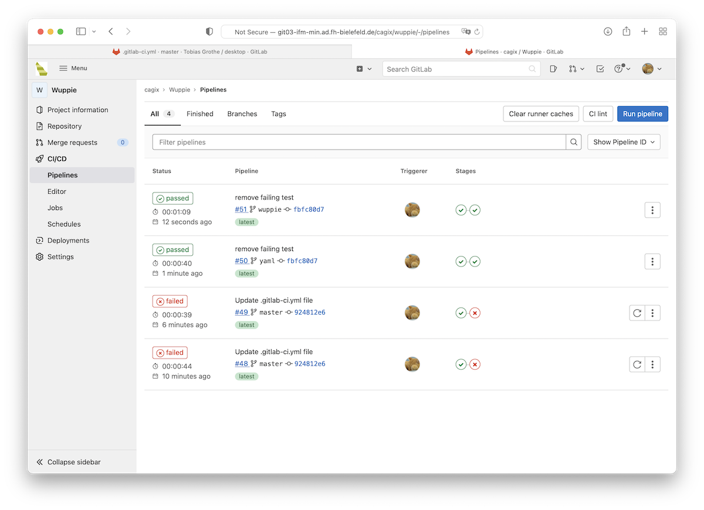
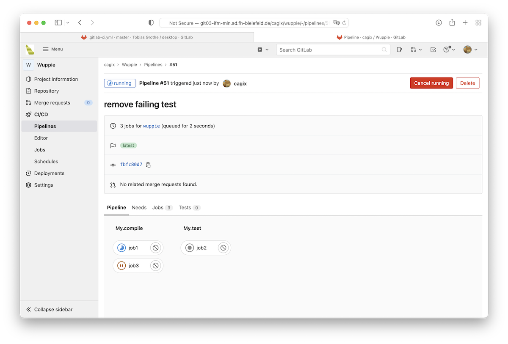

::::::::: notes
## Motivation: Zusammenarbeit in Teams

### Szenario

*   Projekt besteht aus diversen Teilprojekten
*   Verschiedene Entwicklungs-Teams arbeiten (getrennt) an verschiedenen Projekten
*   Tester entwickeln Testsuiten für die Teilprojekte
*   Tester entwickeln Testsuiten für das Gesamtprojekt

### Manuelle Ausführung der Testsuiten reicht nicht

*   Belastet den Entwicklungsprozess
*   Keine (einheitliche) Veröffentlichung der Ergebnisse
*   Keine (einheitliche) Eskalation bei Fehlern
*   Keine regelmäßige Integration in Gesamtprojekt

### Continuous Integration

*   Regelmäßige, automatische Ausführung: Build und Tests
*   Reporting
*   Weiterführung der Idee: Regelmäßiges Deployment (*Continuous Deployment*)
:::::::::


## Continuous Integration (CI)

{width="70%" web_width="60%"}


::: notes
### Vorgehen

*   Entwickler und Tester committen ihre Änderungen regelmäßig (Git, SVN, ...)
*   CI-Server arbeitet Build-Skripte ab, getriggert durch Events: Push-Events, Zeit/Datum, ...
    *   Typischerweise wird dabei:
        *   Das Gesamtprojekt übersetzt ("gebaut")
        *   Die Unit- und die Integrationstests abgearbeitet
        *   Zu festen Zeiten werden zusätzlich Systemtests gefahren
    *   Typische weitere Builds: "Nightly Build", Release-Build, ...
    *   Ergebnisse jeweils auf der Weboberfläche einsehbar (und per E-Mail)

### Einige Vorteile

*   Tests werden regelmäßig durchgeführt (auch wenn sie lange dauern oder die
    Maschine stark belasten)
*   Es wird regelmäßig ein Gesamt-Build durchgeführt
*   Alle Teilnehmer sind über aktuellen Projekt(-zu-)stand informiert

### Beispiele für verbreitete CI-Umgebungen

*   [Jenkins](https://www.jenkins.io/)
*   [GitLab CI](https://docs.gitlab.com/ee/ci/)
*   [GitHub CI](https://resources.github.com/ci-cd/)
*   [Bamboo](https://www.atlassian.com/software/bamboo)
*   [Travis CI](https://www.travis-ci.com)
:::

<!-- cagix/pm-ci-demo -->
[Live-Demo Gitlab-CI]{.bsp}


::: notes
## Übersicht über Pipelines

{width="70%" web_width="60%"}


*   In Spalte "Status" sieht man das Ergebnis der einzelnen Pipelines:
    "pending" (die Pipeline läuft gerade), "cancelled" (Pipeline wurde manuell
    abgebrochen), "passed" (alle Jobs der Pipeline sind sauber durchgelaufen),
    "failed" (ein Job ist fehlgeschlagen, Pipeline wurde deshalb abgebrochen)
*   In Spalte "Pipeline" sind die Pipelines eindeutig benannt aufgeführt
*   In Spalte "Commit" erkennt man den Commit (inkl. Branch)
*   In Spalte "Stages" sieht man den Zustand der einzelnen Stages

Wenn man mit der Maus auf den Status oder die Stages geht, erfährt man mehr bzw.
kann auf eine Seite mit mehr Informationen kommen.
:::


::: notes
## Detailansicht einer Pipeline

{width="70%" web_width="60%"}


Wenn man in eine Pipeline in der Übersicht klickt, werden die einzelnen
Stages dieser Pipeline genauer dargestellt.
:::


::: notes
## Detailansicht eines Jobs

{width="70%" web_width="60%"}


Wenn man in einen Job einer Stage klickt, bekommt man quasi die Konsolenausgabe
dieses Jobs. Hier kann man ggf. Fehler beim Ausführen der einzelnen Skripte
oder die Ergebnisse beispielsweise der JUnit-Läufe anschauen.
:::


::: notes
## Gitlab-CI: Konfiguration mit YAML-Datei

```yaml
stages:
    - my.compile
    - my.test

job1:
    script:
        - echo "Hello"
        - ant compile
        - echo "wuppie!"
    stage: my.compile
    only:
        - yaml
    tags:
        - ivyjava

job2:
    script: "ant test"
    stage: my.test
    tags:
        - ivyjava
```


### Stages

Unter "`stages`" werden die einzelnen Stages einer Pipeline definiert. Diese werden
in der hier spezifizierten Reihenfolge durchgeführt, d.h. zurerst würde `my.compile`
ausgeführt und erst wenn alle Jobs in `my.compile` erfolgreich ausgeführt wurden,
würde anschließend `my.test` ausgeführt.

Dabei gilt: Die Jobs einer Stage werden parallel zueinander ausgeführt, und
die Jobs der nächsten Stage werden erst dann gestartet, wenn alle Jobs der
aktuellen Stage erfolgreich beendet wurden.

Wenn keine eigenen "`stages`" definiert werden, kann man
<!-- TODO -->
([lt. Doku](http://git03-ifm-min.ad.fh-bielefeld.de/help/ci/yaml/README.md#stages))
auf die Default-Stages `build`, `test` und `deploy` zurückgreifen. **Achtung**: Sobald
man eigene Stages definiert, stehen diese Default-Stages *nicht* mehr zur Verfügung!


### Jobs

"`job1`" und "`job2`" definieren jeweils einen Job.

*   "`job1`" besteht aus mehreren Befehlen (unter "`script`"). Alternativ
    kann man die bei "`job2`" gezeigte Syntax nutzen, wenn nur ein
    Befehl zu bearbeiten ist.

    Die Befehle werden von Gitlab-CI in einer Shell ausgeführt.

*   Der Job "`job1`" ist der Stage "`my.compile`" zugeordnet (Abschnitt "`stage`").
    Einer Stage können mehrere Jobs zugeordnet sein, die dann parallel
    ausgeführt werden.

    Wenn ein Job nicht explizit einer Stage zugeordnet ist, wird er
    <!-- TODO -->
    ([lt. Doku](http://git03-ifm-min.ad.fh-bielefeld.de/help/ci/yaml/README.md#stages))
    zur Default-Stage `test` zugewiesen. (Das geht nur, wenn es diese
    Stage auch gibt!)

*   Mit "`only`" und "`except`" kann man u.a. Branches oder Tags angeben,
    für die dieser Job ausgeführt (bzw. nicht ausgeführt) werden soll.

*   Unter "`tags`" wird ein Label vergeben. Dieses muss mit einem der dem
    Projekt zugeordneten (Shared) Runner übereinstimmen.

    <!-- TODO -->
    [**In PM nutzen wir aktuell den Shared Runner mit dem Tag "`ivyjava`"!**]{.alert}
    Dieser Runner muss in Ihrem Repo unter `Settings > CI/CD > Runners` unter
    "Shared Runners" auftauchen (grün markiert). (Diese Einstellung ist nur
    dann sichtbar, wenn unter `Settings > General > Permissions` die Pipelines
    aktiviert sind.)

Durch die Kombination von Jobs mit der Zuordnung zu Stages und Events lassen
sich unterschiedliche Pipelines für verschiedene Zwecke definieren.
:::


::: notes
## Hinweise zur Konfiguration

Im Browser in den Repo-Einstellungen arbeiten:
<!-- TODO: Einstellungen prüfen -->

1.  Unter "`Settings > General > Permissions`" die "`Pipelines`" aktivieren
2.  Prüfen unter "`Settings > CI/CD > Runners`", dass unter
    <!-- TODO: Runner? -->
    "`Available shared Runners`" der Runner mit dem Tag **"ivyjava"**
    steht und mit grün markiert ist ...
3.  Unter "`Settings > CI/CD > General pipelines`" einstellen:
    *   "`Git strategy for pipelines`": "`git clone`"
    *   "`Timeout`": "`10m`"
    *   "`Public pipelines`": `false` (nicht angehakt)
4.  YAML-File ("`.gitlab-ci.yml`") in Projektwurzel anlegen,
    Aufbau siehe Literaturhinweise
5.  Ant-Skript erstellen, lokal lauffähig bekommen, in Jobs nutzen
6.  Im "`.gitlab-ci.yml`" die relevanten Branches einstellen (vgl. Literatur)
7.  Pushen, und unter "`CI/CD > Pipelines`" das Builden beobachten
    *   in Status reinklicken und schauen, ob und wo es hakt
8.  `README.md` anlegen in Projektwurzel (neben "`.gitlab-ci.yml`"),
    Markdown-Schnipsel aus "`Settings > CI/CD > General pipelines > Pipeline status`"
    auswählen und einfügen ....


Optional:

9.  Ggf. Schedules unter "`CI/CD > Schedules`" anlegen
10. Ggf. extra Mails einrichten: "`Settings > Integrations > Pipelines emails`"
:::


## Wrap-Up

Überblick über Continuous Integration:

*   Konfigurierbare Aktionen, die auf dem Gitlab-Server ausgeführt werden
*   Unterschiedliche Trigger: Commit, Merge, ...
*   Aktionen können Branch-spezifisch sein
*   Aktionen können von anderen Aktionen abhängen


<!-- DO NOT REMOVE - THIS IS A LAST SLIDE TO INDICATE THE LICENSE AND POSSIBLE EXCEPTIONS (IMAGES, ...). -->
::: slides
## LICENSE


Unless otherwise noted, this work is licensed under CC BY-SA 4.0.
:::
