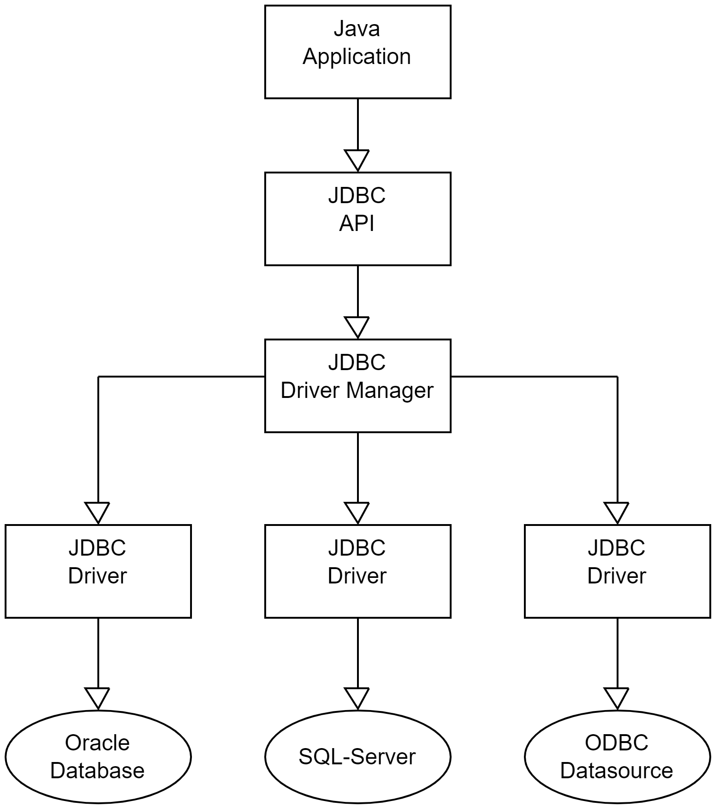

## Motivation
- Mit Datenbanken interagieren, Daten senden und abfragen

## JDBC

- **J**ava **D**ata**b**ase **C**onnectivity (JDBC) ist eine Java-API, um auf Datenbanken zuzugreifen
- Damit können Verbindungen zu Datenbank hergestellt und SQL-Statements ausgeführt werden.
- JDBC konvertiert die SQL-Datentypen in Java-Datentypen und umgedreht.
- Die JDBC API ist universal und Datenbanksystem unabhängig
- Die einzelnen Datenbanksystem-Hersteller stellen JDBC-Treiber zur Verfügung.
- Was machen die Treiber? Implementieren die von JDBC vorgegebene Schnittstelle, damit der Treiber vom JDBC-Driver-Manager genutzt werden kann.  
- Der JDBC Driver Manager lädt den Datenbanksystem spezifischen Treiber in die Anwendung.




## Treiber Registrieren

Für unterschiedliche Datenbanksysteme gibt es unterschiedliche Treiber. Diese müssen in der Java-Anwendung registriert werden, um mithilfe von JDBC eine Verbindung zur Datenbank aufzubauen und Anweisungen zu verschicken.

Möglichkeit 1: Dynamsch zur Laufzeit `Class.forName()`
```java
  Class.forName("{datenbanktreiber}")
```

Beispiel:

Oracle:
```java
  Class.forName("oracle.jdbc.driver.OracleDriver");
```
MySQL:
```java
  Class.forName("com.mysql.jdbc.Driver");
```

- Treiber-Registrationen kann so konfigurierbar und portierbar gemacht werden. (Man muss "nur" den String-Parameter von `Class.forName` austauschen). 
- Gängiges/Bevorzugtes Vorgehen

Möglichkeit 2: Statisch `DriverManager.registerDriver()`
```java
  Driver myDriver = new {driver}();
  DriverManager.registerDriver( myDriver );
```

Beispiel:

Oracle:
```java
  Driver myDriver = new oracle.jdbc.driver.OracleDriver();
  DriverManager.registerDriver(myDriver);
```
MySQL:
```java
  Driver myDriver = com.mysql.jdbc.Driver();
  DriverManager.registerDriver(myDriver);
```

- Findet Anwendungm, wenn dynamisches Laden von der verwendeten JVM nicht unterstützt wird.

## Verbindung aufbauen

Mit drei Parametern.
```java
  String URL="jdbc:URL/TO/DATABASE";
  String USER= "USER";
  String PASSWORD = "PASSWORD"
  Connection connection = DriverManager.getConnection(URL,USER,PASSWORD)
```

Mit einem Paramter. Username und Passwort werden in der URL angegeben.
```java
  String URL="jdbc:USER/PASSWORD/URL/TO/DATABASE";
  Connection connection = DriverManager.getConnection(URL)
```

Mit Properties um Username und Passwort anzugeben.
 ```java
  String URL="jdbc:URL/TO/DATABASE";
  Properties login = new Properties();
  login.put("user","USER");
  login.put("password","PASSWORD");
  Connection connection = DriverManager.getConnection(URL,login)
```

Am Ende muss die Verbindung zur Datenbank geschlossen werden.
```java
  connection.close();
```

- Per Default sind `Connection`s im "auto-commit" Modus. Das beduetet, alle `Statement`s werden automatisch an die Datenbank gesendet.
- Mit `connection.setAutoCommit(false)`, kann dieser Modus disabled werden.
- Dann müssen `Statement`s mit `connection.commit()` gesendet werden.

## Statements

- Mit `Statement`s werden SQL-Befehle erstellt, die dann an die Datenbank gesendet werden können.

Statement erstellen mithilfe des `Connection`-Objekts
```java
Statement st= connection.createStatement();
```

## `ResultSet`
- Alle SQL-Statements die Daten aus der Datenbank lesen, geben diese als `ResultSet` zurück und kann sich wie eine Tablel vorgestellt werden.
- Das `ResultSet`-Objekt hält dann einen Pointer auf die aktuell betrachtete Reihe in der Tabelle.
- `ResultSet`s können auch Konfiguriert werden
    - Zugriffsrechte (`RSConcurrency`)
        - `CONCUR_READ_ONLY` (default): Nur Lesezugriff auf die Daten.
        - `CONCUR_UPDATABLE`: Daten können über das `ResultSet` geupdated werden.

    - Scrollbarkeit (`RSType`)
        - `TYPE_FORWARD_ONLY` (default) Pointer kann nur Vorwärts bewegt werden
        - `TYPE_SCROLL_INSENSITIVE`: Pointer kann Vorwärts und Rückwärts bewegt werden
        - `TYPE_SCROLL_SENSITIVE`: Pointer kann Vortwärts und Rückwärts bewegt werden, zeitgleich werden Änderungen in der Datenbank berücksichtigt (das `ResultSet` updated sich)

- Um das `ResultSet` zu konfigurieren, müssen die Parameter im `Statement` gesetzt werden `Statement st= connection.createStatment(RSType,RSConcurrency)`.

## Beispiel Abfragen

Datensätze aus der Datenbank abfragen:

```java
String sql= "SELECT * FROM USER";
ResultSet rs = st.executeQuery(sql);

while(rs.next){
    System.out.println("ID:" + rs.getInt("id"));
    System.out.println("Username:" + rs.getString("name"));
    System.out.println("Age:" + rs.getInt("age"));
}
rs.close();
```

Datensätze in der Datenbank hinzufügen:

```java
String sql="INSERT INTO User VALUES ('Wuppi Fluppi',22)";
st.executeUpdate(sql);
sql="INSERT INTO User VALUES ('Tutti Frutti ',100)";
st.executeUpdate(sql);
```

Datensätze in der Datenbank ändern:

```java
String sql="UPDATE User SET age = 20 WHERE id in (100,110)";
ResultSet rs= st.executeUpdate(sql);
while(rs.next){
    System.out.println("ID:" + rs.getInt("id"));
    System.out.println("Username:" + rs.getString("name"));
    System.out.println("Age:" + rs.getInt("age"));
}
rs.close();
```


`PreparedStatments` für wiederholte oder gesammelte abfragen:
- Vorallem dann praktisch, wenn die Änderung eines Datensatztes die Änderung eines anderen Datensatzes impliziert.
```java
public void feedAnimals(HashMap<String,Integer> foodSpend){
    String sqlToday="UPDATE animal SET foodToday=? WHERE id = ?"
    String sqlTotal="UPDATE animal SET foodTotal=foodTotal+? WHERE id=?"
    PreparedStatement today= connection.prepareStatement(sqlToday);
        PreparedStatement total= connection.prepareStatement(sqlTotal);
    connection.setAutoCommit(false);
    for (Map.Entry<String, Integer> entry : foodSpend.entrySet()) {

        today.setInt(1,entry.getValue().intValue());
        today.setString(2, entry.getKey());
        today.executeUpdate();

        total.setInt(1,entry.getValue().intValue());
        total.setString(2, entry.getKey());
        total.executeUpdate();

        connection.commit();
    }
}

```

## SQL-Exceptions
- Auch mit JDBC kann es zu Fehlern/Probleme kommen.
    - Fehlerhafte Statements
    - Verbindungsprobleme
    - Fehler in den Treibern oder der Datenbank selber
- Daher ist Exceptionhandling besonders wichtig.
-

```java
try {
    // do something
}
catch (Excpetion e){
    //ups
    e.printStackTrace();
}
finally{
    connection.close();
}

```

## Wrap-Up
- JDBC ist eine API um mit Datenbanken zu interagieren
- JDBC verwendet einen Driver-Manager
- gibt unterschiedliche treiber
- how to connection aufbauen
- how to statement senden
- how to result auswerten
...

<!-- DO NOT REMOVE - THIS IS A LAST SLIDE TO INDICATE THE LICENSE AND POSSIBLE EXCEPTIONS (IMAGES, ...). -->
::: slides
## LICENSE


Unless otherwise noted, this work is licensed under CC BY-SA 4.0.

\bigskip

### Exceptions
*   TODO (what, where, license)
:::
