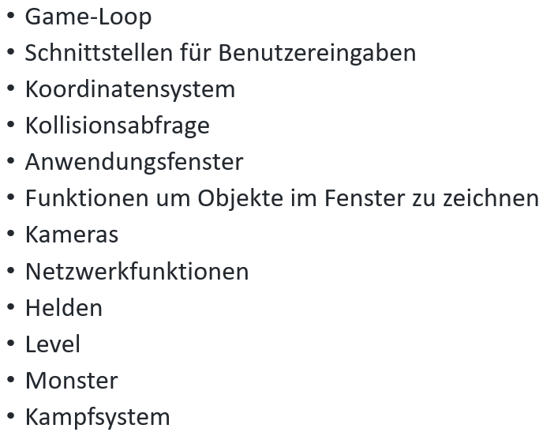
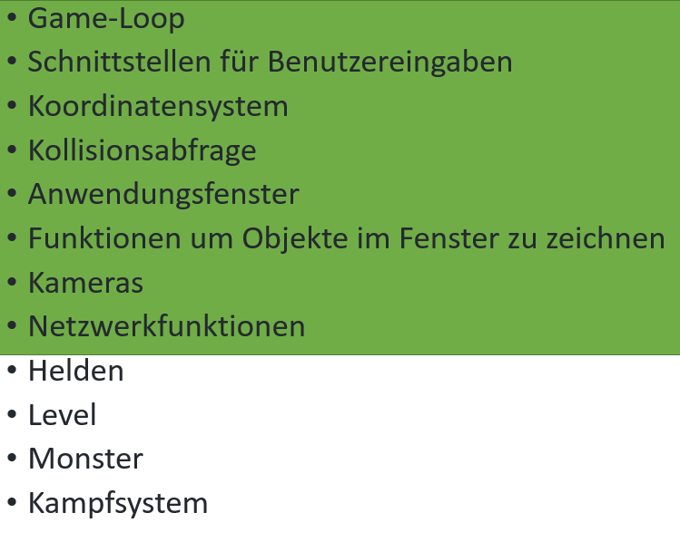

## Checkliste für die Entwicklung eines simplen Videospiels

{width="60%"}

## Checkliste für die Entwicklung eines simplen Videospiels mit Framework

{width="60%"}

::: notes
Neben der eigentlichen Funktionalität werden an Softwareprodukte viele weitere
Randbedingungen gestellt.

Dies können Sicherheitsbedingungen sein oder Anforderungen an die Art und Weise
der Bereitstellung des Produktes, zum Beispiel als Webservice. Viele dieser
Anforderungen ähneln sich von Produkt zu Produkt und müssen dennoch immer wieder
neu programmiert werden.

Für einen Webservice muss beispielsweise eine HTML-Schnittstelle bereitgestellt
werden, die Anfragen annimmt, bearbeitet und die Antworten wieder zurückliefert.
:::

## Was sind Frameworks?

::: notes
Frameworks liefern die Rahmenstruktur und Architektur, um Programme für die
verschiedenen Anwendungszwecke einfacher und effizient zu entwickeln. Sie legen
dabei fest, WIE programmiert werden soll.

Frameworks stellen Code bereit, der an entsprechenden Stellen mit eigenen Klassen
und Funktionen erweitert werden muss, um die eigentliche Funktion der Anwendung
zu implementieren, sind dabei aber selbst keine eigenen Programme (vgl. PM-Dungeon).

"Frameworks sind die Lückentexte der Programmierung."
:::

::: notes
## Unterschied zu Libraries

*   Libraries stellen Funktionen bereit, die frei in der eigenen Implementierung
    genutzt werden können.
*   Beispiele für Libraries
    *   Auswerten von regulären Ausdrücken
    *   Verwenden von Netzwerkprotokollen
    *   Komplexe mathematischen Funktionen

\smallskip

*   Frameworks geben eine Implementierung vor, die mit eigenen Verhalten erweitert
    werden kann/muss.
*   Beispiele für Frameworks
    *   Web Anwendungssysteme
    *   GUI-Systeme
    *   Testen von Software
:::

{width="80%"}

## Verbreitete Frameworks

| Framework | Anwendungszweck                                  |
|-----------|--------------------------------------------------|
| JUnit     | Testen von Software                              |
| Play      | Web Anwendungen                                  |
| Spring    | Web Anwendungen und Enterprise Java-Applications |
| Hibernate | Datenbanken: Anbindungen und Kommunikation       |
| libGDX    | Game Development  :)                             |

## Mögliche Vor- und Nachteile von Frameworks

### (+) Vorteile

*   Ermöglichen eine schnelle Implementierung umfangreicher Softwarekonstrukte
*   Verstecken komplexe Zusammenhänge vor den Entwicklern
*   "Erzwingen" das Einhalten eines bestimmen Qualitätsstandards
*   Große Communities [(das kann aber auch für Libraries gelten ...)]{.notes}

\bigskip

### (-) Nachteile

*   Oftmals sehr umfangreich und schwer zu erlernen
*   Fokus oft nicht mehr nur auf einem Anwendungsbereich (z.B. Spring)
*   Schließen sich oft gegenseitig aus
*   Nicht alles, was sich Framework nennt, ist auch wirklich eins
*   Hype-Gefahr: Frameworks werden stark angepriesen, um dann fallen gelassen
    zu werden [(das kann aber auch für Libraries gelten ...)]{.notes}

::: notes
## Frameworks finden

### Wann sollte man Frameworks verwenden?

Wenn man bereits etablierte Anwendungen (wie Webservices) mit eigener
Funktionalität anbieten möchte.

### Wie/Wo findet man passende Frameworks?

*   Internetrecherche
*   Foren
*   GitHub/Open-Source-Projekte
:::

## Wie starte ich mit einem Framework?

::: notes
Beispielproblem: Es soll eine interne Webanwendung bereitgestellt werden, die
bei jedem Aufruf eine zufällige Zahl zurückgibt.

Für Webanwendungen gibt es eine Vielzahl an Frameworks. Für dieses kleine Problem
ist ein einfaches und schlankes Framework zu bevorzugen.
:::

1.  [Webseite des Frameworks](https://javalin.io/) besuchen und prüfen, ob es
    für die eigenen Zwecke geeignet ist
    *   Beschreibung auf der Webseite analysieren
    *   [Dokumentation](https://javalin.io/documentation) überfliegen
    *   Beispielprojekte anschauen
2.  [Hello World](https://javalin.io/tutorials/gradle-setup) programmieren
    [(Achtung: In der Doku fehlt:  `implementation 'org.slf4j:slf4j-simple:1.8.0-beta4'`!)]{.notes}
3.  Schrittweises Erweitern der Startanwendung, bis ein Verständnis für
    das Framework erlangt wurde \newline (MWE: _Minimal Working Example_):
    [JavalinHelloWorld](https://github.com/PM-Dungeon/PM-Lecture/blob/master/markdown/frameworks/src/javalin/src/main/java/JavalinHelloWorld.java)
4.  Anwendung erweitern: [JavalinRandomNumber](https://github.com/PM-Dungeon/PM-Lecture/blob/master/markdown/frameworks/src/javalin/src/main/java/JavalinRandomNumber.java)

\bigskip

**Frameworks müssen ge-/erlernt werden.**

[Demo: [Web-Anwendung für Zufallszahlen](https://github.com/PM-Dungeon/PM-Lecture/blob/master/markdown/frameworks/src/javalin/)]{.bsp}

## Wrap-Up

*   Frameworks stellen einen Rahmen und eine Architektur für wiederkehrende
    Softwarestrukturen bereit
*   Frameworks sind keine Libraries

<!-- DO NOT REMOVE - THIS IS A LAST SLIDE TO INDICATE THE LICENSE AND POSSIBLE EXCEPTIONS (IMAGES, ...). -->
::: slides
## LICENSE

Unless otherwise noted, this work is licensed under CC BY-SA 4.0.

\bigskip

### Exceptions
*   Website [javalin.io](https://javalin.io/) and Javalin-"HelloWorld" (["Getting started"](https://javalin.io/documentation))
:::
