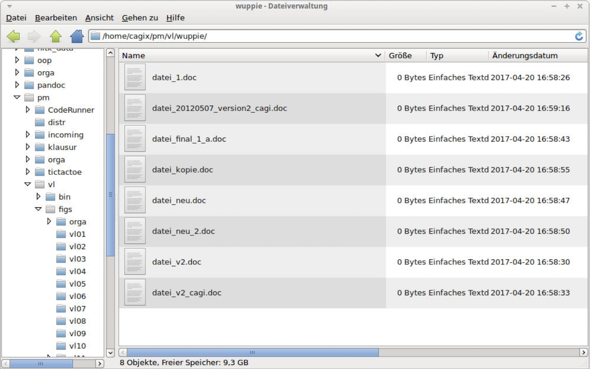

## Typische Probleme bei SW-Entwicklung

*   Was hat wer wann (und wo) geändert? Und warum?
*   Ich brauche den Stand von gestern/letzter Woche/...
*   Ich will schnell mal eine neue Idee ausprobieren ...
*   Ich arbeite an mehreren Rechnern (Synchronisation)
*   Wir müssen gemeinsam an der gleichen Codebasis arbeiten.
*   Wir arbeiten am Release v42, aber Kunde braucht schnell einen Fix für v40

## Folgen SW-Entwicklung ohne Versionsverwaltung

{width=80%}

::: notes
*   Filesystem müllt voll mit manuell versionierten
    Dateien/Sicherungen ala `file_20120507_version2_cagi.txt`
*   Ordner/Projekte müssen dupliziert werden für neue Ideen
*   Code müllt voll mit auskommentierten Zeilen ("Könnte ja noch gebraucht werden")
*   Unklar, wann welche Änderung von wem warum eingeführt wurde
*   Unbeabsichtigtes Überschreiben mit älteren Versionen beim Upload
    in gemeinsamen Filesharing-Bereich
:::

## Prinzip Versionsverwaltung

:::::: columns
::: {.column width="48%"}

{width="80%" web_width="40%"}

:::
::: {.column width="50%"}

\vspace{10mm}

*   [**Repository:**]{.alert}
    **Datenbank** mit verschiedenen Versionsständen, Kommentaren, Tags etc.

\bigskip

*   [**Workingcopy:**]{.alert}
    **Arbeitskopie** eines bestimmten Versionsstandes

:::
::::::

## Varianten: Zentrale Versionsverwaltung (Beispiel SVN)

{width="80%"}

::: notes
Es gibt ein zentrales Repository (typischerweise auf einem Server), von dem die Developer einen
bestimmten Versionsstand "auschecken" (sich lokal kopieren) und in welches sie Änderungen wieder
zurück "pushen".

Zur Abfrage der Historie und zum Veröffentlichen von Änderungen benötigt man entsprechend immer
eine Verbindung zum Server.
:::

## Varianten: Verteilte Versionsverwaltung (Beispiel Git)

{width="80%"}

::: notes
In diesem Szenario hat jeder Developer nicht nur die Workingcopy, sondern auch noch eine Kopie
des Repositories. Zusätzlich kann es einen oder mehrere Server geben, auf denen dann nur das
Repository vorgehalten wird, d.h. dort gibt es normalerweise keine Workingcopy. Damit kann
unabhängig voneinander gearbeitet werden.

Allerdings besteht nun die Herausforderung, die geänderten Repositories miteinander abzugleichen.
Das kann zwischen dem lokalen Rechner und dem Server passieren, aber auch zwischen zwei "normalen"
Rechnern (also zwischen den Developern).
:::

## Versionsverwaltung mit Git: Typische Arbeitsschritte

a.  Repository anlegen (oder clonen)

\bigskip

b.  Dateien neu erstellen (und löschen, umbenennen, verschieben)
c.  Änderungen einpflegen ("committen")
d.  Änderungen und Logs betrachten
e.  Änderungen rückgängig machen
f.  Projektstand markieren ("taggen")

\bigskip

g.  Entwicklungszweige anlegen ("branchen")
h.  Entwicklungszweige zusammenführen ("mergen")

\bigskip

i.  Änderungen verteilen (verteiltes Arbeiten, Workflows)

## (Globale) Konfiguration

**Minimum**:

*   `git config --global user.name <name>`
*   `git config --global user.email <email>`

::: notes
Diese Konfiguration muss man nur einmal machen.

Wenn man den Schalter `--global` weglässt, gelten die Einstellungen nur
für das aktuelle Projekt/Repo.

Zumindest Namen und EMail-Adresse **muss** man setzen, da Git diese
Information beim Anlegen der Commits speichert (== benötigt!).
:::

\bigskip
\bigskip

**Aliase**:

*   `git config --global alias.ci commit`
*   `git config --global alias.co checkout`
*   `git config --global alias.br branch`
*   `git config --global alias.st status`
*   `git config --global alias.ll 'log --all --graph --decorate --oneline'`

::: notes
Zusätzlich kann man weitere Einstellungen vornehmen, etwa auf bunte
Ausgabe umschalten: `git config --global color.ui auto` oder Abkürzungen
(Aliase) für Befehle definieren: `git config --global alias.ll 'log --all --oneline --graph --decorate'` ...

Git (und auch GitHub) hat kürzlich den Namen des Default-Branches von `master`
auf `main` geändert. Dies kann man in Git ebenfalls selbst einstellen:
`git config --global init.defaultBranch <name>`.

Anschauen kann man sich die Einstellungen in der Textdatei `~/.gitconfig`
oder per Befehl `git config --global -l`.
:::

[Konsole]{.bsp}

## Neues Repo anlegen

*   `git init`

    \blueArrow Erzeugt neues Repository im akt. Verzeichnis

\bigskip

*   `git clone <url>`

    \blueArrow Erzeugt (verlinkte) Kopie [des Repos unter `<url>`]{.notes}

[Konsole]{.bsp}

## Wrap-Up

*   Git: Versionsmanagement mit dezentralen Repositories
*   Anlegen eines lokalen Repos mit `git init`
*   Clonen eines existierenden Repos mit `git clone <url>`

<!-- DO NOT REMOVE - THIS IS A LAST SLIDE TO INDICATE THE LICENSE AND POSSIBLE EXCEPTIONS (IMAGES, ...). -->
::: slides
## LICENSE

Unless otherwise noted, this work is licensed under CC BY-SA 4.0.
:::
