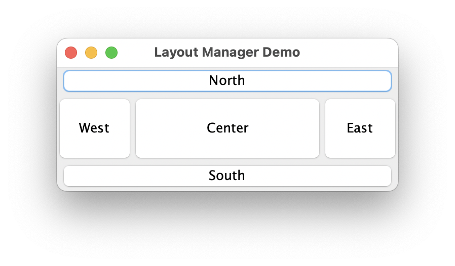
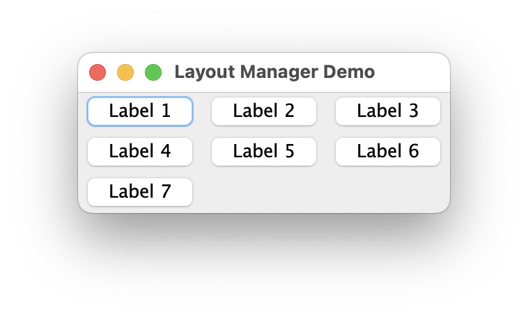

## Überblick

Anordnung der Komponenten [in einem Container ist]{.notes} abhängig vom **Layout**

\bigskip

Verschiedene beliebte Layout-Manager:

*   `BorderLayout`
*   `FlowLayout`
*   `GridLayout`
*   `GridBagLayout`
*   ...


## _BorderLayout_

{width="40%"}

```java
JPanel contentPane = new JPanel();

contentPane.setLayout(new BorderLayout());

contentPane.add(new JButton("North"), BorderLayout.NORTH);  // also: PAGE_START
contentPane.add(new JButton("West"), BorderLayout.WEST);    // also: LINE_START
contentPane.add(new JButton("Center"), BorderLayout.CENTER);
contentPane.add(new JButton("East"), BorderLayout.EAST);    // also: LINE_END
contentPane.add(new JButton("South"), BorderLayout.SOUTH);  // also: PAGE_END
```

::: notes
Es gibt fünf verschiedene Bereiche, in denen die Komponenten bei einem Border-Layout angeordnet
werden können. Für die "historischen" Konstanten `NORTH`, `SOUTH`, `WEST` und `EAST` gibt es
mittlerweile neue Namen, die eher am Aufbau einer Seite orientiert werden können.

Man kann auch nur einige Teile nutzen, bei der Tabellen-Demo beispielsweise wurde nur der
`NORTH`-Bereich für den Tabellenkopf und der `CENTER`-Bereich für die eigentliche Tabelle
genutzt.

Wenn das Fenster vergrößert wird, bekommt zunächst der Mittelteil den neuen zur Verfügung stehenden
Platz. Die anderen Bereiche werden dabei auf vergrößert, aber nur so weit, dass der neue verfügbare
Platz ggf. ausgefüllt wird.

Mit den Methoden `setHgap()` und `setVgap()` kann der Abstand zwischen den Komponenten eingestellt
werden (horizontal und vertikal, Abstände in Pixel).
:::

[Demo: [layout.Border](https://github.com/Programmiermethoden/PM-Lecture/blob/master/markdown/gui/src/layout/Border.java)]{.bsp}


## _FlowLayout_

{width="60%"}

```java
JPanel contentPane = new JPanel();

contentPane.setLayout(new FlowLayout());

contentPane.add(new JButton("Label 1"));
contentPane.add(new JButton("Label 2"));
contentPane.add(new JButton("Label 3"));
```

::: notes
Das `FlowLayout` ist ein sehr einfaches Layout, welches per Default in `JPanel` genutzt wird.

Die Komponenten werden der Reihe nach in einer Zeile angeordnet. Wenn der Platz nicht ausreicht,
bricht diese Zeile um in mehrere Zeilen.

Per Default werden die Komponenten zentriert angeordnet. Über den Konstruktor oder die Methoden
`setAlignment()` und `setHgap()` bzw. `setVgap()` kann aber eine andere Ausrichtung definiert
werden, ebenso wie ein vertikales und horizontales Padding zwischen den Komponenten.
:::

[Demo: [layout.Flow](https://github.com/Programmiermethoden/PM-Lecture/blob/master/markdown/gui/src/layout/Flow.java)]{.bsp}


## _GridLayout_

{width="40%"}

```java
JPanel contentPane = new JPanel();

contentPane.setLayout(new GridLayout(0, 3));

contentPane.add(new JButton("Label 1"));
contentPane.add(new JButton("Label 2"));
contentPane.add(new JButton("Label 3"));
```

::: notes
Das `GridLayout` ist ein sehr einfaches Layout mit einer tabellenartigen Struktur. Dabei werden
die Komponenten nacheinander auf die "Zellen" verteilt, beginnend mit der ersten Zeile. Alle
Komponenten werden dabei gleich groß dargestellt.

Über den Konstruktor wird die Anzahl der gewünschten Zeilen und Spalten angegeben. Es darf auch
für einen der beiden Parameter der Wert 0 verwendet werden, in diesem Fall werden so viele Zeilen
oder Spalten angelegt, wie für die hinzugefügten Komponenten benötigt.

Auch in diesem Layout kann das Padding über die Methoden `setHgap()` bzw. `setVgap()` eingestellt
werden.
:::

[Demo: [layout.Grid](https://github.com/Programmiermethoden/PM-Lecture/blob/master/markdown/gui/src/layout/Grid.java)]{.bsp}


## Komplexer Layout-Manager: _GridBagLayout_

*   Layout-Manager ähnlich zu `GridLayout`
*   Zusätzlich `GridBagConstraints`: Verhalten bei Größenveränderungen

\bigskip

| Constraint   | Bedeutung                                                                                 |
|:-------------|:------------------------------------------------------------------------------------------|
| `gridx`      | **Spalte** für Komponente (linke obere Ecke)                                              |
| `gridy`      | **Zeile** für Komponente (linke obere Ecke)                                               |
| `gridwidth`  | **Anzahl der Spalten** für Komponente                                                     |
| `gridheight` | **Anzahl der Zeilen** für Komponente                                                      |
| `fill`       | Vergrößert **Komponente** in  Richtung: `NONE`, `HORIZONTAL`, `VERTICAL`, `BOTH`          |
| `weightx`    | Platz in x-Richtung wird unter den **Grid-Slots** entsprechend ihrem "Gewicht" aufgeteilt |
| `weighty`    | Platz in y-Richtung wird unter den **Grid-Slots** entsprechend ihrem "Gewicht" aufgeteilt |

::: notes
Beim Hinzufügen einer Komponente wird eine Instanz der Klasse `GridBagConstraints` mitgegeben.
Diese definiert, wie die Komponente in der gitterartigen Struktur konkret angeordnet werden soll:
Startposition im Gitter (x, y) bzw (Spalte, Zeile), wie viele Spalten oder Zeilen soll die
Komponente überstreichen und wie soll auf Größenänderungen des Containers reagiert werden.

Beispiel:

```java
JPanel contentPane = new JPanel();
contentPane.setLayout(new GridBagLayout());

GridBagConstraints c2 = new GridBagConstraints();
c2.gridx = 1;
c2.gridy = 0;
c2.gridheight = 2;
c2.fill = GridBagConstraints.VERTICAL;
c2.weightx = 0.5;
c2.weighty = 0.5;

contentPane.add(new JButton("Label 2"), c2);
```

Der Button wird dem Panel mit dem GridBagLayout hinzugefügt und soll in Spalte 1 und Zeile 0
angeordnet werden. Er soll sich dabei über 2 Zeilen erstrecken (und 1 Spalte). Der Button soll
sich in vertikaler Richtung vergrößern, sofern Platz zur Verfügung steht.

Dem Grid-Slot wird ein Gewicht in x- und in y-Richtung von je 0.5 mitgegeben. Bei einer Änderung
des Containers in der jeweiligen Richtung wird der neue Platz unter den Slots gemäß ihren Gewichten
aufgeteilt.
:::

[Demo: [layout.GridBag](https://github.com/Programmiermethoden/PM-Lecture/blob/master/markdown/gui/src/layout/GridBag.java)]{.bsp}


## Wrap-Up

*   Anordnung von Komponenten lässt sich mit Layout-Manager steuern

\bigskip

*   Auswahl von beliebten Layout-Managern:
    *   `BorderLayout`: Gitterartige Struktur mit fünf Elementen
    *   `FlowLayout`: Zeilenweise Anordnung (Umbruch bei Platzmangel)
    *   `GridLayout`: Tabellenartige Struktur, Elemente gleich groß
    *   `GridBagLayout`: Wie `GridLayout`, mit mehr Möglichkeiten: `GridBagConstraints`


<!-- DO NOT REMOVE - THIS IS A LAST SLIDE TO INDICATE THE LICENSE AND POSSIBLE EXCEPTIONS (IMAGES, ...). -->
::: slides
## LICENSE


Unless otherwise noted, this work is licensed under CC BY-SA 4.0.
:::
