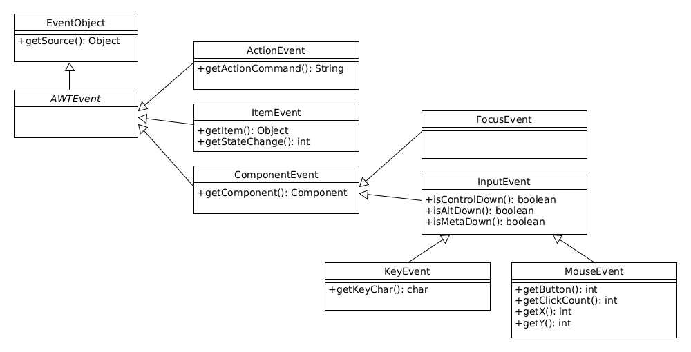
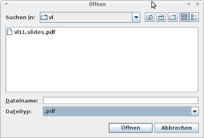

# Swing 101: Basics

## Wiederholung GUI in Java

*   **AWT**: `abstract window toolkit`
    *   Älteres Framework ("Legacy")
    *   "Schwergewichtig": plattformangepasst
    *   Paket `java.awt`

*   **Swing**
    *   Nutzt AWT
    *   "Leichtgewichtig": rein in Java implementiert
    *   Paket `javax.swing`

*   **JavaFX**
    *   Soll als Ersatz für Swing dienen
        *   Community eher verhalten
        *   Weiterentwicklung immer wieder unklar
        *   Nicht mehr im JDK/Java SE Plattform enthalten
    *   Vergleichsweise komplexes Framework, auch ohne Java programmierbar
        (Skriptsprache FXML)

::: notes
_Anmerkung_: In Swing reimplementierte Klassen aus AWT:
Präfix "J": `java.awt.Button` (AWT) => `javax.swing.JButton` (Swing)
:::


## Graphische Komponenten einer GUI

TODO: Screenshot einfaches Fenster, gelabelt

::: notes
*   Top-Level Komponenten
    *   Darstellung direkt auf Benutzeroberfläche des Betriebssystems
    *   Beispiele: Fenster, Dialoge

*   Atomare Komponenten
    *   Enthalten i.d.R. keine weiteren Komponenten
    *   Beispiele: Label, Buttons, Bilder

*   Gruppierende Komponenten
    *   Bündeln und gruppieren andere Komponenten
    *   Beispiele: JPanel
:::

\bigskip
[Achtung:]{.alert}
Unterteilung nicht im API ausgedrückt: Alle Swing-Bausteine leiten von
Klasse `javax.swing.JComponent` ab!

=> Nutzung "falscher" Methoden führt zu Laufzeitfehlern.


## Ein einfaches Fenster

TODO: Code

[Demo: Fenster mit einigen Elementen]{.bsp}


# Swing Events

## Reaktion auf Events: Anwendung Observer-Pattern

::::::::: notes
*   Swing-GUI läuft in Dauerschleife
*   Komponenten registrieren Ereignisse (Events):
    *   Mausklick
    *   Tastatureingaben
    *   Mauszeiger über Komponente
    *   ...
* Reaktion mit passendem Listener: Observer Pattern!

:::::: columns
::: {.column width="45%"}

{width="80%"}

:::
::: {.column width="45%"}

{width="80%"}

:::
::::::
:::::::::

{width="80%"}

=> Observer aus dem Observer-Pattern!

::: notes
In Swing werden die "Observer" als "Listener" bezeichnet.
:::

```java
component.addActionListener(ActionListener);
component.addMouseListener(MouseListener);
```


## Details zu Listenern

*   Ein Listener kann bei mehreren Observables registriert sein:

    ```java
    Handler single = new Handler();
    singleButton.addActionListener(single);
    multiButton.addActionListener(single);
    ```

*   Ein Observable kann mehrere Listener bedienen:

    ```java
    Handler h1 = new Handler();
    Handler h2 = new Handler();
    multiButton.addActionListener(h1);
    multiButton.addActionListener(h2);
    ```

*   Sequentielles Abarbeiten der Events bzw. Benachrichtigung der Observer

{width="80%"}
[Quelle: Java-SE-7-Tutorial, Oracle.com, figures/uiswing/events/2eventsource.gif]{.origin}

[Beispiel: java2d.swing.MultiListenerDemo]{.bsp}


## Wie komme ich an die Daten eines Events?

{width="80%"}

**Event-Objekte**: Quelle des Events plus aufgetretene Daten

[Beispiel: java2d.swing.MouseListenerDemo]{.bsp}


## Listener vs. Adapter

::: notes
*   Vielzahl möglicher Events
*   Jeweils passendes Event-Objekt u. Event-Listener-Interface
*   Oft nur wenige Methoden, u.U. aber [viele Methoden]{.alert}
:::

=> Bei Nutzung eines Event-Listeners müssen immer [**alle**]{.alert}
Methoden implementiert werden (auch nicht benötigte)!

\bigskip
Abhilfe: **Adapter**-Klassen:

*   Für viele Event-Listener-Interfaces existieren Adapter-Klassen
*   Implementieren jeweils ein Interface
*   Alle Methoden mit **leerem** Body vorhanden

\smallskip
=> Nutzung Adapterklassen: Nur benötigte
Listener-Methoden überschreiben.

\bigskip
Details siehe @Deitel2012,
Abschnitt 14.15: "Adapter Classes"

[Beispiel: java2d.swing.MouseAdapterDemo]{.bsp}


# Swing: Nützliche Widgets

## Radiobuttons: _JRadioButton_

\bigskip

{width="80%"}

::: notes
*   Erzeugen einen neuen "Knopf" (rund)
    -   vergleiche `JCheckBox` => eckiger "Knopf"
*   Parameter: Beschriftung und Aktivierung
*   Reagieren mit `ItemListener`
:::

*   **Logische Gruppierung der Buttons**: `ButtonGroup`
    *   `JRadioButton` sind **unabhängige** Objekte
    *   Normalerweise nur ein Button aktiviert
    *   Aktivierung eines Buttons => vormals aktivierter Button deaktiviert

    ```java
    JRadioButton b1 = new JRadioButton("Button 1", true);
    JRadioButton b2 = new JRadioButton("Button 2", false);

    ButtonGroup radioGroup = new ButtonGroup();
    radioGroup.add(b1);
    radioGroup.add(b2);
    ```

[Beispiel: java2d.swing.RadioButtonFrame]{.bsp}


## Dateien oder Verzeichnisse auswählen: _JFileChooser_

{width="80%"}

::: notes
```java
JFileChooser fc = new JFileChooser("Startverzeichnis");
fc.setFileSelectionMode(JFileChooser.FILES_AND_DIRECTORIES);
// JFileChooser.FILES_ONLY, JFileChooser.DIRECTORIES_ONLY
```

*   Anzeigen mit `fc.showOpenDialog()`
*   Rückgabewert vergleichen mit `JFileChooser.APPROVE_OPTION`:
    Datei/Ordner wurde ausgewählt => Prüfen!
*   Selektierte Datei als `File` bekommen: `fc.getSelectedFile()`

**Filtern der Anzeige**: `FileFilter`

*   Setzen mit `JFileChooser.setFileFilter()`
*   Überschreiben von
    *   `boolean accept(File f)`
    *   `String getDescription()`
:::

[Beispiel: java2d.swing.FileChooserDemo]{.bsp}


## TabbedPane und Scroll-Bars

\bigskip

**TabbedPane**: `JTabbedPane`

*   Container für weitere Komponenten
*   Methode zum Hinzufügen anderer Swing-Komponenten:

    ```java
    public void addTab(String title, Icon icon, Component component, String tip)
    ```

\smallskip

**Scroll-Bars**: `JScrollPane`

*   Container für weitere Komponenten
*   Scroll-Bars werden bei Bedarf sichtbar
*   Hinzufügen einer Komponente:

    ```java
    JPanel panel = new JPanel();
    JTextArea text = new JTextArea(5, 10);

    JScrollPane scrollText = new JScrollPane(text);
    panel.add(scrollText);
    ```

<!-- XXX
*   Zusammenbauen der Komponenten und Container am Beispiel zeigen/erklären
*   Wirkung der Optionen (als Tooltips) zeigen
*   Wirkung der Scrollpane zeigen (letzter Tab)
-->

[Beispiel: java2d.swing.TabbedPane]{.bsp}


## Kontextmenü mit _JPopupMenu_

*   Menü kann über anderen Komponenten angezeigt werden
*   Einträge vom Typ `JMenuItem` hinzufügen (beispielsweise `JRadioButtonMenuItem`)
    ```java
    public JMenuItem add(JMenuItem menuItem)
    ```
*   Menü über der aufrufenden Komponente "`invoker`" anzeigen
    ```java
    public void show(Component invoker, int x, int y)
    ```

::: notes
**Details zu `JMenuItem`**

*   Erweitert `AbstractButton`
*   Reagiert auf `ActionEvent`
    => `ActionListener` implementieren für Reaktion auf Menüauswahl
:::

[Beispiel: java2d.swing.PopupFrame]{.bsp}

<!-- TODO
BC mit Java9/Windows: Beispiel scheint nicht zu funktionieren
Fenster ist zunächst grau, mit rechter Maus bekommt man Auswahlmenü ...
-->


::: notes
## Details zum Kontextmenü

**Triggern der Anzeige eines `JPopupMenu**`

*   Beispielsweise über `MouseListener` einer (anderen!) Komponente
*   Darin Reaktion auf `MouseEvent.isPopupTrigger()`
    => `JPopupMenu.show()` aufrufen

```java
JFrame myFrame = new JFrame();
JPopupMenu kontextMenu = new JPopupMenu();

myFrame.addMouseListener(new MouseAdapter() {
    public void mousePressed(MouseEvent e) {
        if (e.isPopupTrigger()) {
            kontextMenu.show(e.getComponent(), e.getX(), e.getY());
        }
    }
});
```
:::


# Swing: Layout-Manager

## Überblick

todo

## Grid

todo

## Border

todo

## Flow

todo


## Komplexer Layoutmanager: _GridBagLayout_

*   Layoutmanager mit gitterartiger Grundstruktur
*   Erzeugung/Verwendung ähnlich zu `GridLayout`
*   Zusätzlich **Constraints**, beschreiben Verhalten des
    Layouts bei Größenveränderungen: `GridBagConstraints`

| Constraint   | Bedeutung                                                                                                    |
|:-------------|:-------------------------------------------------------------------------------------------------------------|
| `gridx`      | **Spalte** für Komponente (linke obere Ecke)                                                                 |
| `gridy`      | **Zeile** für Komponente (linke obere Ecke)                                                                  |
| `gridwidth`  | **Anzahl der Spalten** für Komponente                                                                        |
| `gridheight` | **Anzahl der Zeilen** für Komponente                                                                         |
| `fill`       | Vergrößert **Komponente** (wenn Platz ist) in angegebene  Richtung: `NONE`, `HORIZONTAL`, `VERTICAL`, `BOTH` |
| `weightx`    | Freier Platz in x-Richtung wird unter den **Grid-Slots** entsprechend ihrem "Gewicht" aufgeteilt             |
| `weighty`    | Freier Platz in y-Richtung wird unter den **Grid-Slots** entsprechend ihrem "Gewicht" aufgeteilt             |

::: notes
Selbststudium: Machen Sie sich mit Hilfe der Literatur mit dem `GridBagLayout`
vertraut. Nutzen Sie den Beispielcode und variieren Sie die verschiedenen
Parameter/Constraints, um sich mit dem Verhalten und den Auswirkungen vertraut
zu machen!

[Beispiel: java2d.swing.MultiListenerGridBagDemo]{.bsp}
:::


# Swing: Tabellen

## Einfache Tabelle mit festen Daten

*   Einfache Tabelle erzeugen:

    ```java
    public JTable(final Object[][] rowData,
       final Object[] columnNames)
    ```

*   Daten gleich mit erzeugen/übergeben:

    ```java
    Object[][] rowData = {
    { "Hein", "Bloed", new Integer(5) },
    { "Susi", "Studi", new Integer(2) } };
    ```

*   Tabellenkopf als einfaches Array:

    ```java
    Object[] columnNames = { "Vorname", "Name", "ect" };
    ```

*   Tabelle soll allen Platz im Container nutzen:

    ```java
    table.setFillsViewportHeight(true);
    ```

[Beispiel: java2d.swing.tabledemo.SimpleTableDemo]{.bsp}


## Selektierbare und sortierbare Tabelle

*   Tabelle sortierbar machen:

    ```java
    table.setAutoCreateRowSorter(true);
    ```

*   Selektion erkennen und reagieren mit MouseListener:

    ```java
    table.addMouseListener(new MouseAdapter() {
        public void mouseClicked(MouseEvent e) {
            TableModel model = table.getModel();
            int c = table.getSelectedColumn();  // selektierte Spalte
            int r = table.getSelectedRow();     // selektierte Zeile
            model.getValueAt(r, c);         // Wert in Zeile r, Spalte c
    }});
    ```

[Beispiel: java2d.swing.tabledemo.SelectTableDemo]{.bsp}


## Einschub: MVC-Pattern

<!-- TODO ausarbeiten -->
TODO ausarbeiten (Abbildung ist nur Platzhalter)

{width="80%"}


## Daten in separatem Modell

*   Modell muss von `AbstractTableModel` ableiten
*   Methoden zur Interaktion mit Tabelle implementieren!
*   Tabelle wird über Instanz von diesem Modell erzeugt
*   Tabelle ist View und Controller zugleich, trägt sich bei Erzeugung
    als Listener beim Modell ein
*   Modell muss die Tabelle über Änderungen an den Daten informieren:
    ```java
    fireTableCellUpdated(row, col);
    ```

\bigskip
=> Kapselung der Daten! Müssen nicht als Array o.ä. vorliegen!

[Beispiel: java2d.swing.tabledemo.ModelTableDemo]{.bsp}


## Modelleigenschaften

*   Korrekte Spalten-Typen und damit bessere Anzeige:

    ```java
    public Class getColumnClass(int c) {
        return getValueAt(0, c).getClass();
    }
    ```

*   Spalten können gegen Editieren gesperrt werden:

    ```java
    public boolean isCellEditable(int row, int col) {
        return (col<2) ? false : true;
    }
    ```

*   Kontrolle über Änderung der Daten in `setValueAt()`

*   Daten können in beliebigem Format vorliegen! Interface nach
    "aussen" dennoch tabellenartig.


## Eigene Listener beim Modell registrieren

```java
TableModel m = table.getModel();
m.addTableModelListener(new TableModelListener() {
    public void tableChanged(TableModelEvent e) {
        int row = e.getFirstRow();
        int column = e.getColumn();
        TableModel model = (TableModel) e.getSource();
        String columnName = model.getColumnName(column);
        Object data = model.getValueAt(row, column);
        int changeType = e.getType();
        ...
    }
});
```

[Beispiel: java2d.swing.tabledemo.ModelListenerTableDemo]{.bsp}


## Wrap-Up

*   Fortgeschrittene Swing-Komponenten
    *   Scroll-Bars, Panel mit Tabs, Kontextmenü, Radiobuttons
    *   Fortgeschrittenes Layout mit `GridBagLayout`
    *   Komplexe Daten mit `JTable` anzeigen
    *   Swing-Komponenten (nicht nur `JTable`!) haben Datenmodelle,
        können separat erzeugt werden, haben eigene Listener, ...
*   Trennung Daten und Anzeige: MVC-Pattern
*   Observer-Pattern in Swing-Komponenten:
    *   Events: Enthalten Source-Objekt und Informationen
    *   Event-Listener: Interfaces mit Methoden zur Reaktion
    *   Adapter: Listener mit leeren Methodenrümpfen


<!-- DO NOT REMOVE - THIS IS A LAST SLIDE TO INDICATE THE LICENSE AND POSSIBLE EXCEPTIONS (IMAGES, ...). -->
::: slides
## LICENSE


Unless otherwise noted, this work is licensed under CC BY-SA 4.0.
:::
