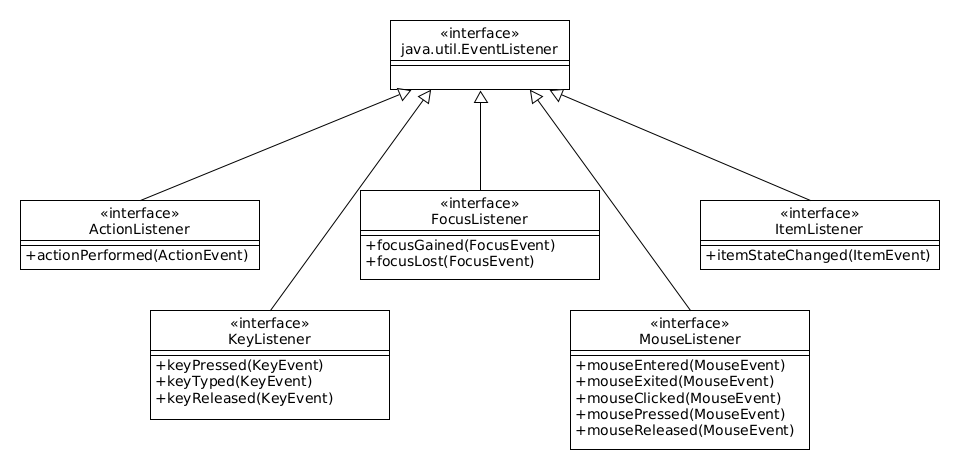

## Reaktion auf Events: Anwendung Observer-Pattern

::::::::: notes
*   Swing-GUI läuft in Dauerschleife
*   Komponenten registrieren Ereignisse (Events):
    *   Mausklick
    *   Tastatureingaben
    *   Mauszeiger über Komponente
    *   ...
* Reaktion mit passendem Listener: Observer Pattern!

:::::: columns
::: {.column width="45%"}

{width="80%"}

:::
::: {.column width="45%"}

{width="80%"}

:::
::::::
:::::::::

{width="80%"}

=> Observer aus dem Observer-Pattern!

::: notes
In Swing werden die "Observer" als "Listener" bezeichnet.
:::

```java
component.addActionListener(ActionListener);
component.addMouseListener(MouseListener);
```


## Details zu Listenern

*   Ein Listener kann bei mehreren Observables registriert sein:

    ```java
    Handler single = new Handler();
    singleButton.addActionListener(single);
    multiButton.addActionListener(single);
    ```

*   Ein Observable kann mehrere Listener bedienen:

    ```java
    Handler h1 = new Handler();
    Handler h2 = new Handler();
    multiButton.addActionListener(h1);
    multiButton.addActionListener(h2);
    ```

*   Sequentielles Abarbeiten der Events bzw. Benachrichtigung der Observer

{width="80%"}
[Quelle: Java-SE-7-Tutorial, Oracle.com, figures/uiswing/events/2eventsource.gif]{.origin}

[Beispiel: java2d.swing.MultiListenerDemo]{.bsp}


## Wie komme ich an die Daten eines Events?

{width="80%"}

**Event-Objekte**: Quelle des Events plus aufgetretene Daten

[Beispiel: java2d.swing.MouseListenerDemo]{.bsp}


## Listener vs. Adapter

::: notes
*   Vielzahl möglicher Events
*   Jeweils passendes Event-Objekt u. Event-Listener-Interface
*   Oft nur wenige Methoden, u.U. aber [viele Methoden]{.alert}
:::

=> Bei Nutzung eines Event-Listeners müssen immer [**alle**]{.alert}
Methoden implementiert werden (auch nicht benötigte)!

\bigskip
Abhilfe: **Adapter**-Klassen:

*   Für viele Event-Listener-Interfaces existieren Adapter-Klassen
*   Implementieren jeweils ein Interface
*   Alle Methoden mit **leerem** Body vorhanden

\smallskip
=> Nutzung Adapterklassen: Nur benötigte
Listener-Methoden überschreiben.

\bigskip
Details siehe @Deitel2012,
Abschnitt 14.15: "Adapter Classes"

[Beispiel: java2d.swing.MouseAdapterDemo]{.bsp}


## Wrap-Up

*   Observer-Pattern in Swing-Komponenten:
    *   Events: Enthalten Source-Objekt und Informationen
    *   Event-Listener: Interfaces mit Methoden zur Reaktion
    *   Adapter: Listener mit leeren Methodenrümpfen


<!-- DO NOT REMOVE - THIS IS A LAST SLIDE TO INDICATE THE LICENSE AND POSSIBLE EXCEPTIONS (IMAGES, ...). -->
::: slides
## LICENSE


Unless otherwise noted, this work is licensed under CC BY-SA 4.0.
:::
