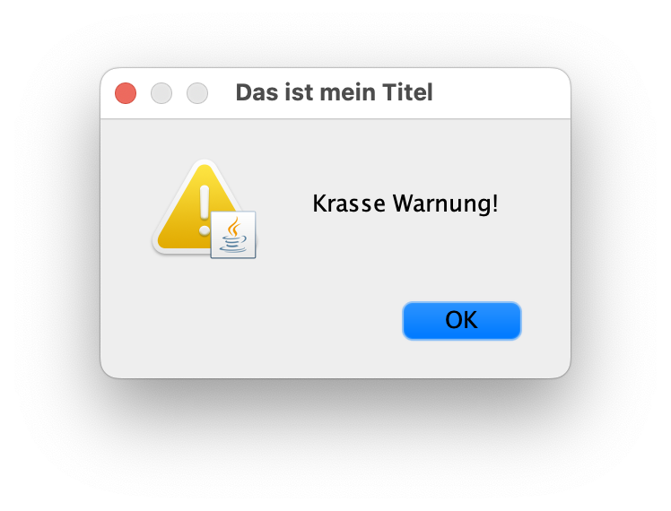

## Radiobuttons: _JRadioButton_

\bigskip

{width="50%"}

\bigskip

::: notes
*   Erzeugen einen neuen "Knopf" (rund)
    -   vergleiche `JCheckBox` => eckiger "Knopf"
*   Parameter: Beschriftung und Aktivierung
*   Reagieren mit `ItemListener`
:::

\bigskip

*   **Logische Gruppierung der Buttons**: `ButtonGroup`
    *   `JRadioButton` sind **unabhängige** Objekte
    *   Normalerweise nur ein Button aktiviert
    *   Aktivierung eines Buttons => vormals aktivierter Button deaktiviert

    \smallskip

    ```{.java size=footnotesize}
    JRadioButton b1 = new JRadioButton("Button 1", true);
    JRadioButton b2 = new JRadioButton("Button 2", false);

    ButtonGroup radioGroup = new ButtonGroup();
    radioGroup.add(b1);    radioGroup.add(b2);
    ```

[Demo: widgets.RadioButtonDemo]{.bsp href="https://github.com/Programmiermethoden/PM-Lecture/blob/master/markdown/gui/src/widgets/RadioButtonDemo.java"}


## Dateien oder Verzeichnisse auswählen: _JFileChooser_

{width="40%"}

\bigskip

```{.java size=footnotesize}
JFileChooser fc = new JFileChooser("Startverzeichnis");
fc.setFileSelectionMode(JFileChooser.FILES_AND_DIRECTORIES);
if (fc.showOpenDialog() == JFileChooser.APPROVE_OPTION)
    fc.getSelectedFile()
```

::: notes
*   `fc.setFileSelectionMode()`: Dateien, Ordner oder beides auswählbar
*   Anzeigen mit `fc.showOpenDialog()`
*   Rückgabewert vergleichen mit `JFileChooser.APPROVE_OPTION`:
    Datei/Ordner wurde ausgewählt => Prüfen!
*   Selektierte Datei als `File` bekommen: `fc.getSelectedFile()`

**Filtern der Anzeige**: `FileFilter`

*   Setzen mit `JFileChooser.setFileFilter()`
*   Überschreiben von
    *   `boolean accept(File f)`
    *   `String getDescription()`
:::

[Demo: widgets.FileChooserDemo]{.bsp href="https://github.com/Programmiermethoden/PM-Lecture/blob/master/markdown/gui/src/widgets/FileChooserDemo.java"}


## TabbedPane und Scroll-Bars

\bigskip

*   **TabbedPane**: `JTabbedPane`
    *   Container für weitere Komponenten
    *   Methode zum Hinzufügen anderer Swing-Komponenten:

        \smallskip

        ```{.java size=footnotesize}
        public void addTab(String title, Icon icon, Component component, String tip)
        ```

\bigskip

*   **Scroll-Bars**: `JScrollPane`
    *   Container für weitere Komponenten
    *   Scroll-Bars werden bei Bedarf sichtbar
    *   Hinzufügen einer Komponente:

        \smallskip

        ```{.java size=footnotesize}
        JPanel panel = new JPanel();
        JTextArea text = new JTextArea(5, 10);

        JScrollPane scrollText = new JScrollPane(text);
        panel.add(scrollText);
        ```

<!-- XXX
*   Zusammenbauen der Komponenten und Container am Beispiel zeigen/erklären
*   Wirkung der Optionen (als Tooltips) zeigen
*   Wirkung der Scrollpane zeigen (letzter Tab)
-->

[Demo: widgets.TabbedPaneDemo]{.bsp href="https://github.com/Programmiermethoden/PM-Lecture/blob/master/markdown/gui/src/widgets/TabbedPaneDemo.java"}


## Dialoge mit _JOptionPane_

{width="40%"}

\bigskip

```java
JOptionPane.showMessageDialog(
    this,
    "Krasse Warnung!",
    "Das ist mein Titel",
    JOptionPane.WARNING_MESSAGE)
```

::: notes
Ein Dialog ist ein eigenes Top-Level-Fenster, welches zumindest eine Message zeigt.
Zusätzlich kann man den Fenster-Titel einstellen und ein kleines Icon anzeigen lassen,
was verdeutlichen soll, ob es sich um eine Bestätigung oder Frage oder Warnung etc.
handelt.

Damit der Dialog auch wirklich bedient werden muss, ist er "modal", d.h. er liegt "vor"
der Elternkomponente. Diese wird als Referenz übergeben und bekommt erst wieder den
Fokus, wenn der Dialog geschlossen wurde.
:::

[Demo: widgets.DialogDemo]{.bsp href="https://github.com/Programmiermethoden/PM-Lecture/blob/master/markdown/gui/src/widgets/DialogDemo.java"}


## Menüs mit _JMenuBar_, _JMenu_ und _JMenuItem_

```java
JMenuBar menuBar = new JMenuBar();
JMenu menu1 = new JMenu("(M)ein Menü");
JMenuItem m1 = new JMenuItem("Text: A");
JMenuItem m2 = new JMenuItem("Text: B");

menu1.add(m1);
menu1.add(m2);

menuBar.add(menu1);

frame.setJMenuBar(menuBar);
```

::: notes
Eine Menüleiste wird über das Objekt `JMenuBar` realisiert. Diese ist eine Eigenschaft des Frames
und kann nur dort hinzugefügt werden.

In der Menüleiste kann es mehrere Menüs geben, diese werden mit Objekten vom Typ `JMenu`
erstellt.

Wenn man mit der Maus ein Menü ausklappt, wird eine Liste der Menüeinträge angezeigt. Diese
sind vom Typ `JMenuItem` und verhalten sich wie Buttons.
:::

[Demo: widgets.MenuDemo]{.bsp href="https://github.com/Programmiermethoden/PM-Lecture/blob/master/markdown/gui/src/widgets/MenuDemo.java"}


## Kontextmenü mit _JPopupMenu_

*   Menü kann über anderen Komponenten angezeigt werden

*   Einträge vom Typ `JMenuItem` hinzufügen (beispielsweise `JRadioButtonMenuItem`)

    ```{.java size=footnotesize}
    public JMenuItem add(JMenuItem menuItem)
    ```

*   Menü über der aufrufenden Komponente "`invoker`" anzeigen

    ```{.java size=footnotesize}
    public void show(Component invoker, int x, int y)
    ```

::: notes
### Details zu _JMenuItem_

*   Erweitert `AbstractButton`
*   Reagiert auf `ActionEvent`
    => `ActionListener` implementieren für Reaktion auf Menüauswahl

### Details zum Kontextmenü

**Triggern der Anzeige eines `JPopupMenu`**

*   Beispielsweise über `MouseListener` einer (anderen!) Komponente
*   Darin Reaktion auf `MouseEvent.isPopupTrigger()`
    => `JPopupMenu.show()` aufrufen

```java
JFrame myFrame = new JFrame();
JPopupMenu kontextMenu = new JPopupMenu();

myFrame.addMouseListener(new MouseAdapter() {
    public void mousePressed(MouseEvent e) {
        if (e.isPopupTrigger()) {
            kontextMenu.show(e.getComponent(), e.getX(), e.getY());
        }
    }
});
```
:::

[Demo: widgets.PopupDemo]{.bsp href="https://github.com/Programmiermethoden/PM-Lecture/blob/master/markdown/gui/src/widgets/PopupDemo.java"}


## Wrap-Up

Nützliche Swing-Komponenten:

*   Scroll-Bars
*   Panel mit Tabs
*   Dialogfenster und Dateiauswahl-Dialoge
*   Menüleisten und Kontextmenü
*   Radiobuttons und Checkboxen, logische Gruppierung


<!-- DO NOT REMOVE - THIS IS A LAST SLIDE TO INDICATE THE LICENSE AND POSSIBLE EXCEPTIONS (IMAGES, ...). -->
::: slides
## LICENSE


Unless otherwise noted, this work is licensed under CC BY-SA 4.0.
:::
