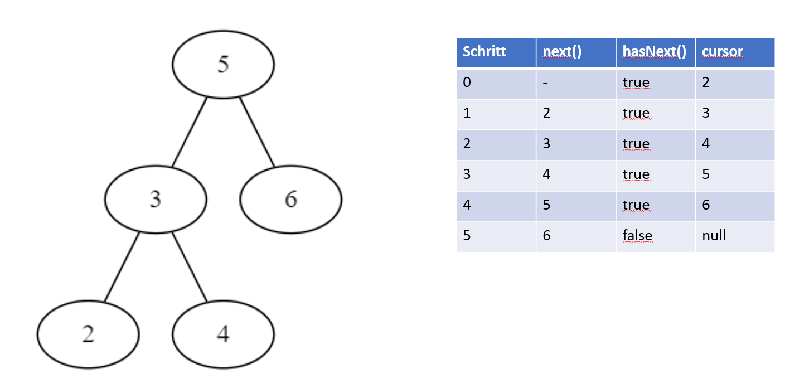

## Motivation
Lorem Ipsum. Starte mit H2-Level.
...

## Collection

{web_width="80%"}
Beispiel collection_example

::: notes
* `Collection`ist ein Interface des JDK.
* Klassen die `Collection` implementieren speichern eine Menge an Objekten.
* Bieten Methoden zum Verwalten dieser Mengen.
* Unteranderen gibt es die aus ADS bekannten Datentypen wie Listen, Sets, Queues etc.
* `List`Collections sind eine geordnete Liste an Objekten. Objekte können an jede Stell der Liste eingefügt, gelöscht oder geändert werden. Mithilfe des Index greift man auf ein spezifisches Objekt innerhalb der Liste zu.
* `Queue` Collections sind eine geordnete Liste an Objekten. Objekte können nur an das Ende der Liste hinzugefügt werden und nur das Objekt am Anfang der Liste (head) kann verwendet oder gelöscht werden (First in first out). 
* `Set` Collections sind eine ungeordnete Menge an Objekten. Objekte können in einem Set nur einmal enthalten sein. Über das Set kann nicht direkt auf das Objekt zugegriffen werden. Es kann aber geprüft werden ob ein spezifisches Objekt in einem Set ist.
:::

## Unterschiedliche List Typen

Beispiel: collection_example
note:::
* ArrayList
* LinkedList
* Vector
* Stack
:::

## Iterator

{web_width="80%"}
Beispiel iterator_example

:::note
* Ein Objekt welches das `Iterator<E>`Interface implementiert ist ein Iterator und läuft eine spezifische Datenstruktur sequenziell durch.
* Mithilfe eines Cursor merkt sich der Iterator, bei welchem Eintrag der Datenstrukut er aktuell ist.
* Mit `forEachReaining(Consumer<? super E> action)` kann eine Aktion auf alle verbleibenden Elemente in der Datenstruktur angewendet werden. Diese Methode ist im Interface default implementiert.
* Mit `hasNext()`kann geprüft werden, ob noch ein weiteres Element in der Datenstruktur liegt. 
* Mit `next()`wird der Cursor einen Eintrag weiter geschoben und das Element zurückgegeben.
* Mit `remove()`kann das letzte zurückgegebene Element aus der Datenstruktur entfernt werden. Diese Methode ist im Interface default implementiert. Sie ist optional.
:::

## Collections

{web_width="80%"}
Beispiel collection_example

::: notes
* `Collections`ist eine Klasse mit statischen Methoden, die auf `Collection`s ausgeführt werden.
:::

## equqals() und hashCode()

Beispiel /hash_example

note:::
* `boolean equals(Object o)`ist eine Methode der Java `Object`Class und wird genutzt um Objekte auf Gleichheit zu prüfen. 
* Die dafault implementierung von `equals`gibt nur dann `true` zurück, wenn die beiden zu vergleichenden Objekte identisch sind.
* In der Praxis kann es sich anbieten diese Methode zu überschreieben und eigene Kriterien für Gleichheit aufzustellen.
* Die `int hashCode()` Methode gibt den Hash-Wert eines Objektes zurück. Der Hash-Wert eins Objektes wird genutzt, um dieses in einen Hash-basierten Container abzulegen bzw. zu finden. 
* Wird die Methode `equals` überschrieben, sollte aich die Methode `hashCode` überschrieben werden.

Der `hashCode`-Vertrag
* Der Rückgabewert der `hashCode` Methode für ein Objekt bleibt über die Laufzeit einer Anwendung immer identisch, solange sich die Werte zur prüfung der Gleichheit nicht ändern. 
* Wenn zwei objekte nach der `equals` Methode identisch sind, so ist auch der Rückgabewert der `hashCode` Methode für beide Objekte identisch.
* Sind zwei Objekte nach der `equals`Methode nicht identisch, kann der Rückgabewert der `hashCode`Methode dennoch identisch sein. Unterschiedliche Werte für unterschiedliche Objekte verbessern allerdings die Leistung von Hash-Berechnungen wie `HashMap`. 
:::

## Map

{web_width="80%"}
Beispiel /hash_example

::: notes
* Eine `Map`speichert Objekte als Paar von `Key`und `Value`.
* Ein Paar von `Key`und `Value`ist ein Eintrag. 
* Der `Key`ist in einer Map einzigartig und wird verwendet, um auf `Value`zuzugreifen.
* Ein `Value`kann mehrfach im einer Map enthalten sein.
* Über eine Map kann nicht Traversiert werden, dafür muss die Map in ein Set umgewandelt werden.
* `HashMap`hällt keine Ordnung in den Einträgen. Zugriff auf Einträge in einer `HashMap` ist O(1).
* `LinkedHashMap` hält die Einträge in der Reihenfolge in der Sie eingefügt wurden.
* `TreeMap` hält die Einträge in aufsteigender Reihenfolge. 
:::

## Wrap-Up
* Mit dem `Collection`Interface des Java Collection Frameworks können Datenstrukturen erstellt/verwendet werden, die eine Menge an Objekten speichern und verwalten.
* Die `Collections`Klasse liefert statische Methoden die auf `Collection`s angewendet werden können. 
* Mithilfe eines `Iterator`kann über eine `Collection`iteriert werden.
* Das `Map`Interface wird von Klassen implementiert die Paare (Key,Value) von Objekten speichert.
* `Object.equals(Object o)` wird geutzt um Objekte auf inhaltliche Gleichheit zu prüfen.
* `Object.hashCode()` wird genutzt, um einen Hash-Wert für ein Objekt zu berechnen und in Hash-Containern zu speichern/suchen. 
* Der `hashCode`-Vertrag definiert die Verhaltensweisen von `hashCode()`.  
...

<!-- DO NOT REMOVE - THIS IS A LAST SLIDE TO INDICATE THE LICENSE AND POSSIBLE EXCEPTIONS (IMAGES, ...). -->
::: slides
## LICENSE

Unless otherwise noted, this work is licensed under CC BY-SA 4.0.

\bigskip

### Exceptions
*   TODO (what, where, license)
:::
