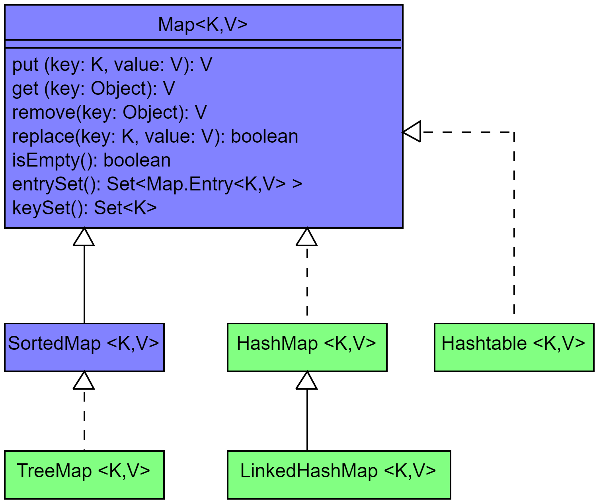

## Motivation
Lorem Ipsum. Starte mit H2-Level.
...

## Collection

{web_width="80%"}
::: notes
* `Collection`ist ein Interface des JDK.
* Klassen die `Collection` implementieren speichern eine Menge an Objekten.
* Bieten Methoden zum Verwalten dieser Mengen.
* Unteranderen gibt es die aus ADS bekannten Datentypen wie Listen, Sets, Queues etc.
* `List`Collections sind eine geordnete Liste an Objekten. Objekte können an jede Stell der Liste eingefügt, gelöscht oder geändert werden. Mithilfe des Index greift man auf ein spezifisches Objekt innerhalb der Liste zu.
* `Queue` Collections sind eine geordnete Liste an Objekten. Objekte können nur an das Ende der Liste hinzugefügt werden und nur das Objekt am Anfang der Liste (head) kann verwendet oder gelöscht werden. 
* `Set` Collections sind eine ungeordnete Menge an Objekten. Objekte können in einem Set nur einmal enthalten sein. Über das Set kann nicht direkt auf das Objekt zugegriffen werden. Es kann aber geprüft werden ob ein spezifisches Objekt in einem Set ist.
:::

## Collections

{web_width="80%"}
::: notes
Alternativ:
:::

## Map

{web_width="80%"}
::: notes
* Eine `Map`speichert Objekte als Paar von `Key`und `Value`.
* Ein Paar von `Key`und `Value`ist ein Eintrag. 
* Der `Key`ist in einer Map einzigartig und wird verwendet, um auf `Value`zuzugreifen.
* Ein `Value`kann mehrfach im einer Map enthalten sein.
* Über eine Map kann nicht Traversiert werden, dafür muss die Map in ein Set umgewandelt werden.
* `HashMap`hällt keine Ordnung in den Einträgen.
* `LinkedHashMap` hält die Einträge in der Reihenfolge in der Sie eingefügt wurden.
* `TreeMap` hält die Einträge in aufsteigender Reihenfolge. 
:::

## Iterator
...

## hashCode() und equals()
...

## ADS?

## Anwendungsbeispiele

## Unterschiedliche List Typen

## Wrap-Up
...

<!-- DO NOT REMOVE - THIS IS A LAST SLIDE TO INDICATE THE LICENSE AND POSSIBLE EXCEPTIONS (IMAGES, ...). -->
::: slides
## LICENSE

Unless otherwise noted, this work is licensed under CC BY-SA 4.0.

\bigskip

### Exceptions
*   TODO (what, where, license)
:::
