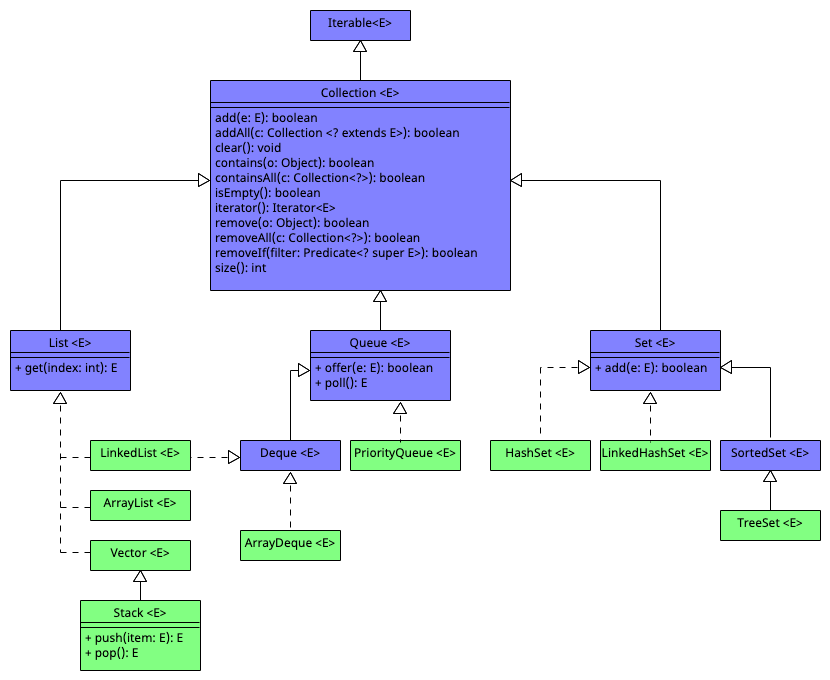

## Motivation
Lorem Ipsum. Starte mit H2-Level.
...

## Collection

{web_width="80%"}
::: notes
* `Collection`ist ein Interface des JDK.
* Klassen die `Collection` implementieren speichern eine Menge an Objekten.
* Bieten Methoden zum Verwalten dieser Mengen.
* Unteranderen gibt es die aus ADS bekannten Datentypen wie Listen, Sets, Queues etc.
* `List`Collections sind eine geordnete Liste an Objekten. Objekte können an jede Stell der Liste eingefügt, gelöscht oder geändert werden. Mithilfe des Index greift man auf ein spezifisches Objekt innerhalb der Liste zu.
* `Queue` Collections sind eine geordnete Liste an Objekten. Objekte können nur an das Ende der Liste hinzugefügt werden und nur das Objekt am Anfang der Liste (head) kann verwendet oder gelöscht werden (First in first out). 
* `Set` Collections sind eine ungeordnete Menge an Objekten. Objekte können in einem Set nur einmal enthalten sein. Über das Set kann nicht direkt auf das Objekt zugegriffen werden. Es kann aber geprüft werden ob ein spezifisches Objekt in einem Set ist.
:::

## Beispiele Collection

## Collections

{web_width="80%"}
::: notes
* `Collections`ist eine Klasse mit statischen Methoden, die auf `Collection`s ausgeführt werden.
:::

## Unterschiedliche List Typen

## Beispiele Collection

## Map

{web_width="80%"}
::: notes
* Eine `Map`speichert Objekte als Paar von `Key`und `Value`.
* Ein Paar von `Key`und `Value`ist ein Eintrag. 
* Der `Key`ist in einer Map einzigartig und wird verwendet, um auf `Value`zuzugreifen.
* Ein `Value`kann mehrfach im einer Map enthalten sein.
* Über eine Map kann nicht Traversiert werden, dafür muss die Map in ein Set umgewandelt werden.
* `HashMap`hällt keine Ordnung in den Einträgen. Zugriff auf Einträge in einer `HashMap` ist O(1).
* `LinkedHashMap` hält die Einträge in der Reihenfolge in der Sie eingefügt wurden.
* `TreeMap` hält die Einträge in aufsteigender Reihenfolge. 
:::

## hashCode() und equals()
...

## Beispiele Map
todo: kann eigentlich raus und einfach als source file

```java
HashMap <String,Integer> lagerbestand = new HashMap<>();
lagerbestand.put("Apfel",12);
lagerbestand.put("Banane",3);
lagerbestand.put("Birne",1);

for(String key : lagerbestand.keySet()) //iterieren über eine Map per KeySet
  lagerbestand.update(key,lagerbestand.get(key)+3);

lagerbestand.putIfAbsent("Apfel",2); //Keine Anpassung, da "Apfel" bereits hinterlegt ist
lagerbestand.putIfAbsent("Orange",33); //Neuer Eintrag "Orange" mit dem Value '33'
```

## Iterator

todo beispiel grafik, code als src file und hier raus, nur verweis

```java
Vector <Integer> vector = new Vector<>();
vector.add(1);
vector.add(2);
vector.add(3);

Iterator <Integer> iterator = vector.iterator();
System.out.println(i.next()); //1
iterator.forEachRemaining(x-> System.out.print(x)); //23
iterator.hasNext(); //false
iterator.next(); //NoSuchElementException
```

todo eigener interator schreiben (als inner class)


:::note
* Ein Objekt welches das `Iterator<E>`Interface implementiert ist ein Iterator und läuft eine spezifische Datenstruktur sequenziell durch.
* Mithilfe eines Cursor merkt sich der Iterator, bei welchem Eintrag der Datenstrukut er aktuell ist.
* Mit `forEachReaining(Consumer<? super E> action)` kann eine Aktion auf alle verbleibenden Elemente in der Datenstruktur angewendet werden. Diese Methode ist im Interface default implementiert.
* Mit `hasNext()`kann geprüft werden, ob noch ein weiteres Element in der Datenstruktur liegt. 
* Mit `next()`wird der Cursor einen Eintrag weiter geschoben und das Element zurückgegeben.
* Mit `remove()`kann das letzte zurückgegebene Element aus der Datenstruktur entfernt werden. Diese Methode ist im Interface default implementiert. Sie ist optional.


## Wrap-Up
* Mit dem `Collection`Interface des Java Collection Frameworks können Datenstrukturen erstellt/verwendet werden, die eine Menge an Objekten speichern und verwalten.
* Die `Collections`Klasse liefert statische Methoden die auf `Collection`s angewendet werden können. 
* Mithilfe eines `Iterator`kann über eine `Collection`iteriert werden.
* Das `Map`Interface wird von Klassen implementiert die Paare (Key,Value) von Objekten speichert.
...


<!-- DO NOT REMOVE - THIS IS A LAST SLIDE TO INDICATE THE LICENSE AND POSSIBLE EXCEPTIONS (IMAGES, ...). -->
::: slides
## LICENSE


Unless otherwise noted, this work is licensed under CC BY-SA 4.0.

\bigskip

### Exceptions
*   TODO (what, where, license)
:::
