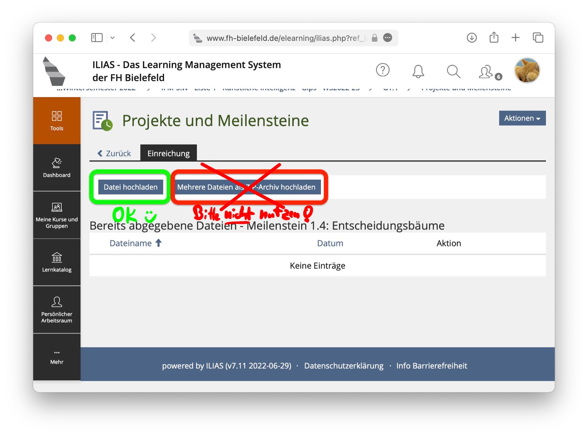
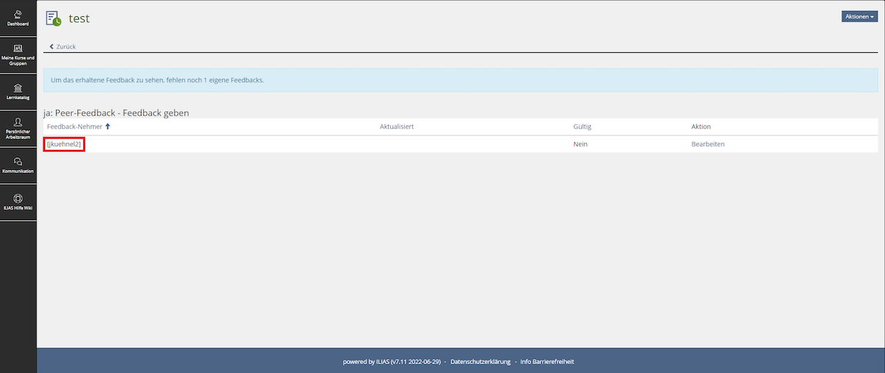
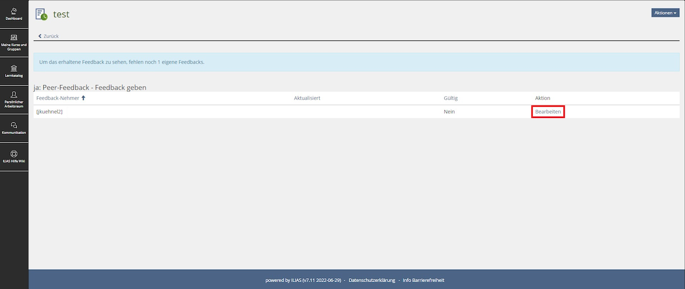
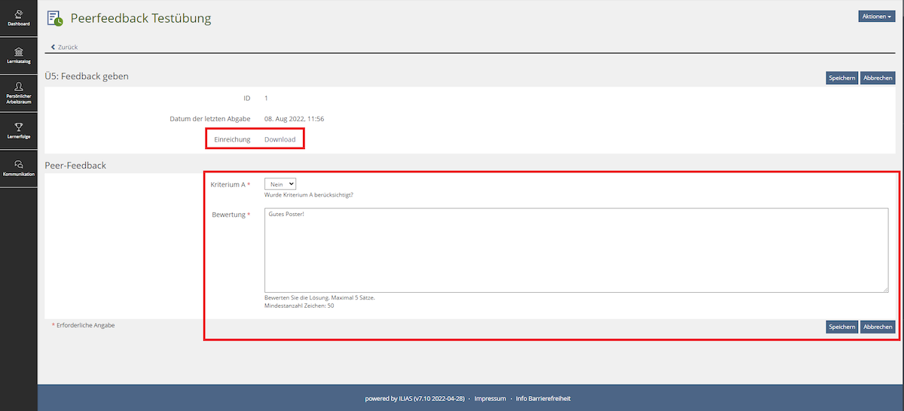

## Flipped Classroom

Wir drehen die Vorlesungen vom Ablauf her "um" - daher die Bezeichnung "Flipped Classroom".

Beim Flipped Classroom arbeiten Sie sich **vor der jeweiligen Vorlesung** selbstständig
durch das für die jeweilige Woche bereitgestellte Material: Skript, Videos, Quizzes,
Literaturhinweise, ..., gern auch bereits durch die Übungsaufgaben.

In der gemeinsamen Vorlesungssitzung wird kein neuer Stoff präsentiert. Wir sprechen
gemeinsam über Ihre Fragen zum aktuellen Thema und werden im Plenum oder in Kleingruppen
passende Fallstudien lösen.

Das setzt voraus, dass Sie vorbereitet in die Stunde kommen und sich aktiv einbringen.

## Prüfungsform "Performanzprüfung"

Die Performanzprüfung besteht aus **zwei Teilprüfungen**, die Sie unabhängig voneinander
absolvieren können: der **praktischen Teilleistung** und der **theoretischen Teilleistung**.

Dies sind zwei getrennte Prüfungsleistungen, für die Sie sich **jeweils separat im LSF**
anmelden müssen. Die Gesamtnote für das Modul entspricht dem Mittelwert aus den beiden
Teilleistungen (50% Praxis, 50% Theorie).

Diese Prüfungsform gilt automatisch für alle Studierenden in Programmiermethoden, die nicht
bereits früher unter einer anderen Prüfungsform in Programmiermethoden eine Prüfungsleistung
abgelegt oder begonnen haben.

(vgl. auch "Regelung für Wiederholer").

## Regelung für Wiederholer

### Performanzprüfung

Wer bereits früher in Programmiermethoden eine Prüfungsleistung unter der Prüfungsform
"Performanzprüfung" abgelegt hat und diese Prüfung noch nicht abgeschlossen hat, belegt
die fehlenden Teilleistungen in diesem Semester.

Wenn Ihnen die **theoretische Teilleistung** fehlt, dann nehmen Sie an der Klausur teil
(d.h. für den ersten Prüfungszeitraum an den beiden kürzeren Prüfungen, für den zweiten
Prüfungszeitraum an der längeren E-Klausur).

Wenn bei Ihnen die **praktische Teilleistung** noch offen ist, nehmen Sie entsprechend
am Praktikum teil.

Melden Sie sich für die jeweilige Teilleistung im LSF an.

### Parcours-Prüfung

Wer bereits früher in Programmiermethoden eine Prüfungsleistung unter der Prüfungsform
"Parcours-Prüfung" abgelegt hat und diese Prüfung noch nicht abgeschlossen hat, belegt
in diesem Semester sowohl das **Praktikum** als auch die **Klausur**.

Sie bekommen auf beide Teile eine (interne) Teilnote, die gemittelt die Note in der
Parcours-Prüfung ergeben.

Sie müssen sich entsprechend im LSF sowohl für die **praktische Teilleistung** als auch
für die **theoretische Teilleistung** anmelden.

**Bitte melden Sie sich zeitnah (_vor Beginn der Praktika_) per E-Mail beim Dozenten.**

## 2-Wochen-Zyklen im Praktikum

In diesem Semester gibt es einen 2-Wochen-Rhythmus im Praktikum.

### Erste Woche: Konzeptphase

In der ersten Woche suchen Sie sich die zu bearbeitenden Aufgaben aus und erstellen ein
Lösungskonzept. Dieses laden Sie bis zur Deadline als PDF in die jeweilige ILIAS-Aufgabe
hoch.

Anschließend erfolgt eine Peer-Feedback-Phase. Das System weist Ihnen mehrere Abgaben zu
und Sie haben einen Tag Zeit, um Ihr Feedback im ILIAS abzugeben.

Am Freitag in der ersten Woche stellen Sie Ihr Konzept im Praktikum vor. Dabei ist jedes
Teammitglied anwesend und kann Auskunft geben.

### Zweite Woche: Implementierungsphase

Danach treten Sie in die zweite Woche des aktuellen Zyklus ein und setzen Ihr Konzept in
eine Implementierung um. Diese laden als ZIP-Datei bis zur Deadline als Abgabe in die
jeweilige ILIAS-Aufgabe hoch.

Anschließend erfolgt eine erneute Peer-Feedback-Phase. Das System weist Ihnen mehrere
Abgaben zu und Sie haben einen Tag Zeit, um Ihr Feedback im ILIAS abzugeben.

Am Freitag in der zweiten Woche stellen Sie Ihre Lösung im Praktikum vor. Dabei ist jedes
Teammitglied anwesend und kann Auskunft geben.

### Überarbeitung nach Feedback

Sie können das Feedback in beiden Wochen nutzen, um Ihre Lösung zu verbessern. Die
Überarbeitung darf sich aber nur auf die Kritik im Feedback beziehen.

## Bearbeitung der Übungsaufgaben

Die Übungsaufgaben sollen in 3er-Teams bearbeitet und gelöst werden. Die Einteilung
wird über Etherpads im ILIAS passieren.

Sie können Ihre Teams gern auch im Semester wechseln, dazu müssen Sie einfach nur den
Eintrag in den Etherpads im ILIAS anpassen.

Sie können sich in jedem Zyklus die Aufgaben relativ frei auswählen; natürlich hängen
aber bestimmte Aufgaben von anderen Aufgaben ab.

## Workload Praktikum

Pro **Zyklus** sollen Sie aus Aufgaben für **15 Punkte** bearbeiten.

Sie können auch mehr machen, aber wir limitieren die maximal erreichbare Punktzahl
hier auf _15 Punkte pro Woche_.

Dazu kommen dann in den Zyklen 3 bis 5 noch je bis zu 5 Punkte für die Codequalität.

## Abgabe der Lösungen

Bitte laden Sie Ihre Lösung als eine **PDF-Datei** (Konzeptphase) oder als ein
**Zip-Archiv** (Implementierungsphase) in die jeweilige Aufgabe im ILIAS hoch.

Dies passiert jeweils **1x pro Team**: Eine Person lädt die Lösung hoch und trägt
dabei die anderen Teammitglieder mit im ILIAS ein.

_Anmerkung_: Falls Sie mehrere Dateien hochladen wollen, erzeugen Sie bitte vor
dem Upload lokal ein Zip-Archiv, welches Sie dann per Button "Datei einreichen"
hochladen und abgeben. Bitte _nicht_ den Button "Mehrere Dateien als Zip-Archiv
hochladen" nutzen!

{width="80%"}

## Peer-Feedback: How to Review

Sobald die Abgabefrist für eine Aufgabe abgelaufen ist, verteilt ILIAS automatisch
an alle, die selbst eine Lösung hochgeladen haben, zufällige Aufforderungen zum
Review anderer Abgaben.

Sie finden die angeforderten Reviews im ILIAS in der jeweiligen Aufgabe.

{width="80%"}

Gehen Sie **nach der Deadline der Aufgabe** (i.d.R. Mittwoch 18 Uhr) und
**vor der Deadline des Reviews** (i.d.R. Donnerstag 15 Uhr) ins ILIAS in die
Aufgabe und klicken auf den Button "Feedback geben", um nachzuschauen, wem Sie
ein Peer-Feedback geben sollen.

{width="80%"}

Indem Sie auf "Bearbeiten" klicken, finden Sie hier die Kriterien für die Reviews
in Form von kurzen Checklisten, sowie die Abgabe des zu bewertenden Peers, welche
Sie über den Download-Button herunterladen können. Hier ist auch das Feedback
einzutragen.

{width="80%"}
{width="80%"}

_Hinweis_: Wenn bei den Review-Fragen mit den "Ja/Nein"-Checkboxen alle Kriterien
mit "Nein" beantwortet werden mussten, also keine der Checkboxen angehakt werden
kann, schreiben Sie bitte einen entsprechenden Kommentar in das Freitextfeld. Sonst
können Sie das Review nicht absenden.

_Hinweis_: Es kann passieren, dass ILIAS Ihnen die Lösung Ihres eigenen Teams zuweist.
In diesem Fall führen Sie bitte kein vollständiges Review durch, sondern wählen Sie
den entsprechenden Punkt auf der Checkliste aus ("eigenes Team").

Nachdem Sie fristgemäß die geforderte Anzahl an Feedbacks vergeben haben, wird in der
Aufgabe ein weiterer Button "Erhaltenes Feedback zeigen" freigeschaltet, über welchen
Sie das an Sie vergebene Feedback einsehen können.

{width="80%"}

Die Reviews sollen Ihnen helfen, Ihre Lösung zu reflektieren und einzuordnen. Beim
Erstellen der Feedbacks sehen Sie anhand der Kriterien, welche Aspekte wichtig waren
und wo Sie vielleicht noch einmal nachschauen sollten. Das von den anderen Studierenden
empfangene Feedback kann Sie im Lernprozess unterstützen - nutzen Sie die Chance und
überarbeiten Sie Ihre Lösung anhand des Feedbacks. Bitte beachten Sie aber auch, dass
das empfangene Feedback von sehr unterschiedlicher Qualität sein kann und deshalb stets
kritisch hinterfragt werden sollte.

## Vorstellung der Lösungen

Im Praktikum stellen Sie Ihre Lösungen vor und diskutieren darüber.

Wer nicht in der Vorstellung teilnimmt oder wer zwar anwesend ist, aber nicht auf Fragen
anworten kann/will, kann leider keine Punkte bekommen.

## Zeitslots für Vorstellung

Wir werden mit jedem Team einen individuellen Abgabeslot in Ihrer Praktikumsgruppe
vereinbaren, damit Sie im Praktikum zielgerichtet zu Ihrer Abgabe kommen können und
so Wartezeiten vermeiden können.

Dazu gibt es vorbereitete Etherpads im ILIAS, wo Sie sich mit Ihrem Team für einen
Abgabeslot eintragen.

## Verteilung der Punkte

Sie können sich in jedem Zyklus Aufgaben für 15 Punkte frei aussuchen.

Dabei kann jede Aufgabe natürlich nur einmal bearbeitet und abgeben werden. Die
"freien Aufgaben" können dagegen mehrfach bearbeitet werden, sofern Sie jedes Mal
andere Inhalte wählen.

Um in einem Zyklus die Punkte zu bekommen, ist nicht nur guter Code notwendig. Sie
müssen auch an den "Vorarbeiten" ausreichend teilgenommen haben. Das bedeutet, dass
Sie jeden der sechs Schritte erfolgreich durchlaufen haben:

1.  Fristgerechte Einreichung der ausreichenden Konzeptskizze,
2.  Sinnvolles Peer-Feedback für die Konzepte,
3.  Vorstellung der Konzeptskizze im Praktikum,
4.  Fristgerechte Einreichung der Implementierung,
5.  Sinnvolles Peer-Feedback für die Implementierungen,
6.  Vorstellung der Implementierung im Praktikum.

## Verspätete Abgaben, Krankheit

Es gibt keine verspäteten Abgaben. Das sind 0P.

Bei Krankheit/familiären Notfällen:
Es gibt eine zusätzliche Abgabe in der letzten Vorlesungswoche. Dieser Termin steht allen
offen, die sonst zu wenig Punkte im Praktikum gesammelt haben oder wegen Krankheit einmal
"ausgefallen" sind. Bei diesem Termin können Sie alleine oder im Team abgeben; die Konzeptphase
und die beiden Peer-Feedbacks entfallen.

Wenn die persönliche Ausnahmesituation länger vorliegen sollte, müssen ggf. andere
Lösungen gefunden werden, um das Semester erfolgreich abschließen zu können. Nehmen
Sie in diesem Fall zeitnah Kontakt zu Ihren Dozenten auf.

## Bonus-Punkte: Helfen im Framework

Sie können aktiv dabei helfen, das Dungeon-Framework weiterzuentwickeln und sich so Bonus-Punkte
für das Praktikum erarbeiten.

Dazu reichen Sie Ihre Lösung für die Bounty-Aufgaben als Pull-Request ein. Sie können aber auch
Fehler beheben oder Features implementieren, die Sie gerne im Dungeon sehen würden, oder ein bereits
bestehendes Issue mit dem Label "help wanted" bearbeiten. Wenn Sie kein bereits existierendes Issue
bearbeiten, also ein neues Feature implementieren wollen, erstellen Sie bitte zunächst ein Issue, um
Ihre Idee mit dem Dungeon-Team zu diskutieren und vorab zu prüfen, ob wir einen PR dazu akzeptieren
würden!

Für einen **akzeptierten PR** können Sie bis zu 5 Bonus-Punkte erhalten. Es gibt _keinen Anspruch_
auf einen Merge, die Entscheidung liegt beim Dozenten.

Bei der Bepunktung betrachten wir nicht nur den Fix/Code selbst, sondern auch Ihren Umgang mit Git
und die Qualität der Kommunikation innerhalb von GitHub (Issue-Beschreibungen, PR-Beschreibungen etc.)
sowie den Umfang des Problems. Angedacht ist die Aufteilung bis zu 2P bei Merge, und bis zu 3P für
das Verhalten und die Kommunikation im PR.

Weitere Informationen darüber, wie Sie am Framework mitarbeiten können, finden Sie in der
[CONTRIBUTING.md](https://github.com/Programmiermethoden/Dungeon/blob/master/CONTRIBUTING.MD).
