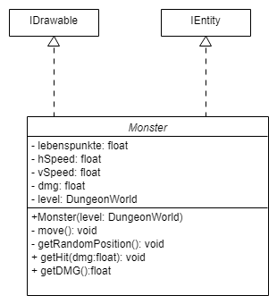

# Aufgabe

Das Dungeon soll um mindestens zwei Monster erweitert werden. Die Monster sollen
unterschiedliche Eigenschaften haben und sich zufällig im Dungeon bewegen.

# Ansatz und Modellierung

Da mehrere Monster erstellt werden sollen, diese sich jedoch viele Eigenschaften
teilen, wird eine abstrakte Klasse `Monster` als Basisklasse für Monster erstellt.
Die `Monster`-Klasse stellt alle grundlegenden Eigenschaften und Funktionen eines
Monsters bereit.

Da Monster auch im Dungeon gezeichnet werden müssen, implementiert die Klasse
`Monster` das Interface `IDrawable`. Die Monster sollen vom `EntityController`
verwaltet werden, daher implementiert die Klasse auch das Interface `IEntity`.

## Monster haben zusätzlich folgende Grundeigenschaften:

-   `float Lebenspunkte`: Geben die verbleibenden Lebenspunkte des Monsters an
    -   Hat das Monster 0 Lebenspunkte, wird es mit Hilfe der `deletable`-Methode
        aus dem `EntityController`entfernt.
-   `float hSpeed`: Die Geschwindigkeit, in der sich das Monster horizontal bewegt
-   `float vSpeed`: Die Geschwindigkeit, in der sich das Monster vertikal bewegt
-   `float dmg`: Den Schaden, den das Monster im Kampf macht
-   `dungeonWorld level`: Genau wie der Held müssen auch Monster das Level kennen,
    um sich darin zu bewegen. Wird im Konstruktor gesetzt.

## Monster haben zusätzlich folgende Grundfunktionen:

-   `void move()`: Bewegt das Monster in eine zufällige Richtung

    Dafür verwenden wir zwei Zufallszahlen: Die erste Zahl gibt an, ob sich das
    Monster nach rechts oder links bewegt, die zweite Zahl, ob sich das Monster
    nach oben oder unten bewegt. Zusätzlich gibt es die Chance, dass ein Monster
    sich gar nicht bewegt.

    ```java
    int linksOrechts = getRandomZahl(0,1);
    int obenOunten = getRandomZahl(0,1);

    //30% Chance, sich nicht zu bewegen
    if (getRandomZahl(0,100) > 30) {
        //horizontal
        if (linksOrechts == 0) {
            this.x += this.hSpeed;
        } else {
            this.x -= this.hSpeed;
        }

        //vertikal
        if (obenOunten == 0) {
            this.y += this.vSpeed;
        } else {
            this.y -= this.vSpeed;
        }
    }
    ```

-   `void getHit(float dmg)`: Zieht dem Monster Lebenspunkte ab
-   `float getDMG()`: Gibt Schaden zurück
-   `getRandomPosition()`: Wird im Konstruktor aufgerufen, sucht sich eine
    zufällige Position im Dungeon als Spawn-Punkt

## Daraus ergibt sich folgendes UML:



## Beschreibung der konkreten Monster:

1.  Zombie:
    -   Hat 5 Lebenspunkte
    -   Macht 0.5 Schaden
    -   Bewegt sich sowohl vertikal als auch horizontal mit 0.1f
    -   Bewegt sich in eine zufällige Richtung

2.  Einbeiniger Pirat:
    -   Hat 3 Lebenspunkte
    -   Macht 1 Schaden
    -   Bewegt sich nur horizontal
        -   hSpeed=0.2f;
        -   vSpeed=0f;

Monster werden beim Laden eines Levels im Dungeon verteilt. Dafür erstellen
wir die Funktion `spawnMonster` in unserem `MainController`, welche in der
`onLevelLoad`-Methode aufgerufen wird.

`spawnMonster` erstellt eine zufällige Anzahl an Monstern (zwischen 5 und 10),
platziert diese mit Hilfe von `getRandomPointInDungeon` (wie beim Helden) im
Dungeon und fügt Sie dem `EntityController` hinzu.

Verlässt der Spieler das Level, werden alle Monster aus dem `EntityController`
gelöscht. Dafür wird die gesamte Liste des `EntityController` gelöscht und der
Held neu hinzugefügt.


# Umsetzung

## 28.04.

-   Erstellen der Monster-Klasse nach Modellierung (1h)
-   Erstellen der spezifischen Monster nach Modellierung (1h)
-   Monster im Dungeon spawnen lassen nach Modellierung (1h)
-   Implementierung einer zusätzlichen Kollisionsabfrage in der `move`-Methode (0.5h)


# Postmortem

Da wir uns viel Zeit und Gedanken bei der Modellierung der Lösung gemacht haben,
konnten wir diese fast wie geplant umsetzen.

Wir sind auf ein Problem bei unserer Modellierung gestoßen: Unsere Monster bewegen
sich auch durch Wände. Die Lösung ist, in der `move`-Methode genau wie beim Held eine
Kollisionsabfrage durchzuführen. Ist das Feld unbetretbar, bewegt sich das Monster
dadurch in diesem Frame nicht.

Durch unsere Monster-Basisklasse können wir auch in Zukunft schnell und einfach neue
Monster im erstellen (Geister, welche durch Wände gehen können?!).
