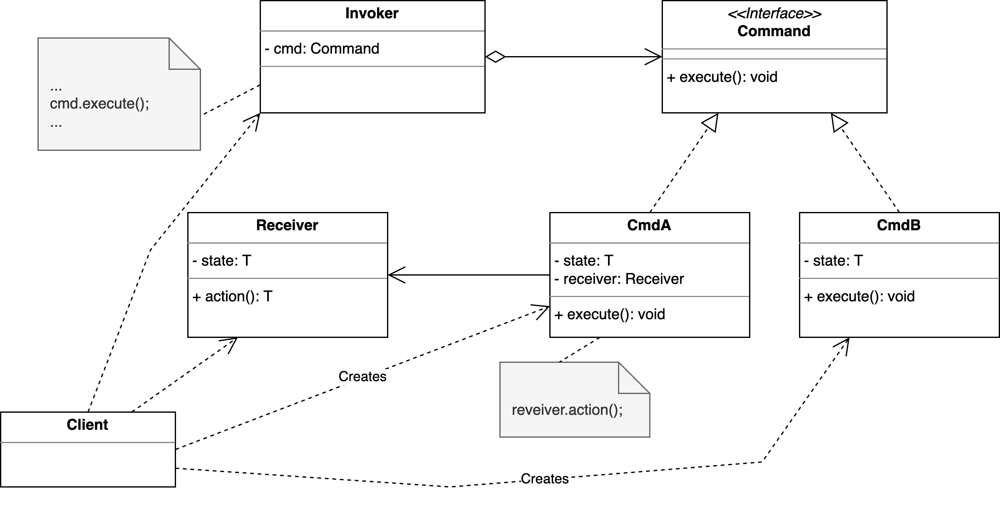

## Motivation

::: notes
Irgendwo im Dungeon wird es ein Objekt einer Klasse ähnlich wie `InputHandler`
geben mit einer Methode ähnlich zu `handleInput()`:
:::

```java
public class InputHandler {
    public void handleInput() {
        switch (isPressed()) {
            case BUTTON_W -> hero.jump();
            case BUTTON_A -> hero.moveX();
            case ...
            default -> { ... }
        }
    }
}
```

::: notes
Diese Methode wird je Frame einmal aufgerufen, um auf eventuelle Benutzereingaben
reagieren zu können. Je nach gedrücktem Button wird auf den Hero eine bestimmte
Aktion ausgeführt ...

Das funktioniert, ist aber recht unflexibel. Die Aktionen sind den Buttons fest
zugeordnet und erlauben keinerlei Konfiguration.
:::


## Auflösen der starren Zuordnung über Zwischenobjekte

```java
public interface Command {
    void execute();
}

public class Jump implements Command {
    private Entity e;
    public void execute() { e.jump(); }
}

public class InputHandler2 {
    private final Command wbutton = new Jump(hero);   // Über Ctor/Methoden setzen!
    private final Command abutton = new MoveX(hero);  // Über Ctor/Methoden setzen!

    public void handleInput() {
        switch (isPressed()) {
            case BUTTON_W -> wbutton.execute();
            case BUTTON_A -> abutton.execute();
            case ...
            default -> { ... }
        }
    }
}
```

::: notes
Die starre Zuordnung "Button : Aktion" wird aufgelöst und über Zwischenobjekte konfigurierbar
gemacht.

Für die Zwischenobjekte wird ein Typ `Command` eingeführt, der nur eine `execute()`-Methode
hat. Für jede gewünschte Aktion wird eine Klasse davon abgeleitet, diese Klassen können auch
einen Zustand pflegen.

Den Buttons wird nun an geeigneter Stelle (Konstruktor, Methoden, ...) je ein Objekt der
jeweiligen Command-Unterklassen zugeordnet. Wenn ein Button betätigt wird, wird auf dem
Objekt die Methode `execute()` aufgerufen.

Damit die Kommandos nicht nur auf den Helden wirken können, kann man den Kommando-Objekten
beispielsweise noch eine Entität mitgeben, auf der das Kommando ausgeführt werden soll. Im
Beispiel oben wurde dafür der `Hero` genutzt.
:::


## Command: Objektorientierte Antwort auf Callback-Funktionen

{width="80%"}

::: notes
Im Command-Pattern gibt es vier beteiligte Parteien: Client, Receiver, Command und Invoker.

Ein Command ist die objektorientierte Abstraktion eines Befehls. Es hat möglicherweise
einen Zustand, und man kann ein Kommando durch den Aufruf der `execute()`-Methode auf dem
Objekt ausführen. Dabei wird auf dem Receiver dann eine vorher verabredete Methode ausgeführt.
(Ein Command-Objekt kennt also "seinen" Receiver.)

Ein Receiver ist eine Klasse, die Aktionen durchführen kann. Sie kennt die anderen Akteure
nicht.

Der Invoker (manchmal auch "Caller" genannt) ist eine Klasse, die Commands aggregiert und die
die Commandos "ausführt", indem hier die `execute()`-Methode aufgerufen wird.

Der Client ist ein Programmteil, der ein Command-Objekt aufbaut und dabei einen passenden
Receiver übergibt und der das Command-Objekt dann an den Invoker weiterreicht.


In unserem Beispiel lassen sich die einzelnen Teile so sortieren:

*   Client: Klasse `InputHandler` (erzeugt neue `Command`-Objekte im obigen Code) bzw. `main()`,
    wenn man die `Command`-Objekte dort erstellt und an den Konstruktor von `InputHandler`
    weiterreicht
*   Receiver: Klasse `Hero` (auf diesem wird eine Aktion ausgeführt)
*   Command: `Jump` und `MoveX`
*   Invoker: `InputHandler` (in der Methode `handleInput()`)
:::


## Folie 3

```java
public interface Command {
    void execute();
    Command newCommand(Entity e);
}

public class Jump implements Command {
    private Entity e;

    public void execute() { e.jump(); }
    Command newCommand(Entity e) { return new Jump(e); }
}

public class InputHandler {
    Command xbutton = new Jump();  // oder über Methoden setzen

    void handleInput() {
        Entity e = getSelectedEntity();
        Command c;

        if (isPressed(BUTTON_X)) c = xbutton.newCommand(e);
        else if ...

        c.execute();
    }
}
```

Jetzt kann jedes Command-Objekt eine neue Instanz erzeugen mit der
Entity, die dann dieses Kommando empfangen soll.


## Undo

```java
public interface Command {
    void execute();
    void undo();
    Command newCommand(Entity e);
}

public class MoveX implements Command {
    private Entity e;
    private int oldx;

    public void execute() { oldx = e.getX(); e.move(); }
    public void undo() { e.setX(oldx); e.move(); }
    Command newCommand(Entity e) { return new MoveX(e); }
}

public class InputHandler {
    Command xbutton = new Jump();   // oder über Methoden setzen
    Command wbutton = new MoveX();  // oder über Methoden setzen
    Stack<Command> s = new Stack<>;

    void handleInput() {
        Entity e = getSelectedEntity();

        if (isPressed(BUTTON_X)) s.push(xbutton.newCommand(e));
        else if (isPressed(BUTTON_W)) s.push(wbutton.newCommand(e));
        else if (isPressed(BUTTON_Z)) s.pop().undo();
        else if ...

        s.peek().execute();
    }
}
```

Über den Stack bekommt man ein Undo ...


## Wrap-Up
...


<!-- DO NOT REMOVE - THIS IS A LAST SLIDE TO INDICATE THE LICENSE AND POSSIBLE EXCEPTIONS (IMAGES, ...). -->
::: slides
## LICENSE


Unless otherwise noted, this work is licensed under CC BY-SA 4.0.
:::
