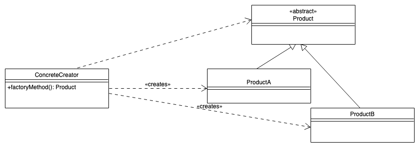

## Einschub Factory-Method-Pattern

## Hands-On: Ticketautomat (10 Minuten)

Implementieren Sie einen Ticketautomaten, der verschiedene Tickets mit
Hilfe des Factory-Method Entwurfsmusters generiert.

\bigskip

*   Nutzer geben Fahrtziel an (und nicht die Ticketart!)
*   Ticketautomat erstellt passendes Ticket
    *   User muss nicht die konkreten Ticketarten kennen
    *   Ticketarten lassen sich leicht austauschen

    => Objekte sollen nicht direkt durch den Nutzer erzeugt werden

[Konsole: factory.FactoryBeispiel]{.bsp}

## Wrap-Up

TODO

<!-- DO NOT REMOVE - THIS IS A LAST SLIDE TO INDICATE THE LICENSE AND POSSIBLE EXCEPTIONS (IMAGES, ...). -->
::: slides
## LICENSE

Unless otherwise noted, this work is licensed under CC BY-SA 4.0.
:::
