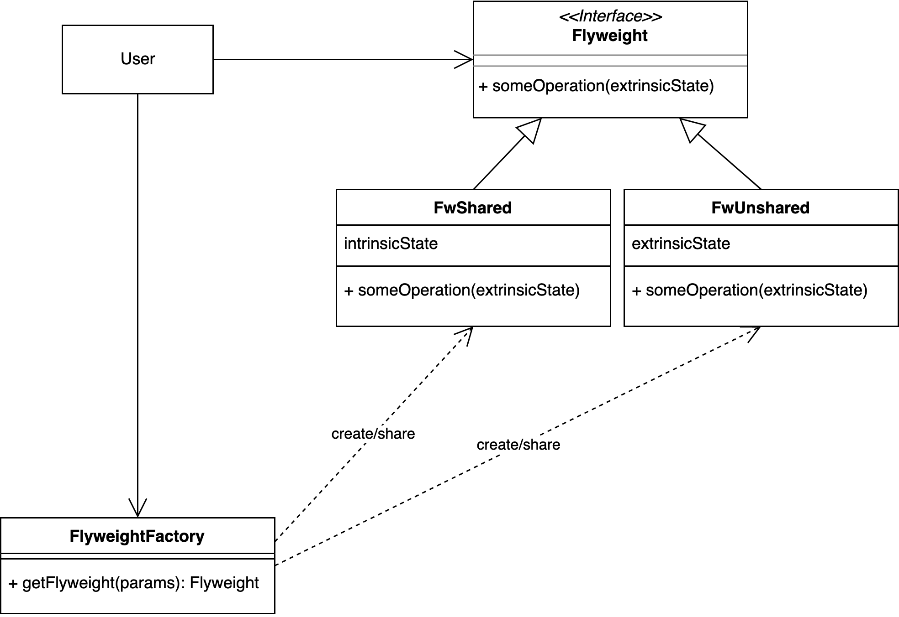
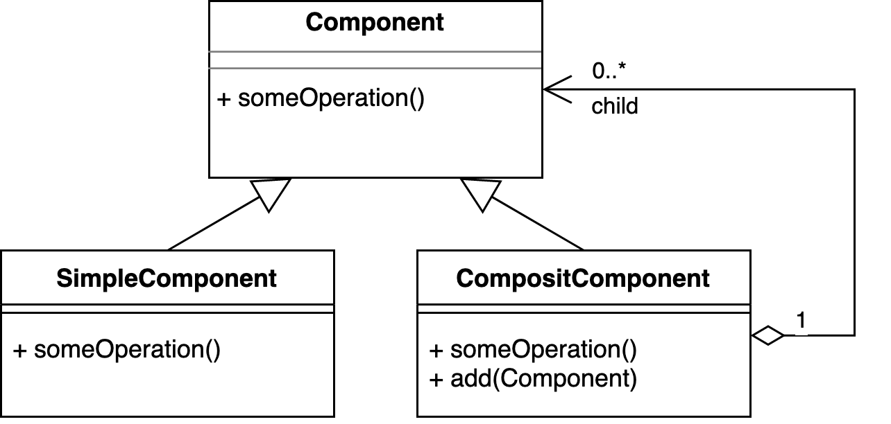

## Motivation: Modellierung eines Levels

::: notes
### Variante I: Einsatz eines Enums für die Felder
:::

```{.java size="footnotesize"}
public enum Tile { WATER, FLOOR, WALL, ... }

public class Level {
    private Tile[][] tiles;

    public Level() {
        tiles[0][0] = Tile.WALL;  tiles[1][0] = Tile.WALL;   tiles[2][0] = Tile.WALL;  ...
        tiles[0][1] = Tile.WALL;  tiles[1][1] = Tile.FLOOR;  tiles[2][1] = Tile.FLOOR; ...
        tiles[0][2] = Tile.WALL;  tiles[1][2] = Tile.WATER;  tiles[2][2] = Tile.FLOOR; ...
        ...
    }

    public boolean isAccessible(int x, int y) {
        switch (tiles[x][y]) {
            case: WATER: return false;
            case: FLOOR: return true;
            ...
        }
    }
    ...
}
```

::: notes
Ein Level kann als Array mit Feldern modelliert werden. Die Felder selbst könnten mit
Hilfe eines Enums repräsentiert werden.

Allerdings muss dann bei jedem Zugriff auf ein Feld und dessen Eigenschaften eine
entsprechende `switch/case`-Fallunterscheidung eingebaut werden. Damit verstreut man
die Eigenschaften über die gesamte Klasse, und bei jeder Änderung am Enum für die Tiles
müssen _alle_ `switch/case`-Blöcke entsprechend angepasst werden.
:::


::: slides
## Motivation: Modellierung eines Levels (cnt.)
:::

::: notes
### Variante II: Einsatz einer Klasse/Klassenhierarchie für die Felder
:::

```{.java size="footnotesize"}
public abstract class Tile {
    protected boolean isAccessible;
    protected Texture texture;
    public boolean isAccessible() { return isAccessible; }
}
public class Floor extends Tile {
    public Floor() { isAccessible = true;  texture = Texture.loadTexture("path/to/floor.png"); }
}
...

public class Level {
    private final Tile[][] tiles;

    public Level() {
        tiles[0][0] = new Wall();  tiles[1][0] = new Wall();   tiles[2][0] = new Wall();  ...
        tiles[0][1] = new Wall();  tiles[1][1] = new Floor();  tiles[2][1] = new Floor(); ...
        tiles[0][2] = new Wall();  tiles[1][2] = new Water();  tiles[2][2] = new Floor(); ...
        ...
    }
    public boolean isAccessible(int x, int y) { return tiles[x][y].isAccessible(); }
}
```

::: notes
Hier werden die Felder über eine Klassenhierarchie mit gemeinsamer Basisklasse modelliert.

Allerdings wird hier die Klassenhierarchie unter Umständen sehr schnell sehr umfangreich.
Außerdem werden Eigenschaften wie Texturen beim Anlegen der Tile-Objekte immer wieder neu
geladen und entsprechend mehrfach im Speicher gehalten (großer Speicherbedarf).
:::


## Flyweight: Nutze gemeinsame Eigenschaften gemeinsam

::: notes
Idee: Eigenschaften, die nicht an einem konkreten Objekt hängen, werden in gemeinsam genutzte
Objekte ausgelagert (Shared Objects/Memory).

Ziel: Erhöhung der Speichereffizienz (geringerer Bedarf an Hauptspeicher, geringere Bandbreite
bei der Übertragung der Daten/Objekt an die GPU, ...).

### Lösungsvorschlag I
:::

```{.java size="footnotesize"}
public final class Tile {
    private final boolean isAccessible;
    private final Texture texture;
    public boolean isAccessible() { return isAccessible; }
}

public class Level {
    private static final Tile FLOOR = new Tile(true,  Texture.loadTexture("path/to/floor.png"));
    private static final Tile WALL  = new Tile(false, Texture.loadTexture("path/to/wall.png"));
    private static final Tile WATER = new Tile(false, Texture.loadTexture("path/to/water.png"));

    private final Tile[][] tiles;

    public Level() {
        tiles[0][0] = WALL;  tiles[1][0] = WALL;   tiles[2][0] = WALL;  ...
        tiles[0][1] = WALL;  tiles[1][1] = FLOOR;  tiles[2][1] = FLOOR; ...
        tiles[0][2] = WALL;  tiles[1][2] = WATER;  tiles[2][2] = FLOOR; ...
        ...
    }
    public boolean isAccessible(int x, int y) { return tiles[x][y].isAccessible(); }
}
```

::: notes
Man legt die verschiedenen Tiles nur je _einmal_ an und nutzt dann Referenzen auf diese Objekte.
Dadurch werden die speicherintensiven Elemente wie Texturen o.ä. nur je einmal geladen und im
Speicher vorgehalten.

Bei dieser Modellierung können die einzelnen Felder aber keine individuellen Eigenschaften haben,
wie etwa, ob ein Feld bereits durch den Helden untersucht/betreten wurde o.ä. ...
:::


::: slides
## Flyweight: Nutze gemeinsame Eigenschaften gemeinsam (cnt.)
:::

::: notes
### Lösungsvorschlag II
:::

```{.java size="scriptsize"}
public final class TileModel {
    private final boolean isAccessible;
    private final Texture texture;
    public boolean isAccessible() { return isAccessible; }
}
public final class Tile {
    private boolean wasEntered;
    private final TileModel model;
    public boolean isAccessible() { return model.isAccessible(); }
    public boolean wasEntered() { return wasEntered; }
}

public class Level {
    private static final TileModel FLOOR = new TileModel(true,  Texture.loadTexture("path/to/floor.png"));
    ...

    private final Tile[][] tiles;

    public Level() {
        tiles[0][0] = new Tile(WALL);  tiles[1][0] = new Tile(WALL);   tiles[2][0] = new Tile(WALL);  ...
        tiles[0][1] = new Tile(WALL);  tiles[1][1] = new Tile(FLOOR);  tiles[2][1] = new Tile(FLOOR); ...
        tiles[0][2] = new Tile(WALL);  tiles[1][2] = new Tile(WATER);  tiles[2][2] = new Tile(FLOOR); ...
        ...
    }
    public boolean isAccessible(int x, int y) { return tiles[x][y].isAccessible(); }
}
```

::: notes
In dieser Variante werden die Eigenschaften eines `Tile` in Eigenschaften aufgeteilt, die von den
Tiles geteilt werden können (im Beispiel Textur und Betretbarkeit) und in Eigenschaften, die je
Feld individuell modelliert werden müssen (im Beispiel: wurde das Feld bereits betreten?).

Entsprechend könnte man für das Level-Beispiel ein `TileModel` anlegen, welches die gemeinsamen
Eigenschaften verwaltet. Man erzeugt dann im Level die nötigen Modelle je genau einmal und nutzt
sie, um damit dann die konkreten Felder zu erzeugen und im Level-Array zu referenzieren. Damit
werden Tile-Modelle von Tiles der gleichen "Klasse" gemeinsam genutzt und die Texturen u.ä. nur
je einmal im Speicher repräsentiert.
:::


## Flyweight-Pattern: Begriffe

*   **Intrinsic** State: invariant, Kontext-unabhängig, gemeinsam nutzbar \newline
    => auslagern in gemeinsame Objekte

\bigskip

*   **Extrinsic** State: variant, Kontext-abhängig und kann nicht geteilt werden \newline
    => individuell modellieren


## Flyweight-Pattern: Klassische Modellierung

{width="60%"}

[[Hinweis zum Beispiel: -Interface, -Factory, +Composite]{.bsp}]{.slides}

::: notes
Im klassischen Flyweight-Pattern der "Gang of Four" [@Gamma2011] wird ein gemeinsames Interface
erstellt, von dem die einzelnen Fliegengewicht-Klassen ableiten. Der Nutzer kennt nur dieses
Interface und nicht direkt die implementierenden Klassen.

Das Interface wird von zwei Arten von Klassen implementiert: Klassen, die nur intrinsischen
Zustand modellieren, und Klassen, die extrinsischen Zustand modellieren.

Für die Klassen, die den intrinsischen Zustand modellieren, werden die Objekte gemeinsam genutzt
(nicht im Diagramm darstellbar) und deshalb eine Factory davor geschaltet, die die Objekte der
entsprechenden Fliegengewicht-Klassen erzeugt und dabei darauf achtet, dass diese Objekte nur
einmal angelegt und bei erneuter Anfrage einfach nur wieder zurückgeliefert werden.

Zusätzlich gibt es Klassen, die extrinsischen Zustand modellieren und deshalb nicht unter den
Nutzern geteilt werden können und deren Objekte bei jeder Anfrage neu erstellt werden. Aber
auch diese werden von der Factory erzeugt/verwaltet.

### Kombination mit dem Composite-Pattern

In der Praxis kann man das Pattern so direkt meist nicht einsetzen, sondern verbindet es mit
dem Composite-Pattern:

{width="40%"}

Ein Element kann eine einfache Komponente sein (im obigen Beispiel war das die Klasse `TileModel`)
oder eine zusammengesetzte Komponente, die ihrerseits andere Komponenten speichert (im obigen
Beispiel war das die Klasse `Tile`, die ein Objekt vom Typ `TileModel` referenziert - allerdings
fehlt im obigen Beispiel das gemeinsame Interface ...).

### Level-Beispiel mit Flyweight (vollständig) und Composite

Im obigen Beispiel wurde zum Flyweight-Pattern noch das Composite-Pattern hinzugenommen, aber
es wurde aus Gründen der Übersichtlichkeit auf ein gemeinsames Interface und auf die Factory
verzichtet. Wenn man es anpassen würde, dann würde das Beispiel ungefähr so aussehen:

```java
public interface ITile {
    public boolean isAccessible();
}

public final class TileModel implements ITile {
    private final boolean isAccessible;
    private final Texture texture;

    public boolean isAccessible() { return isAccessible; }
}

public final class Tile implements ITile {
    private boolean wasEntered;
    private final TileModel model;

    public boolean isAccessible() { return model.isAccessible(); }

    public boolean wasEntered() { return wasEntered; }
}

public final class TileFactory {
    private static final TileModel FLOOR = new TileModel(true,  Texture.loadTexture("path/to/floor.png"));
    ...

    public static final ITile getTile(String tile) {
        switch (tile) {
            case "WALL": return new Tile(WALL);
            case "FLOOR": return new Tile(FLOOR);
            case "WATER": return new Tile(WATER);
            ...
        }
    }
}

public class Level {
    private ITile[][] tiles;

    public Level() {
        tiles[0][0] = TileFactory.getTile("WALL");
        tiles[1][0] = TileFactory.getTile("WALL");
        tiles[2][0] = TileFactory.getTile("WALL");
        ...

        tiles[0][1] = TileFactory.getTile("WALL");
        tiles[1][1] = TileFactory.getTile("FLOOR");
        tiles[2][1] = TileFactory.getTile("FLOOR");
        ...

        tiles[0][2] = TileFactory.getTile("WALL");
        tiles[1][2] = TileFactory.getTile("WATER");
        tiles[2][2] = TileFactory.getTile("FLOOR");
        ...

        ...
    }

    public boolean isAccessible(int x, int y) { return tiles[x][y].isAccessible(); }
}
```
:::


::: notes
## Verwandtschaft zum Type-Object-Pattern

Das [Flyweight-Pattern](https://gameprogrammingpatterns.com/flyweight.html) ist sehr ähnlich zum
`[Type-Object-Pattern]()`{=markdown}. In beiden Pattern teilen
sich mehrere Objekte gemeinsame Daten, die über Referenzen auf gemeinsame Hilfsobjekte eingebunden
werden. Die Zielrichtung unterscheidet sich aber deutlich:

*   Beim Flyweight-Pattern ist das Ziel vor allem die Erhöhung der Speichereffizienz, und die
    dort geteilten Daten müssen nicht unbedingt den "Typ" des nutzenden Objekts definieren.
*   Beim Type-Objekt-Pattern ist das Ziel die Flexibilität auf Code-Ebene, indem man die Anzahl
    der Klassen minimiert und die Typen in ein eigenes Objekt-Modell verschiebt. Das Teilen von
    Speicher ist hier nur ein Nebeneffekt.
:::


## Wrap-Up

Flyweight-Pattern: Steigerung der (Speicher-) Effizienz durch gemeinsame Nutzung von Objekten

\bigskip

*   Lagere _Intrinsic State_ in gemeinsam genutzte Objekte aus
*   Modelliere _Extrinsic State_ individuell


<!-- DO NOT REMOVE - THIS IS A LAST SLIDE TO INDICATE THE LICENSE AND POSSIBLE EXCEPTIONS (IMAGES, ...). -->
::: slides
## LICENSE


Unless otherwise noted, this work is licensed under CC BY-SA 4.0.
:::
