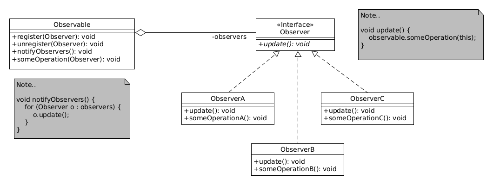

## Verteilung der Prüfungsergebnisse

{width="80%"}

::: notes
Die Studierenden möchten nach einer Prüfung wissen, ob für einen bestimmten Kurs
die/ihre Prüfungsergebnisse im LSF bereit stehen.

Dazu modelliert man eine Klasse `LSF` und implementiert eine Abfragemethode, die
dann alle Objekte regelmäßig aufrufen können. Dies sieht dann praktisch etwa so
aus:

```java
final Person[] persons = { new Lecturer("Frau Holle"),
                           new Student("Heinz"),
                           new Student("Karla"),
                           new Tutor("Kolja"),
                           new Student("Wuppie") };
final LSF lsf = new LSF();

for (Person p : persons) {
    lsf.getGradings(p, "My Module");   // ???!
}
```
:::


## Elegantere Lösung: Observer-Entwurfsmuster

{width="80%"}

::: notes
Sie erstellen im `LSF` eine Methode `register()`, mit der sich interessierte Objekte
beim `LSF` registrieren können.

Zur Benachrichtigung der registrierten Objekte brauchen diese eine geeignete Methode,
die traditionell `update()` genannt wird.
:::

[Demo: [observer](https://github.com/Programmiermethoden/PM-Lecture/blob/master/markdown/pattern/src/observer/)]{.bsp}


## Observer-Pattern verallgemeinert

{width="80%"}

::: notes
Im vorigen Beispiel wurde die Methode `update()` einfach der gemeinsamen Basisklasse `Person`
hinzugefügt. Normalerweise möchte man die Aspekte `Person` und `Observer` aber sauber trennen
und definiert sich dazu ein _separates_ Interface `Observer` mit der Methode `update()`, die
dann alle "interessierten" Klassen (zusätzlich zur bestehenden Vererbungshierarchie) implementieren.

Die Klasse für das zu beobachtende Objekt benötigt dann eine Methode `register()`, mit der sich
Observer registrieren können. Die Objektreferenzen werden dabei einfach einer internen Sammlung
hinzugefügt.

Häufig findet sich dann noch eine Methode `unregister()`, mit der sich bereits registrierte
Beobachter wieder abmelden können. Weiterhin findet man häufig eine Methode `notifyObservers()`,
die man von außen auf dem beobachteten Objekt aufrufen kann und die dann auf allen registrierten
Beobachtern deren Methoden `update()` aufruft. (Dieser Vorgang kann aber auch durch eine sonstige
Zustandsänderung im beobachteten Objekt durchgeführt werden.)

In der Standarddefinition des Observer-Patterns nach [@Gamma2011] werden beim Aufruf der Methode
`update()` keine Werte an die Beobachter mitgegeben. Der Beobachter muss sich entsprechend eine
eigene Referenz auf das beobachtete Objekt halten, um dort dann weitere Informationen erhalten
zu können. Dies kann vereinfacht werden, indem das beobachtete Objekt beim Aufruf der
`update()`-Methode die Informationen als Parameter mitgibt, beispielsweise eine Referenz auf sich
selbst o.ä. ... Dies muss dann natürlich im `Observer`-Interface nachgezogen werden.

**Hinweis**: Es gibt in Swing bereits die Interfaces `Observer` und `Observable`, die aber als
"deprecated" gekennzeichnet sind. Sinnvollerweise nutzen Sie nicht diese Interfaces aus Swing,
sondern implementieren Ihre eigenen Interfaces, wenn Sie das Observer-Pattern einsetzen wollen!
:::


## Wrap-Up

Observer-Pattern: Benachrichtige registrierte Objekte über Statusänderungen

\bigskip

*   Interface `Observer` mit Methode `update()`
*   Interessierte Objekte
    1.  implementieren das Interface `Observer`
    2.  registrieren sich beim zu beobachtenden Objekt (`Observable`)
*   Beobachtetes Objekt ruft auf allen registrierten Objekten `update()` auf
*   `update()` kann auch Parameter haben


<!-- DO NOT REMOVE - THIS IS A LAST SLIDE TO INDICATE THE LICENSE AND POSSIBLE EXCEPTIONS (IMAGES, ...). -->
::: slides
## LICENSE


Unless otherwise noted, this work is licensed under CC BY-SA 4.0.
:::
