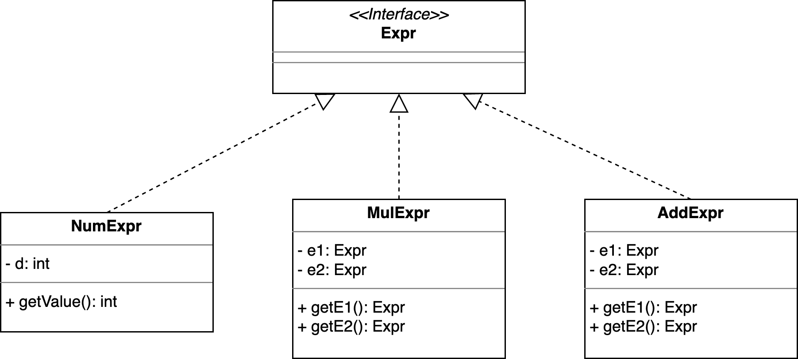
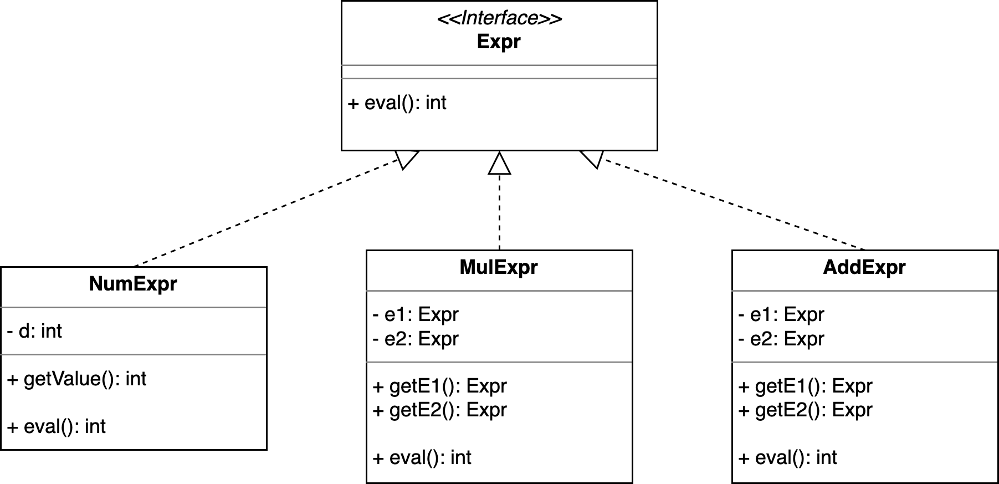
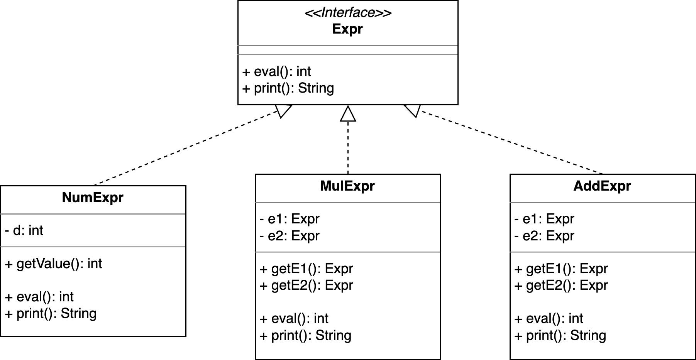

## Motivation: Parsen von "5*4+3"

::::::::: {.columns}
:::::: {.column width="50%"}

::: notes
Zum Parsen von Ausdrücken (_Expressions_) könnte man diese einfache Grammatik
einsetzen. Ein Ausdruck ist dabei entweder ein einfacher Integer oder eine
Addition oder Multiplikation zweier Ausdrücke.
:::

```yacc
expr : e1=expr '*' e2=expr      # MUL
     | e1=expr '+' e2=expr      # ADD
     | INT                      # NUM
     ;
```

::::::
:::::: {.column width="40%"}

::: notes
Beim Parsen von "5*4+3" würde dabei der folgende Parsetree entstehen:
:::

{width="60%" web_width="20%"}

::::::
:::::::::


## Strukturen für den Parsetree

{width="70%"}

::: notes
Der Parsetree für diese einfache Grammatik ist ein Binärbaum. Die Regeln
werden auf Knoten im Baum zurückgeführt. Es gibt Knoten mit zwei Kindknoten,
und es gibt Knoten ohne Kindknoten ("Blätter").

Entsprechend kann man sich einfache Klassen definieren, die die verschiedenen
Knoten in diesem Parsetree repräsentieren. Als Obertyp könnte es ein (noch
leeres) Interface `Expr` geben.

```java
public interface Expr {}

public class NumExpr implements Expr {
    private final int d;

    public NumExpr(int d) { this.d = d; }
}

public class MulExpr implements Expr {
    private final Expr e1;
    private final Expr e2;

    public MulExpr(Expr e1, Expr e2) {
        this.e1 = e1;  this.e2 = e2;
    }
}

public class AddExpr implements Expr {
    private final Expr e1;
    private final Expr e2;

    public AddExpr(Expr e1, Expr e2) {
        this.e1 = e1;  this.e2 = e2;
    }
}


public class DemoExpr {
    public static void main(final String... args) {
        // 5*4+3
        Expr e = new AddExpr(new MulExpr(new NumExpr(5), new NumExpr(4)), new NumExpr(3));
    }
}
```
:::


## Ergänzung I: Ausrechnen des Ausdrucks

::: notes
Es wäre nun schön, wenn man mit dem Parsetree etwas anfangen könnte. Vielleicht
möchte man den Ausdruck ausrechnen?
:::

{width="70%"}

::: notes
Zum Ausrechnen des Ausdrucks könnte man dem Interface eine `eval()`-Methode
spendieren. Jeder Knoten kann für sich entscheiden, wie die entsprechende
Operation ausgewertet werden soll: Bei einer `NumExpr` ist dies einfach der
gespeicherte Wert, bei Addition oder Multiplikation entsprechend die Addition
oder Multiplikation der Auswertungsergebnisse der beiden Kindknoten.

```java
public interface Expr {
    int eval();
}

public class NumExpr implements Expr {
    private final int d;

    public NumExpr(int d) { this.d = d; }
    public int eval() { return d; }
}

public class MulExpr implements Expr {
    private final Expr e1;
    private final Expr e2;

    public MulExpr(Expr e1, Expr e2) {
        this.e1 = e1;  this.e2 = e2;
    }
    public int eval() { return e1.eval() * e2.eval(); }
}

public class AddExpr implements Expr {
    private final Expr e1;
    private final Expr e2;

    public AddExpr(Expr e1, Expr e2) {
        this.e1 = e1;  this.e2 = e2;
    }
    public int eval() { return e1.eval() + e2.eval(); }
}


public class DemoExpr {
    public static void main(final String... args) {
        // 5*4+3
        Expr e = new AddExpr(new MulExpr(new NumExpr(5), new NumExpr(4)), new NumExpr(3));

        int erg = e.eval();
    }
}
```
:::


## Ergänzung II: Pretty-Print des Ausdrucks

::: notes
Nachdem das Ausrechnen so gut geklappt hat, will der Chef nun noch flink eine Funktion,
mit der man den Ausdruck hübsch ausgeben kann:
:::

{width="70%"}

::: notes
Das fängt an, sich zu wiederholen. Wir implementieren immer wieder ähnliche Strukturen,
mit denen wir diesen Parsetree traversieren ... Und wir müssen für _jede_ Erweiterung
immer _alle_ Expression-Klassen anpassen!

[Beispiel: [direct.DemoExpr](https://github.com/PM-Dungeon/PM-Lecture/blob/master/markdown/pattern/src/visitor/direct/DemoExpr.java)]{.bsp}
:::

\vfill

**Das geht besser.**


## Visitor-Pattern (Besucher-Entwurfsmuster)

{web_width="80%"}

[[Hinweis: Implementierungsdetail Traversierung]{.bsp}]{.slides}

::: notes
Das Entwurfsmuster "Besucher" (_Visitor Pattern_) lagert die Aktion beim Besuchen eines
Knotens in eine separate Klasse aus.

Dazu bekommt jeder Knoten im Baum eine neue Methode, die einen Besucher akzeptiert.
Dieser Besucher kümmert sich dann um die entsprechende Verarbeitung des Knotens, also
um das Auswerten oder Ausgeben im obigen Beispiel.

Die Besucher haben eine Methode, die für jeden zu bearbeitenden Knoten überladen wird.
In dieser Methode findet dann die eigentliche Verarbeitung statt: Auswerten des Knotens
oder Ausgeben des Knotens ...

```java
public interface Expr {
    void accept(ExprVisitor v);
}

public class NumExpr implements Expr {
    private final int d;

    public NumExpr(int d) { this.d = d; }
    public int getValue() { return d; }

    public void accept(ExprVisitor v) { v.visit(this); }
}

public class MulExpr implements Expr {
    private final Expr e1;
    private final Expr e2;

    public MulExpr(Expr e1, Expr e2) {
        this.e1 = e1;  this.e2 = e2;
    }
    public Expr getE1() { return e1; }
    public Expr getE2() { return e2; }

    public void accept(ExprVisitor v) { v.visit(this); }
}

public class AddExpr implements Expr {
    private final Expr e1;
    private final Expr e2;

    public AddExpr(Expr e1, Expr e2) {
        this.e1 = e1;  this.e2 = e2;
    }
    public Expr getE1() { return e1; }
    public Expr getE2() { return e2; }

    public void accept(ExprVisitor v) { v.visit(this); }
}


public interface ExprVisitor {
    void visit(NumExpr e);
    void visit(MulExpr e);
    void visit(AddExpr e);
}

public class EvalVisitor implements ExprVisitor {
    private final Stack<Integer> erg = new Stack<>();

    public void visit(NumExpr e) { erg.push(e.getValue()); }
    public void visit(MulExpr e) {
        e.getE1().accept(this);  e.getE1().accept(this);
        erg.push(erg.pop() * erg.pop());
    }
    public void visit(AddExpr e) {
        e.getE1().accept(this);  e.getE1().accept(this);
        erg.push(erg.pop() + erg.pop());
    }
    public int getResult() { return erg.peek(); }
}

public class PrintVisitor implements ExprVisitor {
    private final Stack<String> erg = new Stack<>();

    public void visit(NumExpr e) { erg.push("NumExpr(" + e.getValue() + ")"); }
    public void visit(MulExpr e) {
        e.getE1().accept(this);  e.getE1().accept(this);
        erg.push("MulExpr(" + erg.pop() + ", " + erg.pop() + ")");
    }
    public void visit(AddExpr e) {
        e.getE1().accept(this);  e.getE1().accept(this);
        erg.push("AddExpr(" + erg.pop() + ", " + erg.pop() + ")");
    }
    public String getResult() { return erg.peek(); }
}


public class DemoExpr {
    public static void main(final String... args) {
        // 5*4+3
        Expr e = new AddExpr(new MulExpr(new NumExpr(5), new NumExpr(4)), new NumExpr(3));

        EvalVisitor v1 = new EvalVisitor();
        e.accept(v1);
        int erg = v1.getResult();

        PrintVisitor v2 = new PrintVisitor();
        e.accept(v2);
        String s = v2.getResult();
    }
}
```

### Implementierungsdetail

In den beiden Klasse `AddExpr` und `MulExpr` müssen auch die beiden Kindknoten besucht
werden, d.h. hier muss der Baum weiter traversiert werden.

Man kann sich überlegen, diese Traversierung in den Klassen `AddExpr` und `MulExpr`
selbst anzustoßen.

Alternativ könnte auch der Visitor die Traversierung vornehmen. Gerade bei der Traversierung
von Datenstrukturen ist diese Variante oft von Vorteil, da man hier unterschiedliche
Traversierungsarten haben möchte (Breitensuche vs. Tiefensuche, Pre-Order vs. Inorder vs.
Post-Order, ...) und diese elegant in den Visitor verlagern kann.

[Beispiel Traversierung intern (in den Knotenklassen): [visitor.visit.intrav.DemoExpr](https://github.com/Programmiermethoden/PM-Lecture/blob/master/markdown/pattern/src/visitor/visit/intrav/DemoExpr.java)]{.bsp}

[Beispiel Traversierung extern (im Visitor): [visitor.visit.extrav.DemoExpr](https://github.com/Programmiermethoden/PM-Lecture/blob/master/markdown/pattern/src/visitor/visit/extrav/DemoExpr.java)]{.bsp}

### (Double-) Dispatch

Zur Laufzeit wird in `accept()` der Typ des Visitors aufgelöst und dann in `visit()` der
Typ der zu besuchenden Klasse. Dies nennt man auch "Double-Dispatch".

### Hinweis I

Man könnte versucht sein, die `accept()`-Methode aus den Knotenklassen in die gemeinsame
Basisklasse zu verlagern: Statt

```java
    public void accept(ExprVisitor v) {
        v.visit(this);
    }
```

in _jeder_ Knotenklasse einzeln zu definieren, könnte man das doch _einmalig_ in der
Basisklasse definieren:

```java
public abstract class Expr {
    /** Akzeptiere einen Visitor für die Verarbeitung */
    public void accept(ExprVisitor v) {
        v.visit(this);
    }
}
```

Dies wäre tatsächlich schön, weil man so Code-Duplizierung vermeiden könnte. Aber es
funktioniert in Java leider nicht. (Warum?)

### Hinweis II

Während die `accept()`-Methode nicht in die Basisklasse der besuchten Typen (im Bild oben
die Klasse `Elem` bzw. im Beispiel oben die Klasse `Expr`) verlagert werden kann, kann man
aber die `visit()`-Methoden im Interface `Visitor` durchaus als Default-Methoden im Interface
implementieren.
:::


## Ausrechnen des Ausdrucks mit einem Visitor


[Demo: [extrav.DemoExpr](https://github.com/PM-Dungeon/PM-Lecture/blob/master/markdown/pattern/src/visitor/extrav/DemoExpr.java)]{.bsp}


## Wrap-Up

**Visitor-Pattern**: Auslagern der Traversierung in eigene Klassenstruktur

\bigskip
\smallskip

*   Klassen der Datenstruktur
    *   bekommen eine `accept()`-Methode für einen Visitor
    *   rufen den Visitor mit sich selbst als Argument auf

\smallskip

*   Visitor
    *   hat für jede Klasse eine Überladung der `visit()`-Methode
    *   Rückgabewerte schwierig: Intern halten oder per `return`
        [(dann aber unterschiedliche `visit()`-Methoden für die verschiedenen Rückgabetypen!)]{.notes}

\smallskip

*   (Double-) Dispatch: Zur Laufzeit wird in `accept()` der Typ des Visitors
    und in `visit()` der Typ der zu besuchenden Klasse aufgelöst


<!-- DO NOT REMOVE - THIS IS A LAST SLIDE TO INDICATE THE LICENSE AND POSSIBLE EXCEPTIONS (IMAGES, ...). -->
::: slides
## LICENSE


Unless otherwise noted, this work is licensed under CC BY-SA 4.0.
:::
