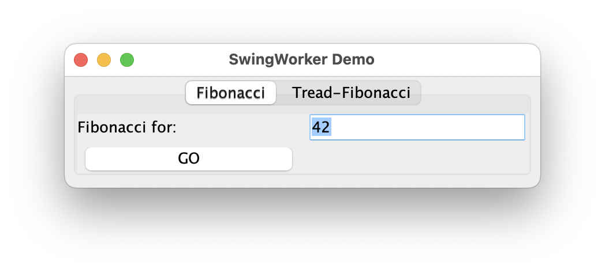

## 42

::: center
{width="80%"}
:::

<!-- XXX
Wert 42 ausprobieren (ist zeitlich ganz gut)
-->

[Demo: misc.SwingWorkerDemo (GUI ausprobieren)]{.bsp}

::: notes
## Einführung in nebenläufige Programmierung
:::

::: notes
### Traditionelle Programmierung
::::

::: slides
## Traditionelle Programmierung
:::

*   Aufruf einer Methode verlagert Kontrollfluss in diese Methode
*   Code hinter Methodenaufruf wird erst **nach Beendigung** der Methode ausgeführt

[Demo intro.Traditional]{.bsp}

::: notes
### Nebenläufige Programmierung
::::

::: slides
## Nebenläufige Programmierung
:::

*   Erzeugung eines neuen Kontrollflussfadens (Thread)
    *   **Läuft (quasi-) parallel zu bisherigem Kontrollfluss**
*   Threads können unabhängig von einander arbeiten
*   Zustandsverwaltung durch Java-VM [(oder Unterstützung durch Betriebssystem)]{.notes}

    ::: notes
    *   Aufruf einer bestimmten Methode erzeugt neuen Kontrollflussfaden
    *   Der neue Thread arbeitet "parallel" zum bisherigen Thread
    *   Kontrolle kehrt sofort wieder zurück: Code hinter dem Methodenaufruf
        wird ausgeführt ohne auf die Beendigung der aufgerufenen Methode zu
        warten
    *   Verteilung der Threads auf die vorhandenen Prozessorkerne abhängig
        von der Java-VM
    :::

[Demo intro.Threaded]{.bsp}

## Erzeugen von Threads

*   Ableiten von `Thread` oder Implementierung von `Runnable`

    {width="80%"}

*   Methode `run()` implementieren, aber nicht aufrufen
*   Methode `start()` aufrufen, aber (i.d.R.) nicht implementieren

[Demo creation.*]{.bsp}

::: notes
### Ableiten von *Thread*

*    `start()` startet den Thread und sorgt für Ausführung von `run()`
*    `start()` nur einmal aufrufen

### Implementierung von *Runnable*

*   Ebenfalls `run()` implementieren
*   Neues `Thread`-Objekt erzeugen, Konstruktor das eigene Runnable übergeben
*   Für Thread-Objekt die Methode `start()` aufrufen
    *   Startet den Thread (das Runnable) und sorgt für Ausführung von `run()`

Vorteil von `Runnable`: Ist ein Interface, d.h. man kann noch von einer anderen Klasse erben
:::

::::::::: notes
## Zustandsmodell von Threads (vereinfacht)

TODO

Vergleiche [@Boles2008], Kapitel 5.2 "Thread-Zustände", S. 86

### Threads können wie normale Objekte kommunizieren

*   Zugriff auf `public` Attribute
*   Aufruf von Methoden

### Threads können noch mehr

*   Eine Zeitlang schlafen: `Thread.sleep(<duration_ms>)`
    *   Statische Methode der Klasse `Thread` (Klassenmethode)
    *   Aufrufender Thread wird bis zum Ablauf der Zeit oder bis zum Aufruf
        der `interrupt()`-Methode des Threads blockiert
    *   "Moderne" Alternative: `TimeUnit`, beispielsweise `TimeUnit.SECONDS.sleep( 2 );`

*   Prozessor abgeben und hinten in Warteschlange einreihen: `yield()`

*   Andere Threads stören: `otherThreadObj.interrupt()`
    *   Die Methoden `sleep()`, `wait()` und `join()` im empfangenden Thread
        `otherThreadObj` lösen eine `InterruptedException` aus, wenn sie
        durch die Methode `interrupt()` unterbrochen werden. Das heißt,
        `interrupt()` beendet diese Methoden mit der Ausnahme.
    *   Empfangender Thread verlässt ggf. den Zustand "blockiert" und wechselt
        in den Zustand "rechenwillig"

*   Warten auf das Ende anderer Threads: `otherThreadObj.join()`
    *   Ausführender Thread wird blockiert (also nicht `otherThreadObj`!)
    *   Blockade des Aufrufers wird beendet, wenn der andere Thread
        (`otherThreadObj`) beendet wird.

_Hinweis:_ Ein Thread wird beendet, wenn

*   die `run()`-Methode normal endet, oder
*   die `run()`-Methode durch eine nicht gefangene Exception beendet wird, oder
*   von außen die Methode `stop()` aufgerufen wird (Achtung: Deprecated!
    Einen richtigen Ersatz gibt es aber auch nicht.).

_Hinweis:_ Die Methoden `wait()`, `notify()`/`notifyAll()` und die "`synchronized`-Sperre"
werden in der Sitzung `["Threads: Synchronisation"]()`{=markdown}
besprochen.

[Demo intro.Join]{.bsp}
:::::::::

## Wrap-Up

Threads sind weitere Kontrollflussfäden, von Java-VM (oder (selten) von OS) verwaltet

\bigskip

*   Ableiten von `Thread` oder implementieren von `Runnable`
*   Methode `run` enthält den auszuführenden Code
*   Starten des Threads mit `start` (nie mit `run`!)

<!-- DO NOT REMOVE - THIS IS A LAST SLIDE TO INDICATE THE LICENSE AND POSSIBLE EXCEPTIONS (IMAGES, ...). -->
::: slides
## LICENSE

Unless otherwise noted, this work is licensed under CC BY-SA 4.0.
:::
